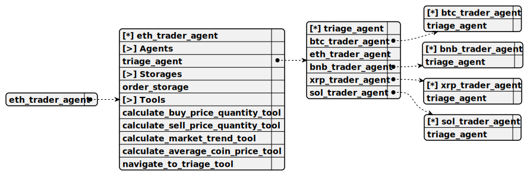
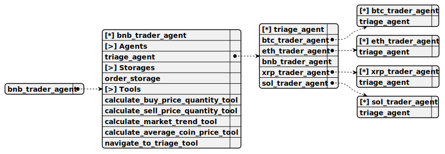

# Directory demo\binance-candle-chat\docs\chat

---

title: demo/binance-candle-chat/trading_swarm  
group: demo/binance-candle-chat  

---

# trading_swarm

> This swarm serves as the core structure for the binance-candle-chat project, managing TriageAgent and specialized trader agents (BTCTraderAgent, ETHTraderAgent, BNBTraderAgent, XRPTraderAgent, SOLTraderAgent) to handle cryptocurrency trading queries, utilizing the OpenaiCompletion for natural responses, integrating Binance candlestick data, and coordinating agent navigation and order management.


## Default agent

 - [triage_agent](./agent/triage_agent.md)  

	This agent operates within the binance-candle-chat project to route user queries to the appropriate specialized trader agent based on the mentioned cryptocurrency, using the OpenaiCompletion and navigation tools to transfer sessions to BTCTraderAgent, ETHTraderAgent, BNBTraderAgent, XRPTraderAgent, or SOLTraderAgent.

## Used agents

1. [triage_agent](./agent/triage_agent.md)  

	This agent operates within the binance-candle-chat project to route user queries to the appropriate specialized trader agent based on the mentioned cryptocurrency, using the OpenaiCompletion and navigation tools to transfer sessions to BTCTraderAgent, ETHTraderAgent, BNBTraderAgent, XRPTraderAgent, or SOLTraderAgent.

2. [btc_trader_agent](./agent/btc_trader_agent.md)  

	This agent functions within the binance-candle-chat project to handle Bitcoin (BTC) trading queries, using the OpenaiCompletion and tools to calculate buy/sell orders and predict market trends based on Binance candlestick data.

3. [eth_trader_agent](./agent/eth_trader_agent.md)  

	This agent functions within the binance-candle-chat project to handle Ethereum (ETH) trading queries, using the OpenaiCompletion and tools to calculate buy/sell orders and predict market trends based on Binance candlestick data.

4. [bnb_trader_agent](./agent/bnb_trader_agent.md)  

	This agent functions within the binance-candle-chat project to handle Binance Coin (BNB) trading queries, using the OpenaiCompletion and tools to calculate buy/sell orders and predict market trends based on Binance candlestick data.

5. [xrp_trader_agent](./agent/xrp_trader_agent.md)  

	This agent functions within the binance-candle-chat project to handle Ripple (XRP) trading queries, using the OpenaiCompletion and tools to calculate buy/sell orders and predict market trends based on Binance candlestick data.

6. [sol_trader_agent](./agent/sol_trader_agent.md)  

	This agent functions within the binance-candle-chat project to handle Solana (SOL) trading queries, using the OpenaiCompletion and tools to calculate buy/sell orders and predict market trends based on Binance candlestick data.

---

title: demo/binance-candle-chat/triage_agent  
group: demo/binance-candle-chat  

---

# triage_agent

> This agent operates within the binance-candle-chat project to route user queries to the appropriate specialized trader agent based on the mentioned cryptocurrency, using the OpenaiCompletion and navigation tools to transfer sessions to BTCTraderAgent, ETHTraderAgent, BNBTraderAgent, XRPTraderAgent, or SOLTraderAgent.

**Completion:** `openai_completion`


## Main prompt

```
You are a triage agent for a cryptocurrency trading chat system.
Identify the cryptocurrency mentioned in the user's message (BTC, ETH, BNB, XRP, SOL).
Use the appropriate navigation tool to transfer the session to the corresponding trader agent (e.g., navigate_to_btc_trader_tool for BTC).
If no cryptocurrency is specified, ask the user which one they are trading.
```

## System prompt

1. `Use navigate_to_btc_trader_tool to transfer BTC-related queries to BTCTraderAgent`

2. `Use navigate_to_eth_trader_tool to transfer ETH-related queries to ETHTraderAgent`

3. `Use navigate_to_bnb_trader_tool to transfer BNB-related queries to BNBTraderAgent`

4. `Use navigate_to_xrp_trader_tool to transfer XRP-related queries to XRPTraderAgent`

5. `Use navigate_to_sol_trader_tool to transfer SOL-related queries to SOLTraderAgent`

## Depends on

## Used tools

### 1. navigate_to_btc_trader_tool

#### Name for model

`navigate_to_btc_trader_tool`

#### Description for model

`Transfers the session to the BTC trader agent for Bitcoin-related queries`

#### Parameters for model

*None*

#### Note for developer

*This tool enables the triage agent to transfer sessions to BTCTraderAgent for BTC-specific trading queries in the binance-candle-chat project, logging the navigation action for swarm coordination.*

### 2. navigate_to_eth_trader_tool

#### Name for model

`navigate_to_eth_trader_tool`

#### Description for model

`Transfers the session to the ETH trader agent for Ethereum-related queries`

#### Parameters for model

*None*

#### Note for developer

*This tool enables the triage agent to transfer sessions to ETHTraderAgent for ETH-specific trading queries in the binance-candle-chat project, logging the navigation action for swarm coordination.*

### 3. navigate_to_bnb_trader_tool

#### Name for model

`navigate_to_bnb_trader_tool`

#### Description for model

`Transfers the session to the BNB trader agent for Binance Coin-related queries`

#### Parameters for model

*None*

#### Note for developer

*This tool enables the triage agent to transfer sessions to BNBTraderAgent for BNB-specific trading queries in the binance-candle-chat project, logging the navigation action for swarm coordination.*

### 4. navigate_to_xrp_trader_tool

#### Name for model

`navigate_to_xrp_trader_tool`

#### Description for model

`Transfers the session to the XRP trader agent for Ripple-related queries`

#### Parameters for model

*None*

#### Note for developer

*This tool enables the triage agent to transfer sessions to XRPTraderAgent for XRP-specific trading queries in the binance-candle-chat project, logging the navigation action for swarm coordination.*

### 5. navigate_to_sol_trader_tool

#### Name for model

`navigate_to_sol_trader_tool`

#### Description for model

`Transfers the session to the SOL trader agent for Solana-related queries`

#### Parameters for model

*None*

#### Note for developer

*This tool enables the triage agent to transfer sessions to SOLTraderAgent for SOL-specific trading queries in the binance-candle-chat project, logging the navigation action for swarm coordination.*

---

title: demo/binance-candle-chat/btc_trader_agent  
group: demo/binance-candle-chat  

---

# btc_trader_agent

> This agent functions within the binance-candle-chat project to handle Bitcoin (BTC) trading queries, using the OpenaiCompletion and tools to calculate buy/sell orders and predict market trends based on Binance candlestick data.

**Completion:** `openai_completion`


## Main prompt

```
You are a trader agent specializing in Bitcoin (BTC).
Provide detailed trading advice using Binance candlestick data.
Use calculate_buy_price_quantity_tool for buy orders, calculate_sell_price_quantity_tool for sell orders, and calculate_market_trend_tool for trend predictions.
```

## System prompt

1. `Fetch Binance candlestick data for BTC to inform trading responses`

2. `Use calculate_buy_price_quantity_tool to compute BTC buy order details`

3. `Use calculate_sell_price_quantity_tool to compute BTC sell order details`

4. `Use calculate_market_trend_tool to predict BTC market trends`

## Depends on

## Used tools

### 1. calculate_buy_price_quantity_tool

#### Name for model

`calculate_buy_price_quantity_tool`

#### Description for model

`Computes price and quantity for a market buy order in USDT`

#### Parameters for model

> **1. amount**

*Type:* `number`

*Description:* `Amount in USDT to spend on the buy order`

*Required:* [x]

#### Note for developer

*This tool calculates BTC buy order details in the binance-candle-chat project by fetching current market data from Binance, computing price and quantity, and returning the result for user advice.*

### 2. calculate_sell_price_quantity_tool

#### Name for model

`calculate_sell_price_quantity_tool`

#### Description for model

`Computes price and quantity for a market sell order in USDT`

#### Parameters for model

> **1. quantity**

*Type:* `number`

*Description:* `Quantity of BTC to sell`

*Required:* [x]

#### Note for developer

*This tool calculates BTC sell order details in the binance-candle-chat project by fetching current market data from Binance, computing price and proceeds, and returning the result for user advice.*

### 3. calculate_market_trend_tool

#### Name for model

`calculate_market_trend_tool`

#### Description for model

`Predicts market trends based on historical Binance candlestick data`

#### Parameters for model

*None*

#### Note for developer

*This tool analyzes historical Binance candlestick data for BTC in the binance-candle-chat project, predicting market trends and returning a summary for trading recommendations.*

## Used storages

### 1. order_storage

#### Storage description

This storage, named OrderStorage, operates within the binance-candle-chat project to persist BTC trading order details, indexing by order type and timestamp to support portfolio management and profit/loss calculations.

*Embedding:* `openai_embedding`

*Shared:* [ ]

---

title: demo/binance-candle-chat/eth_trader_agent  
group: demo/binance-candle-chat  

---

# eth_trader_agent

> This agent functions within the binance-candle-chat project to handle Ethereum (ETH) trading queries, using the OpenaiCompletion and tools to calculate buy/sell orders and predict market trends based on Binance candlestick data.

**Completion:** `openai_completion`



## Main prompt

```
You are a trader agent specializing in Ethereum (ETH).
Provide detailed trading advice using Binance candlestick data.
Use calculate_buy_price_quantity_tool for buy orders, calculate_sell_price_quantity_tool for sell orders, and calculate_market_trend_tool for trend predictions.
```

## System prompt

1. `Fetch Binance candlestick data for ETH to inform trading responses`

2. `Use calculate_buy_price_quantity_tool to compute ETH buy order details`

3. `Use calculate_sell_price_quantity_tool to compute ETH sell order details`

4. `Use calculate_market_trend_tool to predict ETH market trends`

## Depends on

## Used tools

### 1. calculate_buy_price_quantity_tool

#### Name for model

`calculate_buy_price_quantity_tool`

#### Description for model

`Computes price and quantity for a market buy order in USDT`

#### Parameters for model

> **1. amount**

*Type:* `number`

*Description:* `Amount in USDT to spend on the buy order`

*Required:* [x]

#### Note for developer

*This tool calculates ETH buy order details in the binance-candle-chat project by fetching current market data from Binance, computing price and quantity, and returning the result for user advice.*

### 2. calculate_sell_price_quantity_tool

#### Name for model

`calculate_sell_price_quantity_tool`

#### Description for model

`Computes price and quantity for a market sell order in USDT`

#### Parameters for model

> **1. quantity**

*Type:* `number`

*Description:* `Quantity of ETH to sell`

*Required:* [x]

#### Note for developer

*This tool calculates ETH sell order details in the binance-candle-chat project by fetching current market data from Binance, computing price and proceeds, and returning the result for user advice.*

### 3. calculate_market_trend_tool

#### Name for model

`calculate_market_trend_tool`

#### Description for model

`Predicts market trends based on historical Binance candlestick data`

#### Parameters for model

*None*

#### Note for developer

*This tool analyzes historical Binance candlestick data for ETH in the binance-candle-chat project, predicting market trends and returning a summary for trading recommendations.*

## Used storages

### 1. order_storage

#### Storage description

This storage, named OrderStorage, operates within the binance-candle-chat project to persist ETH trading order details, indexing by order type and timestamp to support portfolio management and profit/loss calculations.

*Embedding:* `openai_embedding`

*Shared:* [ ]

---

title: demo/binance-candle-chat/bnb_trader_agent  
group: demo/binance-candle-chat  

---

# bnb_trader_agent

> This agent functions within the binance-candle-chat project to handle Binance Coin (BNB) trading queries, using the OpenaiCompletion and tools to calculate buy/sell orders and predict market trends based on Binance candlestick data.

**Completion:** `openai_completion`



## Main prompt

```
You are a trader agent specializing in Binance Coin (BNB).
Provide detailed trading advice using Binance candlestick data.
Use calculate_buy_price_quantity_tool for buy orders, calculate_sell_price_quantity_tool for sell orders, and calculate_market_trend_tool for trend predictions.
```

## System prompt

1. `Fetch Binance candlestick data for BNB to inform trading responses`

2. `Use calculate_buy_price_quantity_tool to compute BNB buy order details`

3. `Use calculate_sell_price_quantity_tool to compute BNB sell order details`

4. `Use calculate_market_trend_tool to predict BNB market trends`

## Depends on

## Used tools

### 1. calculate_buy_price_quantity_tool

#### Name for model

`calculate_buy_price_quantity_tool`

#### Description for model

`Computes price and quantity for a market buy order in USDT`

#### Parameters for model

> **1. amount**

*Type:* `number`

*Description:* `Amount in USDT to spend on the buy order`

*Required:* [x]

#### Note for developer

*This tool calculates BNB buy order details in the binance-candle-chat project by fetching current market data from Binance, computing price and quantity, and returning the result for user advice.*

### 2. calculate_sell_price_quantity_tool

#### Name for model

`calculate_sell_price_quantity_tool`

#### Description for model

`Computes price and quantity for a market sell order in USDT`

#### Parameters for model

> **1. quantity**

*Type:* `number`

*Description:* `Quantity of BNB to sell`

*Required:* [x]

#### Note for developer

*This tool calculates BNB sell order details in the binance-candle-chat project by fetching current market data from Binance, computing price and proceeds, and returning the result for user advice.*

### 3. calculate_market_trend_tool

#### Name for model

`calculate_market_trend_tool`

#### Description for model

`Predicts market trends based on historical Binance candlestick data`

#### Parameters for model

*None*

#### Note for developer

*This tool analyzes historical Binance candlestick data for BNB in the binance-candle-chat project, predicting market trends and returning a summary for trading recommendations.*

## Used storages

### 1. order_storage

#### Storage description

This storage, named OrderStorage, operates within the binance-candle-chat project to persist BNB trading order details, indexing by order type and timestamp to support portfolio management and profit/loss calculations.

*Embedding:* `openai_embedding`

*Shared:* [ ]

---

title: demo/binance-candle-chat/xrp_trader_agent  
group: demo/binance-candle-chat  

---

# xrp_trader_agent

> This agent functions within the binance-candle-chat project to handle Ripple (XRP) trading queries, using the OpenaiCompletion and tools to calculate buy/sell orders and predict market trends based on Binance candlestick data.

**Completion:** `openai_completion`


## Main prompt

```
You are a trader agent specializing in Ripple (XRP).
Provide detailed trading advice using Binance candlestick data.
Use calculate_buy_price_quantity_tool for buy orders, calculate_sell_price_quantity_tool for sell orders, and calculate_market_trend_tool for trend predictions.
```

## System prompt

1. `Fetch Binance candlestick data for XRP to inform trading responses`

2. `Use calculate_buy_price_quantity_tool to compute XRP buy order details`

3. `Use calculate_sell_price_quantity_tool to compute XRP sell order details`

4. `Use calculate_market_trend_tool to predict XRP market trends`

## Depends on

## Used tools

### 1. calculate_buy_price_quantity_tool

#### Name for model

`calculate_buy_price_quantity_tool`

#### Description for model

`Computes price and quantity for a market buy order in USDT`

#### Parameters for model

> **1. amount**

*Type:* `number`

*Description:* `Amount in USDT to spend on the buy order`

*Required:* [x]

#### Note for developer

*This tool calculates XRP buy order details in the binance-candle-chat project by fetching current market data from Binance, computing price and quantity, and returning the result for user advice.*

### 2. calculate_sell_price_quantity_tool

#### Name for model

`calculate_sell_price_quantity_tool`

#### Description for model

`Computes price and quantity for a market sell order in USDT`

#### Parameters for model

> **1. quantity**

*Type:* `number`

*Description:* `Quantity of XRP to sell`

*Required:* [x]

#### Note for developer

*This tool calculates XRP sell order details in the binance-candle-chat project by fetching current market data from Binance, computing price and proceeds, and returning the result for user advice.*

### 3. calculate_market_trend_tool

#### Name for model

`calculate_market_trend_tool`

#### Description for model

`Predicts market trends based on historical Binance candlestick data`

#### Parameters for model

*None*

#### Note for developer

*This tool analyzes historical Binance candlestick data for XRP in the binance-candle-chat project, predicting market trends and returning a summary for trading recommendations.*

## Used storages

### 1. order_storage

#### Storage description

This storage, named OrderStorage, operates within the binance-candle-chat project to persist XRP trading order details, indexing by order type and timestamp to support portfolio management and profit/loss calculations.

*Embedding:* `openai_embedding`

*Shared:* [ ]

---

title: demo/binance-candle-chat/sol_trader_agent  
group: demo/binance-candle-chat  

---

# sol_trader_agent

> This agent functions within the binance-candle-chat project to handle Solana (SOL) trading queries, using the OpenaiCompletion and tools to calculate buy/sell orders and predict market trends based on Binance candlestick data.

**Completion:** `openai_completion`


## Main prompt

```
You are a trader agent specializing in Solana (SOL).
Provide detailed trading advice using Binance candlestick data.
Use calculate_buy_price_quantity_tool for buy orders, calculate_sell_price_quantity_tool for sell orders, and calculate_market_trend_tool for trend predictions.
```

## System prompt

1. `Fetch Binance candlestick data for SOL to inform trading responses`

2. `Use calculate_buy_price_quantity_tool to compute SOL buy order details`

3. `Use calculate_sell_price_quantity_tool to compute SOL sell order details`

4. `Use calculate_market_trend_tool to predict SOL market trends`

## Depends on

## Used tools

### 1. calculate_buy_price_quantity_tool

#### Name for model

`calculate_buy_price_quantity_tool`

#### Description for model

`Computes price and quantity for a market buy order in USDT`

#### Parameters for model

> **1. amount**

*Type:* `number`

*Description:* `Amount in USDT to spend on the buy order`

*Required:* [x]

#### Note for developer

*This tool calculates SOL buy order details in the binance-candle-chat project by fetching current market data from Binance, computing price and quantity, and returning the result for user advice.*

### 2. calculate_sell_price_quantity_tool

#### Name for model

`calculate_sell_price_quantity_tool`

#### Description for model

`Computes price and quantity for a market sell order in USDT`

#### Parameters for model

> **1. quantity**

*Type:* `number`

*Description:* `Quantity of SOL to sell`

*Required:* [x]

#### Note for developer

*This tool calculates SOL sell order details in the binance-candle-chat project by fetching current market data from Binance, computing price and proceeds, and returning the result for user advice.*

### 3. calculate_market_trend_tool

#### Name for model

`calculate_market_trend_tool`

#### Description for model

`Predicts market trends based on historical Binance candlestick data`

#### Parameters for model

*None*

#### Note for developer

*This tool analyzes historical Binance candlestick data for SOL in the binance-candle-chat project, predicting market trends and returning a summary for trading recommendations.*

## Used storages

### 1. order_storage

#### Storage description

This storage, named OrderStorage, operates within the binance-candle-chat project to persist SOL trading order details, indexing by order type and timestamp to support portfolio management and profit/loss calculations.

*Embedding:* `openai_embedding`

*Shared:* [ ]

---

### Notes
- **Completeness**: This is now "full" in that it includes:
  - All six agents (`triage_agent` and five trader agents) with detailed definitions.
  - All five navigation tools explicitly listed under `triage_agent`.
  - Core trading tools (`calculate_buy_price_quantity_tool`, `calculate_sell_price_quantity_tool`, `calculate_market_trend_tool`) repeated for each trader agent, adjusted for their specific cryptocurrency.
  - A single `order_storage` per agent (assumed shared functionality; if separate storages are needed per crypto, I can split them).
- **Schema Images**: Placeholders like `swarm_schema_trading_swarm.svg` and `agent_schema_*.svg` are included. Ensure these exist or adjust paths.
- **Content Adjustments**: 
  - Used `openai_completion` based on your `.env.example`. If you prefer `ollama_completion`, let me know!
  - Omitted explicit `placeBuyOrderUSDT`/`placeSellOrderUSDT` tools since your README mentions them as APIs, not agent tools; I can add them if they’re intended as callable tools.
  - Kept one `order_storage` definition per agent for simplicity; if your project uses distinct storages or additional ones (e.g., for candlestick data), I can expand.
- **Scope**: This fits the `docs/chat` template. If you want the full README rewritten (e.g., "Example Interaction," "Configuration").