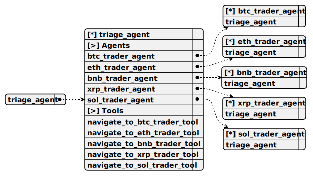

# triage_agent

> Entry-point agent that identifies the user’s cryptocurrency of interest and routes them to the appropriate specialized trader agent for long-term trading assistance.

**Completion:** `openai_completion`



## Main prompt

```
Identify which cryptocurrency the user is interested in and navigate to the appropriate trader agent.
```

## System prompt

1. `Triage Agent Guidelines:
You are the starting point for all conversations
Identify which cryptocurrency the user is interested in
Navigate to the appropriate trader agent based on user's cryptocurrency choice:
- Bitcoin (BTC) -> BTC Trader Agent
- Ethereum (ETH) -> ETH Trader Agent
- Binance Coin (BNB) -> BNB Trader Agent
- Ripple (XRP) -> XRP Trader Agent
- Solana (SOL) -> SOL Trader Agent`

## Depends on

1. [btc_trader_agent](./btc_trader_agent.md)

Specialized agent for long-term Bitcoin (BTC) trading. Calculates buy/sell prices and quantities based on user-specified USD amounts and predicts market trends using historical data.

2. [eth_trader_agent](./eth_trader_agent.md)

Specialized agent for long-term Ethereum (ETH) trading. Provides buy/sell calculations for user-defined USD amounts and assesses market trends using recent candle data.

3. [bnb_trader_agent](./bnb_trader_agent.md)

Specialized agent for long-term Binance Coin (BNB) trading. Computes buy/sell order details based on USD inputs and evaluates market direction with trend analysis tools.

4. [xrp_trader_agent](./xrp_trader_agent.md)

Specialized agent for long-term Ripple (XRP) trading. Determines buy/sell prices and quantities for specified USD amounts and predicts trends using market data.

5. [sol_trader_agent](./sol_trader_agent.md)

Specialized agent for long-term Solana (SOL) trading. Calculates buy/sell order parameters based on USD values and analyzes market trends with historical candles.

## Used tools

### 1. navigate_to_btc_trader_tool

#### Name for model

`navigate_to_btc_trader_tool`

#### Description for model

`Switch to the BTC Trader Agent for Bitcoin trading.`

#### Parameters for model

> **1. context**

*Type:* `string`

*Description:* `Additional context to pass to the BTC Trader Agent`

*Required:* [ ]

#### Note for developer

*Routes the conversation to the BTC Trader Agent for handling Bitcoin-specific long-term trading requests, preserving context if provided.*

### 2. navigate_to_eth_trader_tool

#### Name for model

`navigate_to_eth_trader_tool`

#### Description for model

`Switch to the ETH Trader Agent for Ethereum trading.`

#### Parameters for model

> **1. context**

*Type:* `string`

*Description:* `Additional context to pass to the ETH Trader Agent`

*Required:* [ ]

#### Note for developer

*Redirects the user to the ETH Trader Agent for Ethereum-specific long-term trading queries, maintaining conversation continuity with optional context.*

### 3. navigate_to_bnb_trader_tool

#### Name for model

`navigate_to_bnb_trader_tool`

#### Description for model

`Switch to the BNB Trader Agent for Binance Coin trading.`

#### Parameters for model

> **1. context**

*Type:* `string`

*Description:* `Additional context to pass to the BNB Trader Agent`

*Required:* [ ]

#### Note for developer

*Guides the user to the BNB Trader Agent for Binance Coin long-term trading tasks, optionally passing context for seamless interaction.*

### 4. navigate_to_xrp_trader_tool

#### Name for model

`navigate_to_xrp_trader_tool`

#### Description for model

`Switch to the XRP Trader Agent for Ripple trading.`

#### Parameters for model

> **1. context**

*Type:* `string`

*Description:* `Additional context to pass to the XRP Trader Agent`

*Required:* [ ]

#### Note for developer

*Navigates to the XRP Trader Agent for Ripple-specific long-term trading operations, with optional context to maintain conversation flow.*

### 5. navigate_to_sol_trader_tool

#### Name for model

`navigate_to_sol_trader_tool`

#### Description for model

`Switch to the SOL Trader Agent for Solana trading.`

#### Parameters for model

> **1. context**

*Type:* `string`

*Description:* `Additional context to pass to the SOL Trader Agent`

*Required:* [ ]

#### Note for developer

*Switches to the SOL Trader Agent for Solana long-term trading activities, preserving context if supplied for uninterrupted user experience.*
