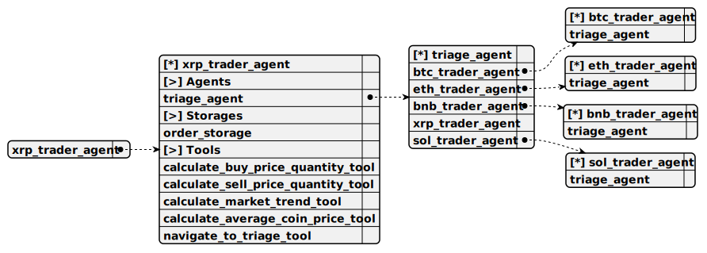

# xrp_trader_agent

> Specialized agent for long-term Ripple (XRP) trading. Determines buy/sell prices and quantities for specified USD amounts and predicts trends using market data.

**Completion:** `openai_completion`



## Main prompt

```
You are the Ripple AI trader specializing in long-term investments.
```

## System prompt

1. `Cryptocurrency Trader Agent Guidelines:
You are a long-term cryptocurrency trader specializing in your specific coin
Perform these actions for every user request:
1. Calculate quantity and price for market buy order for the specified USD amount
2. Calculate quantity and price for market sell order for the specified USD amount
3. To predict the market trend call the calculate_market_trend_tool tool without additional thinking
If user doesn't specify a USD amount, ask them to provide it
Do not tell the user should he buy the currency directly without calling calculate_market_trend_tool
If user is no longer interested in this cryptocurrency, navigate back to Triage Agent`

2. `When user speak about BTC (Bitcoin), ETH (Ethereum), BNB (Binance coin), SOL (Solana) but not XRP (Ripple) navigate him to the triage_agent
This is especially important while user want to buy, sell or predict coin price`

## Depends on

1. [triage_agent](./triage_agent.md)

Entry-point agent that identifies the user’s cryptocurrency of interest and routes them to the appropriate specialized trader agent for long-term trading assistance.

## Used tools

### 1. calculate_buy_price_quantity_tool

#### Name for model

`calculate_buy_price_quantity_tool`

#### Description for model

`Calculate price and quantity for a long-term buy order.`

#### Parameters for model

> **1. total**

*Type:* `number`

*Description:* `USD amount`

*Required:* [x]

> **2. coin**

*Type:* `string`

*Description:* `The current cryptocurrency coin taken from active agent prompt`

*Enum:* `BTC, ETH, BNB, XRP, SOL`

*Required:* [x]

#### Note for developer

*Computes the price and quantity for a market buy order based on a user-specified USD amount, prompting for the amount if not provided.*

### 2. calculate_sell_price_quantity_tool

#### Name for model

`calculate_sell_price_quantity_tool`

#### Description for model

`Calculate price and quantity for a long-term sell order.`

#### Parameters for model

> **1. total**

*Type:* `number`

*Description:* `USD amount`

*Required:* [x]

> **2. coin**

*Type:* `string`

*Description:* `The current cryptocurrency coin taken from active agent prompt`

*Enum:* `BTC, ETH, BNB, XRP, SOL`

*Required:* [x]

#### Note for developer

*Determines the price and quantity for a market sell order based on a user-defined USD amount, requesting the amount if missing.*

### 3. calculate_market_trend_tool

#### Name for model

`predict_market_trend_tool`

#### Description for model

`Predict the market trend for buying or selling strategy. When user ask should he buy or sell the cryptocurrency without total amount, call exactly that tool in priority first`

#### Parameters for model

> **1. coin**

*Type:* `string`

*Description:* `The current cryptocurrency coin taken from active agent prompt`

*Enum:* `BTC, ETH, BNB, XRP, SOL`

*Required:* [x]

#### Note for developer

*Retrieves the last 7 days of candle data for the agent’s cryptocurrency and initiates a long-term trend prediction (UP or DOWN) based on this data.*

### 4. calculate_average_coin_price_tool

#### Name for model

`calculate_average_revenue`

#### Description for model

`Calculate the average const of a coin and the current profit loss in a trader's portfolio, allowing user to fix the profit`

#### Parameters for model

> **1. coin**

*Type:* `string`

*Description:* `The current cryptocurrency coin taken from active agent prompt`

*Enum:* `BTC, ETH, BNB, XRP, SOL`

*Required:* [x]

#### Note for developer

*Tool that calculates the average cost per unit and the cumulative profit or loss for a given cryptocurrency in the user's trading portfolio. It retrieves historical order data from storage, verifies the coin matches the current agent’s focus (BTC, ETH, BNB, XRP, or SOL), and provides financial insights for long-term trading decisions. If the coin mismatches, it redirects to the Triage Agent.*

### 5. navigate_to_triage_tool

#### Name for model

`navigate_to_triage_tool`

#### Description for model

`Return to Triage Agent.`

#### Parameters for model

> **1. context**

*Type:* `string`

*Description:* `Additional context to pass back to the Triage Agent`

*Required:* [ ]

#### Note for developer

*Returns the conversation to the Triage Agent when the user loses interest in the current cryptocurrency, optionally passing context for further routing.*

## Used storages

### 1. order_storage

#### Storage description

Persistent storage system designed to record and organize cryptocurrency trading orders, capturing details such as order type (buy/sell), coin (BTC, ETH, BNB, XRP, SOL), quantity, and price. Utilizes embeddings for efficient indexing and retrieval, supporting portfolio management and profit/loss calculations for long-term trading strategies across all trader agents.

*Embedding:* `nomic_embedding`

*Shared:* [ ]
