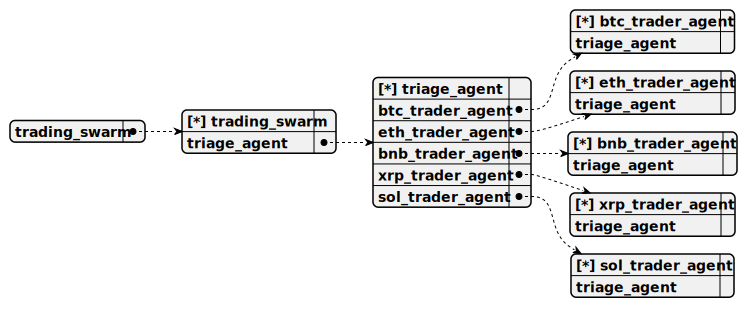

# trading_swarm

> A coordinated system of agents designed for long-term cryptocurrency trading, featuring a Triage Agent for routing and specialized Trader Agents for BTC, ETH, BNB, XRP, and SOL.

## Default agent

 - [triage_agent](./agent/triage_agent.md)

	Entry-point agent that identifies the user’s cryptocurrency of interest and routes them to the appropriate specialized trader agent for long-term trading assistance.

## Used agents

1. [btc_trader_agent](./agent/btc_trader_agent.md)

	Specialized agent for long-term Bitcoin (BTC) trading. Calculates buy/sell prices and quantities based on user-specified USD amounts and predicts market trends using historical data.

2. [eth_trader_agent](./agent/eth_trader_agent.md)

	Specialized agent for long-term Ethereum (ETH) trading. Provides buy/sell calculations for user-defined USD amounts and assesses market trends using recent candle data.

3. [bnb_trader_agent](./agent/bnb_trader_agent.md)

	Specialized agent for long-term Binance Coin (BNB) trading. Computes buy/sell order details based on USD inputs and evaluates market direction with trend analysis tools.

4. [xrp_trader_agent](./agent/xrp_trader_agent.md)

	Specialized agent for long-term Ripple (XRP) trading. Determines buy/sell prices and quantities for specified USD amounts and predicts trends using market data.

5. [sol_trader_agent](./agent/sol_trader_agent.md)

	Specialized agent for long-term Solana (SOL) trading. Calculates buy/sell order parameters based on USD values and analyzes market trends with historical candles.

6. [triage_agent](./agent/triage_agent.md)

	Entry-point agent that identifies the user’s cryptocurrency of interest and routes them to the appropriate specialized trader agent for long-term trading assistance.
