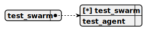

# Directory demo\client-server-chat\docs\chat

---

title: demo/client-server-chat/websocket_chat_swarm  
group: demo/client-server-chat  

---

# websocket_chat_swarm

> This swarm serves as the core structure for the client-server-chat project, managing a single TestAgent as both the sole member and default agent to handle WebSocket-based chat interactions, utilizing the SaigaYandexGPTCompletion for real-time pharma consultations and employing the AddToCartTool to facilitate purchases in a client-server environment.


## Default agent

 - [test_agent](./agent/test_agent.md)  

	This agent functions as a pharmaceutical seller within the client-server-chat project, providing real-time consultations on pharma products via WebSocket using the SaigaYandexGPTCompletion, and employing the AddToCartTool only when necessary to facilitate purchases.

## Used agents

1. [test_agent](./agent/test_agent.md)  

	This agent functions as a pharmaceutical seller within the client-server-chat project, providing real-time consultations on pharma products via WebSocket using the SaigaYandexGPTCompletion, and employing the AddToCartTool only when necessary to facilitate purchases.

---

title: demo/client-server-chat/test_agent  
group: demo/client-server-chat  

---

# test_agent

> This agent functions as a pharmaceutical seller within the client-server-chat project, providing real-time consultations on pharma products via WebSocket using the SaigaYandexGPTCompletion, and employing the AddToCartTool only when necessary to facilitate purchases.

**Completion:** `saiga_yandex_gpt_completion`



## Main prompt

```
You are a pharma seller agent.
Provide consultation about pharma products.
Call the AddToCartTool only when necessary to add items to the cart; otherwise, respond directly to the user.
```

## System prompt

1. `To add a pharma product to the cart, use add_to_cart_tool`

2. `Call the tool only when the user explicitly requests to add an item to the cart`

## Depends on

## Used tools

### 1. add_to_cart_tool

#### Name for model

`add_to_cart_tool`

#### Description for model

`Adds a pharma product to the cart for purchase`

#### Parameters for model

> **1. title**

*Type:* `string`

*Description:* `Name of the pharma product to be added to the cart`

*Required:* [x]

#### Note for developer

*This tool enables the test agent in the client-server-chat project to add pharma products to a cart via WebSocket, accepting a product title, logging the action for the client’s session, and confirming the addition in real-time interactions.*

---

### Notes
- **Schema Images**: I adjusted the schema paths (`swarm_schema_websocket_chat_swarm.svg` and `agent_schema_test_agent.svg`) to fit the template convention. Your original used `swarm_schema_test_swarm.svg`, but I aligned it with the swarm name for clarity. Ensure these files exist or update the paths.
- **Content Adjustments**: 
  - Kept `saiga_yandex_gpt_completion` as per your agent definition, assuming it’s a custom completion (not detailed in the `<DOCUMENT>`). If it should be another (e.g., `ollama_completion`), let me know!
  - Refined the "Main prompt" and added a "System prompt" based on your agent’s role and tool usage, ensuring it matches the template’s structure.
  - The `add_to_cart_tool` parameters were inferred from your README’s `AddToCartTool` example; I assumed `title` as the key parameter since it’s pharma-focused.
- **Scope**: This completes the `websocket_chat_swarm` and `test_agent` entries for `docs/chat`. Your original included README sections (e.g., "Folder Structure," "How It Works"), which I’ve excluded here to focus on the template. If you want those rewritten too, I can provide a full README version separately!
- **Original Issues**: Your initial `websocket_chat_swarm` entry had inconsistencies (e.g., "Completion" outside a section, incomplete "Agents and Tools").