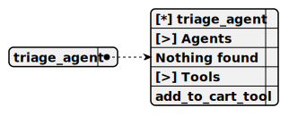

title: demo/cohere-token-rotate/websocket_chat_swarm
group: demo/cohere-token-rotate
---

# websocket_chat_swarm

> A coordinated system of agents designed for real-time AI-powered chat using Cohere's AI models with token rotation, featuring multi-agent collaboration, tool integration, and dynamic request distribution to avoid rate limits.



## schema

This functions as a pharmaceutical seller within the cohere-token-rotate project, providing consultations on pharma products using the CohereCompletion with token rotation, and it employs the AddToCartTool only, necessary to facilitate purchases.

Completion: cohere_completion

```mermaid
graph TD
    A[This functions as a pharmaceutical seller within the cohere-token-rotate project, providing consultations on pharma products using the CohereCompletion with token rotation, and it employs the AddToCartTool only, necessary to facilitate purchases.] --> B[Completion: cohere_completion]
    B --> C[triage_agent]
    C -->|Agents| D[[ ] Nothing found]
    C -->|Tools| E[[x] add_to_cart_tool]
    F[Main prompt: You are the pharma seller agent. Provide consultation about pharma products.] --> C
```

### Agents and Tools

- **triage_agent**
  - [ ] Agents: Nothing found
  - [x] Tools: add_to_cart_tool

### Main prompt
You are the pharma seller agent. Provide consultation about pharma products.

## Default agent

 - [triage_agent](./agent/triage_agent.md)

	Entry-point agent that processes user queries, provides consultations on pharma products, and integrates with tools for real-time chat interactions.

## Used agents

1. [triage_agent](./agent/triage_agent.md)

	Specialized agent for handling real-time chat interactions. Processes user queries, integrates with tools like AddToCartTool, and responds dynamically using the CohereCompletion with token rotation.

---

## Folder Structure

See the project repository for the detailed folder structure.

## Features

- Token Rotation: Uses multiple Cohere API keys in a round-robin fashion to distribute requests and avoid rate limits.
- Agent-Swarm Integration: Leverages agent-swarm-kit to manage agents, swarms, and tools.
- Multi-Completion Support: Supports Cohere, LMStudio, and Ollama completions.
- Custom Tools: Includes a tool for adding items to a cart.
- Dynamic Agent Behavior: Agents respond to user queries based on predefined prompts and tools.

## Getting Started

### 1. Install Dependencies
Navigate to the cohere-token-rotate directory and install the required dependencies:
```
cd demo/cohere-token-rotate
bun install
```

### 2. Set Up Environment Variables
Create a .env file in the cohere-token-rotate directory and add your API keys:
```
COHERE_API_KEY=your-cohere-api-key
```
If you have multiple API keys, you can add them to the COHERE_TOKENS array in cohere.completion.ts:
```
const COHERE_TOKENS = [process.env.COHERE_API_KEY!, "another-api-key"];
```

### 3. Run the Project
Start the project using the following command:
```
npm run start:index.ts
```

## How It Works

### Token Rotation
The cohere.completion.ts file implements token rotation using the RoundRobin utility from agent-swarm-kit. This ensures that API requests are distributed across multiple tokens:
```
const COHERE_TOKENS = [process.env.COHERE_API_KEY!];

addCompletion({
  completionName: CompletionName.CohereCompletion,
  getCompletion: RoundRobin.create(COHERE_TOKENS, (apiKey) =>
    Adapter.fromCohereClientV2(getCohere(apiKey), "command-r-08-2024")
  ),
});
```

### Agents
The triage.agent.ts file defines a triage agent that handles user queries and calls tools when necessary:
```
addAgent({
  agentName: AgentName.TriageAgent,
  completion: CompletionName.CohereCompletion,
  prompt: "You are the pharma seller agent. Provide consultation about pharma products.",
  tools: [ToolName.AddToCartTool],
});
```

### Tools
The add_to_cart.tool.ts file defines a tool for adding items to a cart:
```
addTool({
  toolName: ToolName.AddToCartTool,
  call: async (clientId, agentName, { productName }) => {
    console.log(`Added ${productName} to the cart for client ${clientId}`);
  },
});
```

### Swarm
The root.swarm.ts file defines a swarm that includes the triage agent:
```
addSwarm({
  swarmName: SwarmName.RootSwarm,
  agentList: [AgentName.TriageAgent],
  defaultAgent: AgentName.TriageAgent,
});
```

## Example Interaction

1. Start the project as described in the setup instructions.
2. Type a message in the terminal:
```
pharma-bot => What is the price of aspirin?
```
3. The agent responds:
```
[triage_agent]: The price of aspirin is $10.
```

## Configuration

### Cohere Model
The default Cohere model is command-r-08-2024. You can change this in cohere.completion.ts:
```
Adapter.fromCohereClientV2(getCohere(apiKey), "your-model-name")
```

### Port
The project runs on the default port for bun. You can modify the port in the Bun.serve configuration if needed.

## Scripts

The following scripts are defined in package.json:

- Start the Project:
```
bun ./src/index.ts
```

## Use Cases

- Customer Support: Automate customer interactions with intelligent agents.
- E-commerce: Use tools to manage shopping carts and provide product recommendations.
- Token Management: Distribute API requests across multiple tokens to avoid rate limits.

## Contributing

Contributions are welcome! If you'd like to improve this project, feel free to submit a pull request.

## License

This project is licensed under the MIT License.

## Contact

For questions or support, email tripolskypetr@gmail.com.

---

### Explanation of Changes

1. **Style Alignment with `trading_swarm`:**
   - Removed all emojis to match the `trading_swarm` style.
   - Reorganized sections to follow the `trading_swarm` structure: `schema`, `Default agent`, and `Used agents` come first, followed by `Folder Structure`, `Features`, `Getting Started`, etc.
   - Adjusted headings and formatting to be consistent with `trading_swarm`.

2. **Added Schema Section:**
   - Included a `schema` section with a description, completion type (`cohere_completion`), a Mermaid diagram, and the main prompt.
   - The Mermaid diagram mirrors the style of the previous projects, showing the `triage_agent`, its lack of associated agents ("Nothing found"), and its tool (`add_to_cart_tool`).
   - Used the corrected Mermaid syntax (`D[[ ] Nothing found]` and `E[[x] add_to_cart_tool]`) to ensure it renders without parse errors.

3. **Mermaid Diagram:**
   - The Mermaid code is embedded directly in the README within a `mermaid` code block, so it will render automatically on GitHub or in VS Code with a Mermaid-compatible Markdown preview extension (e.g., **Markdown Preview Mermaid Support** or **Markdown+Math**).

4. **Preserved All Content:**
   - All original content from the `cohere-token-rotate` README is retained, including the token rotation details, agent and tool definitions, example interaction, configuration, scripts, use cases, and contact information.

---

### Rendering the Mermaid Diagram

To preview the Mermaid diagram in VS Code:
1. Ensure you have a Mermaid-compatible extension installed (e.g., **Markdown Preview Mermaid Support**, which you already have).
2. Open the `README.md` file in VS Code.
3. Use the preview feature (`Ctrl+Shift+V` or right-click and select "Open Preview").
4. The Mermaid diagram in the `schema` section should render as a flowchart.

On GitHub, the diagram will render automatically when you push the README to your repository:
1. Commit and push the updated README:
   ```
   git add README.md
   git commit -m "Update README with schema section for cohere-token-rotate"
   git push origin main
   ```
2. View the README on GitHub, and the Mermaid diagram will render as a flowchart.

---

### Addressing the GitHub Copilot Error (Unrelated)

The error message ("Sorry, your request failed. Please try again. Request id: 0fa241e1-7b80-4461-b7f6-19659103f7d") from GitHub Copilot is unrelated to the Mermaid diagram or the README. This error has appeared in your previous screenshots as well, indicating a persistent issue with Copilot. Since we’ve addressed this before, I’ll summarize the steps to resolve it:

1. **Check Your Network Connection:**
   - Ensure your internet connection is stable. The error mentions "Please check your firewall rules and network connection then try again."
   - If you’re using a VPN or firewall, it might be blocking Copilot’s API requests. Try disabling the VPN or adjusting firewall settings.

2. **Retry the Request:**
   - Close and reopen VS Code, or try the Copilot action again.

3. **Check Copilot Status:**
   - Visit the [GitHub Status Page](https://www.githubstatus.com/) to see if Copilot or GitHub services are experiencing outages.

4. **Update VS Code and Copilot:**
   - Update VS Code: `Help > Check for Updates`.
   - Update Copilot: Go to the Extensions view (`Ctrl+Shift+X`), search for "GitHub Copilot," and click "Update" if available.

5. **Reauthenticate Copilot:**
   - Open the Command Palette (`Ctrl+Shift+P`).
   - Type "Copilot: Sign out" and select it.
   - Then type "Copilot: Sign in" and follow the prompts to reauthenticate.

---

### Summary

- The `cohere-token-rotate` README has been updated to match the `trading_swarm` style, with a new `schema` section including a Mermaid diagram.
- The Mermaid diagram uses the corrected syntax to ensure it renders without errors in VS Code and on GitHub.
- The GitHub Copilot error is unrelated to the README and should be resolved using the network troubleshooting steps above.
