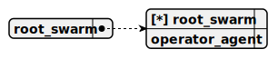

# root_swarm

> This swarm, named root_swarm, forms the backbone of an AI consulting swarm, utilizing a single operator_agent as both its sole member and default agent, leveraging a Firebase Realtime-driven connection bus to redirect customer interactions to the operator dashboard for human assistance when needed.

## Default agent

 - [operator_agent](./agent/operator_agent.md)

	This agent, named operator_agent, operates within an AI consulting swarm, redirecting interactions to the operator dashboard using a Firebase Realtime-implemented connection bus, enabling seamless human assistance when customers request it.

## Used agents

1. [operator_agent](./agent/operator_agent.md)

	This agent, named operator_agent, operates within an AI consulting swarm, redirecting interactions to the operator dashboard using a Firebase Realtime-implemented connection bus, enabling seamless human assistance when customers request it.
