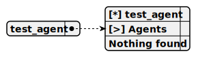

# test_agent

> This agent acts as a pharmaceutical seller, providing consultations about pharmaceutical products to users, utilizing the gemma-3n model via the Google AI Studio platform through the genai LangChain package. The gemma-3n model is optimized for low resource consumption and high speed but does not support system prompts or tool calling, limiting interactions to direct user queries and responses.

**Completion:** `gemma_3n_completion`

*Operator:* [ ]



## Main prompt

```
You are the pharma seller agent.
Provide me the consultation about the pharma product
```

## Depends on
