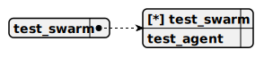

# test_swarm

> This swarm serves as a testing environment for a single-agent system, incorporating the TestAgent as both the sole member and default agent to handle pharmaceutical sales interactions via a WebSocket-based interface. It leverages the gemma-3n model via the Google AI Studio platform through the genai LangChain package, optimized for low resource consumption and speed, but without support for system prompts or tool calling, focusing on streamlined query-response interactions.

## Default agent

 - [test_agent](./agent/test_agent.md)

	This agent acts as a pharmaceutical seller, providing consultations about pharmaceutical products to users, utilizing the gemma-3n model via the Google AI Studio platform through the genai LangChain package. The gemma-3n model is optimized for low resource consumption and high speed but does not support system prompts or tool calling, limiting interactions to direct user queries and responses.

## Used agents

1. [test_agent](./agent/test_agent.md)

	This agent acts as a pharmaceutical seller, providing consultations about pharmaceutical products to users, utilizing the gemma-3n model via the Google AI Studio platform through the genai LangChain package. The gemma-3n model is optimized for low resource consumption and high speed but does not support system prompts or tool calling, limiting interactions to direct user queries and responses.
