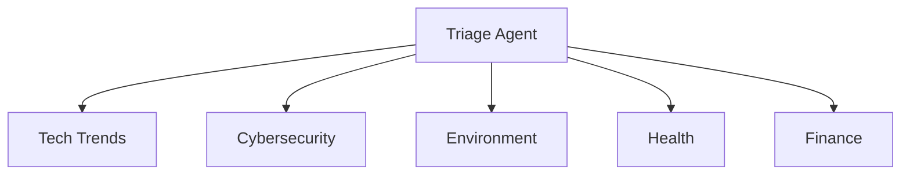

# IT Consulting Swarm

Multi-domain consulting system with 6 specialized agents for various areas of expertise.

## Purpose

Demonstrates capabilities:
- Multi-agent architecture for consulting
- Domain specialization of agents
- Intelligent request routing
- Comprehensive consulting solution

## Key Features

- **6 Specialized Agents**:
  - **Triage Agent**: Request routing
  - **Tech Trends Agent**: Technology trends
  - **Cybersecurity Agent**: Cybersecurity
  - **Environment Agent**: Environmental solutions
  - **Health Agent**: Healthcare and medtech
  - **Finance Agent**: Financial technologies

- **Domain Expertise**: Deep knowledge in each area
- **Client-Server Architecture**: WebSocket for real-time consultations
- **Intelligent Routing**: Automatic expertise determination

## Technology Stack

- **Runtime**: Bun
- **Language**: TypeScript
- **AI Framework**: agent-swarm-kit
- **Architecture**: Client-Server WebSocket
- **AI Provider**: OpenAI

## Project Structure

```
src/
├── client.ts          # WebSocket client
└── lib/
    └── swarm.ts      # Multi-agent swarm configuration
```

## Installation and Setup

```bash
# Install dependencies
bun install

# Run server (terminal 1)
bun run src/client.ts
```

## Конфигурация

Создайте файл `.env`:

```env
OPENAI_API_KEY=your_openai_api_key
WS_PORT=8080
```

## Примеры использования

### Tech Trends
- "What technologies will be relevant in 2025?"
- "Should we invest in AI/ML now?"

### Cybersecurity
- "How to protect corporate network?"
- "Security audit for e-commerce"

### Environment
- "Green IT solutions for data center"
- "Reducing carbon footprint of IT infrastructure"

### Health
- "Implementing telemedicine in clinic"
- "HIPAA compliance for health app"

### Finance
- "Blockchain solutions for bank"
- "Automating financial reporting"

## Агентная архитектура



## Applications

Perfect for:
- IT consulting companies
- Enterprise advisory services
- Digital transformation projects
- Technology assessment
- Strategic planning

## Extension

Easy to add new domains:
- Legal Tech Agent
- Education Agent
- Retail/E-commerce Agent
- Manufacturing Agent