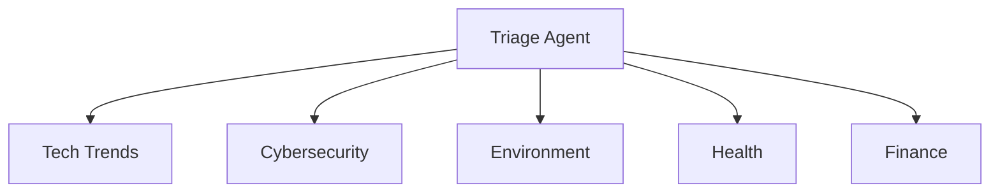

# IT Consulting Swarm

Мультидоменная консалтинговая система с 6 специализированными агентами для различных областей экспертизы.

## Назначение

Демонстрирует возможности:
- Мультиагентной архитектуры для консалтинга
- Доменной специализации агентов
- Интеллектуальной маршрутизации запросов
- Комплексного consulting решения

## Ключевые возможности

- **6 Специализированных агентов**:
  - **Triage Agent**: Маршрутизация запросов
  - **Tech Trends Agent**: Технологические тренды
  - **Cybersecurity Agent**: Кибербезопасность
  - **Environment Agent**: Экологические решения
  - **Health Agent**: Здравоохранение и медтех
  - **Finance Agent**: Финансовые технологии

- **Domain Expertise**: Глубокие знания в каждой области
- **Client-Server Architecture**: WebSocket для real-time консультаций
- **Intelligent Routing**: Автоматическое определение экспертизы

## Технологический стек

- **Runtime**: Bun
- **Язык**: TypeScript
- **AI Framework**: agent-swarm-kit
- **Architecture**: Client-Server WebSocket
- **AI Provider**: OpenAI

## Структура проекта

```
src/
├── client.ts          # WebSocket клиент
└── lib/
    └── swarm.ts      # Multi-agent swarm конфигурация
```

## Установка и запуск

```bash
# Установка зависимостей
bun install

# Запуск сервера (терминал 1)
bun run src/client.ts
```

## Конфигурация

Создайте файл `.env`:

```env
OPENAI_API_KEY=your_openai_api_key
WS_PORT=8080
```

## Примеры использования

### Tech Trends
- "Какие технологии будут актуальны в 2025?"
- "Стоит ли инвестировать в AI/ML сейчас?"

### Cybersecurity
- "Как защитить корпоративную сеть?"
- "Аудит безопасности для e-commerce"

### Environment
- "Green IT решения для дата-центра"
- "Снижение carbon footprint IT инфраструктуры"

### Health
- "Внедрение телемедицины в клинику"
- "HIPAA compliance для health app"

### Finance
- "Blockchain решения для банка"
- "Автоматизация financial reporting"

## Агентная архитектура



## Применение

Идеально для:
- IT консалтинговых компаний
- Enterprise advisory services
- Digital transformation проектов
- Technology assessment
- Strategic planning

## Расширение

Легко добавить новые домены:
- Legal Tech Agent
- Education Agent
- Retail/E-commerce Agent
- Manufacturing Agent