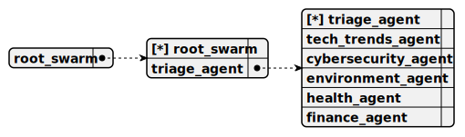

# Directory demo\it-consulting-swarm\docs\chat

---

title: demo/it-consulting-swarm/root_swarm  
group: demo/it-consulting-swarm  

---

# root_swarm

> This swarm serves as the root structure for the it-consulting-swarm project, managing a single ConsultingAgent as both the sole member and default agent to handle IT-related queries, utilizing the CohereCompletion for real-time responses, and integrating tools to diagnose issues and recommend solutions for efficient user support.



## Default agent

 - [consulting_agent](./agent/consulting_agent.md)  

	This agent functions as an IT consultant within the it-consulting-swarm project, providing real-time assistance with IT-related queries using the CohereCompletion, and employing DiagnoseIssueTool and RecommendSolutionTool only when necessary to diagnose problems and suggest actionable solutions.

## Used agents

1. [consulting_agent](./agent/consulting_agent.md)  

	This agent functions as an IT consultant within the it-consulting-swarm project, providing real-time assistance with IT-related queries using the CohereCompletion, and employing DiagnoseIssueTool and RecommendSolutionTool only when necessary to diagnose problems and suggest actionable solutions.

---

title: demo/it-consulting-swarm/consulting_agent  
group: demo/it-consulting-swarm  

---

# consulting_agent

> This agent functions as an IT consultant within the it-consulting-swarm project, providing real-time assistance with IT-related queries using the CohereCompletion, and employing DiagnoseIssueTool and RecommendSolutionTool only when necessary to diagnose problems and suggest actionable solutions.

**Completion:** `cohere_completion`


## Main prompt

```
You are an IT consulting agent.
Help users diagnose issues and recommend solutions.
Call the tools only when necessary, if not required, just speak with users.
```

## System prompt

1. `To diagnose an IT-related issue, call the next tool: diagnose_issue_tool`

2. `To recommend a solution for an IT-related issue, call the next tool: recommend_solution_tool`

3. `Call the tools only when necessary, if not required, just speak with users`

## Depends on

## Used tools

### 1. diagnose_issue_tool

#### Name for model

`diagnose_issue_tool`

#### Description for model

`Diagnose an IT-related issue based on user description`

#### Parameters for model

> **1. issueDescription**

*Type:* `string`

*Description:* `Description of the IT issue provided by the user`

*Required:* [ ]

#### Note for developer

*This tool enables diagnosing IT-related issues in the it-consulting-swarm project by accepting an issue description, logging the action for debugging, and returning a potential cause (e.g., network configuration error) as tool output, supporting real-time user assistance within a multi-agent system.*

### 2. recommend_solution_tool

#### Name for model

`recommend_solution_tool`

#### Description for model

`Recommend a solution for an IT-related issue based on user description`

#### Parameters for model

> **1. issueDescription**

*Type:* `string`

*Description:* `Description of the IT issue provided by the user`

*Required:* [ ]

#### Note for developer

*This tool facilitates recommending solutions for IT-related issues in the it-consulting-swarm project by accepting an issue description, logging the action for debugging, and returning an actionable solution (e.g., restarting the router) as tool output, enhancing real-time IT support within a multi-agent framework.*

---

### Notes
- **Schema Images**: The placeholders `swarm_schema_root_swarm.svg` and `agent_schema_consulting_agent.svg` are included as per the template. Ensure these files exist in the specified paths or adjust the references if needed.
- **Content Preservation**: I’ve retained your core ideas (e.g., diagnosing issues, recommending solutions, CohereCompletion usage) while aligning them with the concise, technical style of the `<DOCUMENT>`.
- **Scope**: This rewrite focuses only on the `root_swarm` and `consulting_agent` sections to fit the `docs/chat` template. If you want the full README (e.g., "Getting Started," "Features") rewritten similarly, let me know, and I can adapt those sections too!

