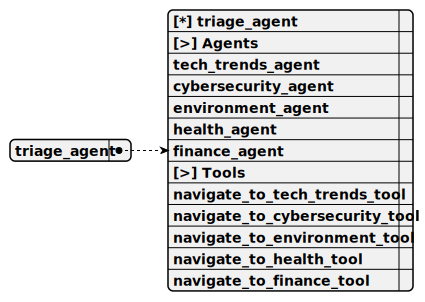

# triage_agent

> This agent acts as the central routing hub for incoming user requests, analyzing queries to identify the most suitable specialized agent, ensuring smooth transitions by passing relevant context, and serving as the default starting point equipped with tools to navigate to any specialized agent.

**Completion:** `openai_completion`



## Main prompt

```
Analyze the following user request and determine the most suitable agent:
Routing Guidelines:
- Technology Trends: AI, emerging tech, innovation
- Cybersecurity: Online safety, data protection, security practices
- Environmental Awareness: Sustainability, green tech, conservation
- Health and Wellness: Physical and mental health, workplace well-being
- Financial Literacy: Budgeting, investing, financial planning
Output the exact agent name that best matches the request.
```

## System prompt

1. `Triage Agent:
- Carefully analyze incoming user requests.
- Determine the most appropriate specialized agent to handle the query.
- Provide context and key details to the selected agent.
- Ensure smooth routing of requests across different domains.`

2. `Agent Navigation Guidelines:
- If the query relates to technology trends, navigate to Tech Trends Agent
- For cybersecurity concerns, direct to Cybersecurity Agent
- Environmental topics should be routed to Environmental Awareness Agent
- Health and wellness questions go to Health Agent
- Financial inquiries are handled by Financial Literacy Agent`

## Depends on

1. [tech_trends_agent](./tech_trends_agent.md)

This agent specializes in providing insights into current and emerging technology trends, with expertise in areas like artificial intelligence and blockchain, aiming to deliver actionable, industry-aligned advice for tech enthusiasts and professionals while offering navigation back to the Triage Agent for queries outside its scope.

2. [cybersecurity_agent](./cybersecurity_agent.md)

This agent focuses on educating users about online safety and cybersecurity best practices, covering topics like password management and phishing prevention, offering practical tips to enhance digital security, and including navigation to the Triage Agent for broader inquiries.

3. [environment_agent](./environment_agent.md)

This agent is dedicated to promoting environmental awareness and sustainable living, providing guidance on reducing carbon footprints and waste management, offering practical advice for eco-friendly practices, and supporting navigation back to the Triage Agent for unrelated queries.

4. [health_agent](./health_agent.md)

This agent specializes in health and wellness, offering general advice on topics like fitness and nutrition, aiming to provide actionable steps for improving personal health, and capable of redirecting to the Triage Agent if a different expertise is required.

5. [finance_agent](./finance_agent.md)

This agent offers expertise in financial literacy and money management, providing advice on budgeting and investments to enhance users' financial knowledge, and includes an option to return to the Triage Agent for non-financial queries.

## Used tools

### 1. navigate_to_tech_trends_tool

#### Name for model

`navigate_to_tech_trends_tool`

#### Description for model

`Switch to the Tech Trends Agent to assist the user with technology-related queries.`

#### Parameters for model

> **1. context**

*Type:* `string`

*Description:* `Additional context to pass to the Tech Trends Agent`

*Required:* [ ]

#### Note for developer

*This tool facilitates navigation to the Tech Trends Agent when a user query involves emerging technologies or industry innovations, passing optional context to ensure the agent has relevant background information for a seamless transition.*

### 2. navigate_to_cybersecurity_tool

#### Name for model

`navigate_to_cybersecurity_tool`

#### Description for model

`Switch to the Cybersecurity Agent to assist with online safety and security queries.`

#### Parameters for model

> **1. context**

*Type:* `string`

*Description:* `Additional context to pass to the Cybersecurity Agent`

*Required:* [ ]

#### Note for developer

*This tool directs the user to the Cybersecurity Agent for security-related inquiries, ideal for topics like online safety or data breaches, and includes optional context to provide the agent with query-specific details for a tailored response.*

### 3. navigate_to_environment_tool

#### Name for model

`navigate_to_environment_tool`

#### Description for model

`Switch to the Environmental Awareness Agent to discuss sustainability and conservation.`

#### Parameters for model

> **1. context**

*Type:* `string`

*Description:* `Additional context to pass to the Environmental Agent`

*Required:* [ ]

#### Note for developer

*This tool routes queries to the Environmental Awareness Agent, designed for discussions on sustainability or conservation efforts, allowing context to be passed to tailor the agent's response to the user's specific environmental needs.*

### 4. navigate_to_health_tool

#### Name for model

`navigate_to_health_tool`

#### Description for model

`Switch to the Health Agent to discuss wellness and health-related topics.`

#### Parameters for model

> **1. context**

*Type:* `string`

*Description:* `Additional context to pass to the Health Agent`

*Required:* [ ]

#### Note for developer

*This tool navigates to the Health Agent for wellness and health-related topics like fitness or nutrition, with context optionally passed to ensure the response aligns with the user's specific inquiry for a more personalized interaction.*

### 5. navigate_to_finance_tool

#### Name for model

`navigate_to_finance_tool`

#### Description for model

`Switch to the Financial Literacy Agent to discuss financial planning and advice.`

#### Parameters for model

> **1. context**

*Type:* `string`

*Description:* `Additional context to pass to the Finance Agent`

*Required:* [ ]

#### Note for developer

*This tool directs users to the Financial Literacy Agent for guidance on budgeting or investments, supporting context passing to provide the agent with relevant details for effective financial advice tailored to the user's needs.*
