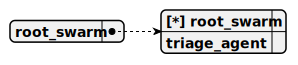

# root_swarm

> This swarm serves as the root structure for the langchain-stream project, managing a single TriageAgent as both the sole member and default agent to handle pharmaceutical sales interactions, utilizing the CohereCompletion with LangChain to stream pending tokens in real-time alongside Ollama and LMStudio completions for efficient, responsive user consultations and cart operations.

## Default agent

 - [triage_agent](./agent/triage_agent.md)

	This agent functions as a pharmaceutical seller within the langchain-stream project, providing real-time consultations on pharma products using the CohereCompletion, which streams pending tokens via LangChain alongside Ollama and LMStudio completions, and it employs the AddToCartTool only when necessary to facilitate purchases.

## Used agents

1. [triage_agent](./agent/triage_agent.md)

	This agent functions as a pharmaceutical seller within the langchain-stream project, providing real-time consultations on pharma products using the CohereCompletion, which streams pending tokens via LangChain alongside Ollama and LMStudio completions, and it employs the AddToCartTool only when necessary to facilitate purchases.
