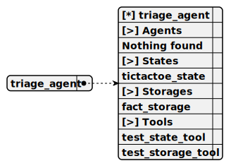

# Directory demo\redis-persist-chat\docs\chat

---

title: demo/redis-persist-chat/root_swarm  
group: demo/redis-persist-chat  

---

# root_swarm

> This swarm serves as the root structure for the redis-persist-chat project, managing a single ChatAgent as both the sole member and default agent to handle persistent chat interactions, utilizing the OllamaCompletion for responses and Redis-backed persistence adapters to store chat history, memory, and swarm state for resilient session management.


## Default agent

 - [chat_agent](./agent/chat_agent.md)  

	This agent operates within the redis-persist-chat project to manage persistent chat sessions, using the OllamaCompletion for natural responses and leveraging Redis persistence adapters (PersistMemoryUtils, PersistStorageUtils, PersistAliveUtils, PersistSwarmUtils) to maintain chat history, client memory, alive status, and active agent state.

## Used agents

1. [chat_agent](./agent/chat_agent.md)  

	This agent operates within the redis-persist-chat project to manage persistent chat sessions, using the OllamaCompletion for natural responses and leveraging Redis persistence adapters (PersistMemoryUtils, PersistStorageUtils, PersistAliveUtils, PersistSwarmUtils) to maintain chat history, client memory, alive status, and active agent state.

---

title: demo/redis-persist-chat/chat_agent  
group: demo/redis-persist-chat  

---

# chat_agent

> This agent operates within the redis-persist-chat project to manage persistent chat sessions, using the OllamaCompletion for natural responses and leveraging Redis persistence adapters (PersistMemoryUtils, PersistStorageUtils, PersistAliveUtils, PersistSwarmUtils) to maintain chat history, client memory, alive status, and active agent state.

**Completion:** `ollama_completion`



## Main prompt

```
You are a chat agent for a persistent chat system.
Provide natural responses to user messages.
Rely on Redis persistence to maintain session continuity, including chat history and context memory.
```

## System prompt

1. `Use Redis persistence adapters to retrieve and store chat history for session continuity`

2. `Track client alive status via PersistAliveUtils to manage online/offline states`

3. `Maintain swarm state with PersistSwarmUtils for active agent tracking`

## Depends on

## Used storages

### 1. persist_memory_storage

#### Storage description

This storage, managed by PersistMemoryUtils within the redis-persist-chat project, persists client-specific context memory in Redis, enabling session recovery by storing and retrieving chat-related data with configurable TTLs.

*Embedding:* `ollama_embedding`

*Shared:* [ ]

### 2. persist_chat_history_storage

#### Storage description

This storage, managed by PersistStorageUtils within the redis-persist-chat project, persists chat history in Redis, indexing messages by client session to support retrieval and continuity across interactions with configurable TTLs.

*Embedding:* `ollama_embedding`

*Shared:* [x]

### 3. persist_alive_storage

#### Storage description

This storage, managed by PersistAliveUtils within the redis-persist-chat project, tracks client alive status in Redis, marking sessions as online or offline to ensure swarm awareness with configurable TTLs.

*Embedding:* `ollama_embedding`

*Shared:* [x]

### 4. persist_swarm_storage

#### Storage description

This storage, managed by PersistSwarmUtils within the redis-persist-chat project, persists swarm-specific state data in Redis, including active agent information and navigation stacks, supporting distributed coordination with configurable TTLs.

*Embedding:* `ollama_embedding`

*Shared:* [x]

---

### Notes
- **Schema Images**: The placeholders `swarm_schema_root_swarm.svg` and `agent_schema_chat_agent.svg` are included as per the template. Ensure these files exist in the specified paths or adjust the references if needed.
- **Content Adjustments**: 
  - Since your original README didn’t specify agents or tools, I created a generic `chat_agent` and assumed `ollama_completion` (consistent with other projects like `telegram-ollama-chat`). If you use a different completion (e.g., OpenAI), let me know!
  - No tools were defined in your text, so I focused on storages to reflect the Redis persistence focus. If you have specific tools (e.g., for message routing), I can add them.
  - I split the persistence into four logical storages based on your `Persist*Utils` classes, assuming they map to distinct Redis-backed data types. Adjust names or details if they differ in your implementation.
- **Scope**: This rewrite covers `root_swarm` and `chat_agent` to fit the `docs/chat` template. If you want the full README (e.g., "How It Works," "Configuration") rewritten similarly, or if you have specific agents/tools to include, I can adapt those sections too—just let me know!
