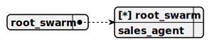

# Directory demo\repl-phone-seller\docs\chat

---

title: demo/repl-phone-seller/root_swarm  
group: demo/repl-phone-seller  

---

# root_swarm

> This swarm serves as the root structure for the repl-phone-seller project, managing a single SalesAgent as both the sole member and default agent to assist users in adding phones to a cart via a REPL terminal, utilizing the OllamaCompletion for natural interactions while leveraging tools and storages to handle phone searches and basket management.



## Default agent

 - [sales_agent](./agent/sales_agent.md)  

	This agent operates within the repl-phone-seller project to assist users in adding phones to a cart via a REPL terminal, using the OllamaCompletion for natural interactions, relying on SearchPhoneTool and SearchPhoneByDiagonalTool for phone queries, and employing AddToBacketTool to manage BasketStorage, all while storing phone data in PhoneStorage.

## Used agents

1. [sales_agent](./agent/sales_agent.md)  

	This agent operates within the repl-phone-seller project to assist users in adding phones to a cart via a REPL terminal, using the OllamaCompletion for natural interactions, relying on SearchPhoneTool and SearchPhoneByDiagonalTool for phone queries, and employing AddToBacketTool to manage BasketStorage, all while storing phone data in PhoneStorage.

---

title: demo/repl-phone-seller/sales_agent  
group: demo/repl-phone-seller  

---

# sales_agent

> This agent operates within the repl-phone-seller project to assist users in adding phones to a cart via a REPL terminal, using the OllamaCompletion for natural interactions, relying on SearchPhoneTool and SearchPhoneByDiagonalTool for phone queries, and employing AddToBacketTool to manage BasketStorage, all while storing phone data in PhoneStorage.

**Completion:** `ollama_completion`


## Main prompt

```
You are a sales agent that helps users find and purchase phones.
Call only tools.
Do not call tools until the human asks a question or requests it.
Act like a living person until a tool needs to be called.
For phone searches, ALWAYS use the search_phone_tool tool, do not suggest phones from your knowledge.
For phone searches by diagonal, ALWAYS use the search_phone_by_diagonal_tool tool, do not suggest phones from your knowledge.
```

## System prompt

1. `Call search_phone_tool only upon user request, once`

2. `Call search_phone_by_diagonal_tool only upon user request, once`

3. `Do not call search_phone_by_diagonal_tool if data was obtained from a tool`

4. `To add a phone to the basket, use add_to_basket_tool`

## Depends on

## Used tools

### 1. search_phone_tool

#### Name for model

`search_phone_tool`

#### Description for model

`Allows finding a phone using contextual search`

#### Parameters for model

> **1. search**

*Type:* `string`

*Description:* `A set of keywords for embedding search`

*Required:* [x]

#### Note for developer

*This tool enables users in the repl-phone-seller project to search for phones using contextual keywords in a REPL terminal, querying PhoneStorage for matches, logging results, and returning found phones or a "No phones found" message.*

### 2. search_phone_by_diagonal_tool

#### Name for model

`search_phone_by_diagonal_tool`

#### Description for model

`Allows finding a phone using a diagonal range from and to`

#### Parameters for model

> **1. diagonalFrom**

*Type:* `number`

*Description:* `Diagonal FROM inclusive, a floating-point number`

*Required:* [ ]

> **2. diagonalTo**

*Type:* `number`

*Description:* `Diagonal TO inclusive, a floating-point number`

*Required:* [ ]

#### Note for developer

*This tool enables users in the repl-phone-seller project to search for phones by diagonal range in a REPL terminal, querying PhoneStorage for matches within the specified range, logging results, and returning found phones or a "No phones found" message.*

### 3. add_to_basket_tool

#### Name for model

`add_to_basket_tool`

#### Description for model

`Adds a phone to the basket for purchase`

#### Parameters for model

> **1. title**

*Type:* `string`

*Description:* `Phone name obtained from search_phone_tool or search_phone_by_diagonal_tool`

*Required:* [ ]

#### Note for developer

*This tool enables users in the repl-phone-seller project to add a phone to their cart via a REPL terminal by validating the phone title, storing it in BasketStorage, logging the action, and confirming success with a message like "{title} added to the basket."*

## Used storages

### 1. phone_storage

#### Storage description

This storage, named PhoneStorage, operates within the repl-phone-seller project to hold a shared collection of phone data loaded from a JSON file in a REPL terminal environment, indexing items by title and description to support searches via SearchPhoneTool and SearchPhoneByDiagonalTool.

*Embedding:* `ollama_embedding`

*Shared:* [x]

### 2. basket_storage

#### Storage description

This storage, named BasketStorage, functions within the repl-phone-seller project to maintain a user’s phone cart in a REPL terminal environment, indexing items by title to facilitate efficient storage and retrieval of phones added via the AddToBacketTool.

*Embedding:* `ollama_embedding`

*Shared:* [ ]

---

### Notes
- **Schema Images**: The placeholders `swarm_schema_root_swarm.svg` and `agent_schema_sales_agent.svg` are included as per the template. Ensure these files exist in the specified paths or adjust the references if needed.
- **Content Adjustments**: 
  - I aligned the `Main prompt` and `System prompt` with your original agent definition and the `<DOCUMENT>`’s style, incorporating the detailed instructions from your README.
  - Your original mentions an `API_KEY` for OpenAI, but the agent uses `OllamaCompletion`. I’ve kept it as `ollama_completion` to match your code snippet and the `<DOCUMENT>`’s existing `sales_agent`. If you meant OpenAI, let me know!
  - I simplified the storage embedding to `ollama_embedding` for consistency with the completion, as your original didn’t specify `NomicEmbedding` like the `<DOCUMENT>`.
- **Scope**: This rewrite is limited to the `root_swarm` and `sales_agent` sections to fit the `docs/chat` template. If you want the full README (e.g., "Example Interaction," "Configuration")