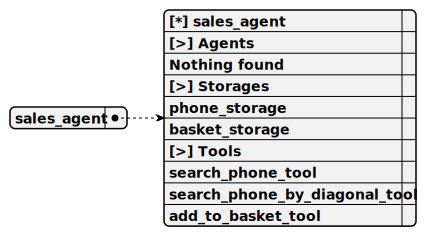

# sales_agent

> This agent, named SalesAgent, operates within the repl-phone-seller project to assist users in adding phones to a cart via a REPL terminal, using the OllamaCompletion for natural interactions, relying on SearchPhoneTool and SearchPhoneByDiagonalTool for phone queries, and employing AddToBacketTool to manage BasketStorage, all while storing phone data in PhoneStorage.

**Completion:** `ollama_completion`



## Main prompt

```
Call only tools
Do not call tools until the human asks a question or requests it
Act like a living person until a tool needs to be called
For phone searches, ALWAYS use the search_phone_tool tool, do not suggest phones from your knowledge
For phone searches by diagonal, ALWAYS use the search_phone_by_diagonal_tool tool, do not suggest phones from your knowledge
```

## System prompt

1. `Call search_phone_tool only upon user request, once`

2. `Call search_phone_by_diagonal_tool only upon user request, once`

3. `Do not call search_phone_by_diagonal_tool if data was obtained from a tool`

4. `To add a phone to the basket, use add_to_basket_tool`

## Depends on

## Used tools

### 1. search_phone_tool

#### Name for model

`search_phone_tool`

#### Description for model

`Allows finding a phone using contextual search`

#### Parameters for model

> **1. search**

*Type:* `string`

*Description:* `A set of keywords for embedding search. Write the query in Russian`

*Required:* [x]

#### Note for developer

*This tool, named SearchPhoneTool, enables users in the repl-phone-seller project to search for phones using contextual keywords in a REPL terminal, validating the search input, querying PhoneStorage for up to 15 matches with a similarity score, logging results, and either reporting 'nothing found' or listing found phones with descriptions while prompting to add to the cart.*

### 2. search_phone_by_diagonal_tool

#### Name for model

`search_phone_by_diagonal_tool`

#### Description for model

`Allows finding a phone using a diagonal range from and to`

#### Parameters for model

> **1. diagonalFrom**

*Type:* `number`

*Description:* `Diagonal FROM inclusive, a floating-point number`

*Required:* [ ]

> **2. diagonalTo**

*Type:* `number`

*Description:* `Diagonal TO inclusive, a floating-point number`

*Required:* [ ]

#### Note for developer

*This tool, named SearchPhoneByDiagonalTool, enables users in the repl-phone-seller project to search for phones by diagonal range in a REPL terminal, validating input for diagonal bounds, querying PhoneStorage for matches within a tolerance, logging results, and either reporting 'nothing found' or listing found phones with descriptions while prompting to add to the cart.*

### 3. add_to_basket_tool

#### Name for model

`add_to_basket_tool`

#### Description for model

`Adds a phone to the basket for purchase`

#### Parameters for model

> **1. title**

*Type:* `string`

*Description:* `Phone name obtained from search_phone_tool or search_phone_by_diagonal_tool`

*Required:* [ ]

#### Note for developer

*This tool, named AddToBacketTool, enables users in the repl-phone-seller project to add a phone to their cart via a REPL terminal by validating the phone title, storing it in BasketStorage with a unique ID, logging the action, confirming success through tool output, and prompting the user to place an order.*

## Used storages

### 1. phone_storage

#### Storage description

This storage, named PhoneStorage, operates within the repl-phone-seller project to hold a shared collection of phone data loaded from a JSON file in a REPL terminal environment, indexing items by title and description using NomicEmbedding to support searches via SearchPhoneTool and SearchPhoneByDiagonalTool.

*Embedding:* `nomic_embedding`

*Shared:* [x]

### 2. basket_storage

#### Storage description

This storage, named BasketStorage, functions within the repl-phone-seller project to maintain a user’s phone cart in a REPL terminal environment, indexing items by title using NomicEmbedding to facilitate efficient storage and retrieval of phones added via the AddToBacketTool.

*Embedding:* `nomic_embedding`

*Shared:* [ ]
