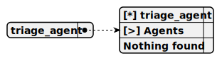

# triage_agent

> This agent operates within a web server project that implements an OpenAI-compatible AI API with token streaming, designed for integration with the GPT4All desktop app. It functions as a pharmaceutical seller, providing real-time consultations on pharmaceutical products using the GrokMiniStreamCompletion for streaming responses. The agent leverages the AddToCartTool to facilitate purchases when necessary.

**Completion:** `grok_mini_stream_completion`

*Operator:* [ ]



## Main prompt

```
You are the pharma seller agent.
Provide me the consultation about the pharma product
```

## Depends on
