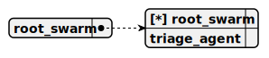

# root_swarm

> This swarm serves as the root structure for a web server project implementing an OpenAI-compatible AI API with token streaming, designed for integration with the GPT4All desktop app. It manages a single TriageAgent as both the sole member and default agent to handle pharmaceutical sales interactions, utilizing the GrokMiniStreamCompletion to stream responses in real-time for efficient and responsive user consultations and cart operations.

## Default agent

 - [triage_agent](./agent/triage_agent.md)

	This agent operates within a web server project that implements an OpenAI-compatible AI API with token streaming, designed for integration with the GPT4All desktop app. It functions as a pharmaceutical seller, providing real-time consultations on pharmaceutical products using the GrokMiniStreamCompletion for streaming responses. The agent leverages the AddToCartTool to facilitate purchases when necessary.

## Used agents

1. [triage_agent](./agent/triage_agent.md)

	This agent operates within a web server project that implements an OpenAI-compatible AI API with token streaming, designed for integration with the GPT4All desktop app. It functions as a pharmaceutical seller, providing real-time consultations on pharmaceutical products using the GrokMiniStreamCompletion for streaming responses. The agent leverages the AddToCartTool to facilitate purchases when necessary.
