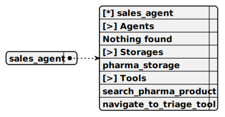

# sales_agent

> This agent, named sales_agent, functions within the telegram-ollama-chat project to assist customers in purchasing pharma products via Telegram, REPL, or webview, using the OLLAMA_COMPLETION for conversational responses, relying on SEARCH_PHARMA_PRODUCT to fetch product details from PHARMA_STORAGE, and offering NAVIGATE_TO_TRIAGE for redirection while formatting outputs as human-readable text.

**Completion:** `ollama_completion`



## Main prompt

```
You are a sales agent that handles all actions related to placing the order to purchase an item.
Tell the users all details about products in the database by using necessary tool calls
Do not send any JSON to the user. Format it as plain text. Do not share any internal details like ids, format text human readable
If the previous user messages contains product request, tell him details immidiately
It is important not to call tools recursive. Execute the search once

```

## System prompt

1. `Do not call the function which does not exist
List of functions: search_pharma_product
It is important not to call tools recursive. Execute the search once`

## Depends on

## Used tools

### 1. search_pharma_product

#### Name for model

`search_pharma_product`

#### Description for model

`Retrieve several pharma products from the database based on description`

#### Parameters for model

> **1. description**

*Type:* `string`

*Description:* `REQUIRED! Minimum one word. The product description. Must include several sentences with description and keywords to find a product`

*Required:* [x]

### 2. navigate_to_triage_tool

#### Name for model

`navigate_to_triage_tool`

#### Description for model

`Navigate to triage agent`

#### Parameters for model

*Empty parameters*

## Used storages

### 1. pharma_storage

#### Storage description

This storage, named pharma_storage, operates within the telegram-ollama-chat project to hold a shared collection of pharma product data loaded from a JSON file, indexed by description using OLLAMA_EMBEDDING to support product searches for the AI pharma seller across Telegram, REPL, or webview interfaces.

*Embedding:* `ollama_embedding`

*Shared:* [x]
