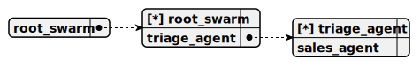

# root_swarm

> This swarm, named root_swarm, serves as the core structure for the telegram-ollama-chat project, managing TRIAGE_AGENT and SALES_AGENT to handle customer interactions via Telegram, REPL, or webview, both utilizing OLLAMA_COMPLETION for conversational responses, with TRIAGE_AGENT as the default to route requests and SALES_AGENT to process pharma sales.

## Default agent

 - [triage_agent](./agent/triage_agent.md)

	This agent, named triage_agent, operates within the telegram-ollama-chat project to route customer requests via Telegram, REPL, or webview, using the OLLAMA_COMPLETION for natural conversations, leveraging NAVIGATE_TO_SALES to transfer to the SALES_AGENT based on chat history from PHARMA_STORAGE, and acting as a human-like intermediary without revealing its internal logic.

## Used agents

1. [triage_agent](./agent/triage_agent.md)

	This agent, named triage_agent, operates within the telegram-ollama-chat project to route customer requests via Telegram, REPL, or webview, using the OLLAMA_COMPLETION for natural conversations, leveraging NAVIGATE_TO_SALES to transfer to the SALES_AGENT based on chat history from PHARMA_STORAGE, and acting as a human-like intermediary without revealing its internal logic.

2. [sales_agent](./agent/sales_agent.md)

	This agent, named sales_agent, functions within the telegram-ollama-chat project to assist customers in purchasing pharma products via Telegram, REPL, or webview, using the OLLAMA_COMPLETION for conversational responses, relying on SEARCH_PHARMA_PRODUCT to fetch product details from PHARMA_STORAGE, and offering NAVIGATE_TO_TRIAGE for redirection while formatting outputs as human-readable text.
