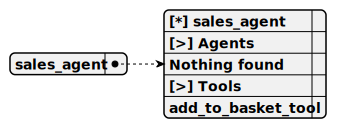

# sales_agent

> This agent, named SalesAgent, is designed for a testbed environment using worker-testbed and the WorkerThreads API with tape. It mocks tool calls to validate their execution, passing tests when the correct tool (e.g., AddToBacketTool) is called as requested and failing otherwise. It uses OpenAI for interaction, manages phone additions to BasketStorage via AddToBacketTool, and stores phone data in PhoneStorage.

**Completion:** `openai_completion`

*Operator:* [ ]



## Main prompt

```
Call only tools
Do not call tools until the human asks a question or requests it
Act like a living person until a tool needs to be called
```

## System prompt

1. `To add a phone to the basket, use add_to_basket_tool`

## Depends on

## Used tools

### 1. add_to_basket_tool

#### Name for model

`add_to_basket_tool`

#### Description for model

`Adds a phone to the basket for purchase`

#### Parameters for model

> **1. title**

*Type:* `string`

*Description:* `The phone name to add to ecommerce shopping cart`

*Required:* [ ]

#### Note for developer

*This tool, named AddToBacketTool, is designed for the repl-phone-seller project's testbed environment using worker-testbed with the WorkerThreads API and tape. It mocks the action of adding a phone to a cart by validating the phone title, storing it in BasketStorage with a unique ID, logging the action, and confirming success through tool output. Tests pass when the tool is called correctly and fail otherwise, with prompts to the user to place an order in the REPL terminal.*
