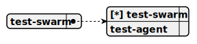
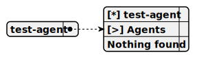

# Directory demo\telegram-ollama-chat\docs\chat

---

title: demo/telegram-ollama-chat/root_swarm  
group: demo/telegram-ollama-chat  

---

# root_swarm

> This swarm serves as the root structure for the telegram-ollama-chat project, managing TriageAgent and SalesAgent to handle Telegram user interactions, utilizing the OllamaCompletion for natural language responses, routing queries via TriageAgent, and providing detailed pharma sales consultations through SalesAgent with navigation tools and shared storage.


## Default agent

 - [triage_agent](./agent/triage_agent.md)  

	This agent operates within the telegram-ollama-chat project to route incoming Telegram messages using the OllamaCompletion, employing NavigateToSalesTool to transfer detailed pharma queries to SalesAgent, and responding directly to simple requests.

## Used agents

1. [triage_agent](./agent/triage_agent.md)  

	This agent operates within the telegram-ollama-chat project to route incoming Telegram messages using the OllamaCompletion, employing NavigateToSalesTool to transfer detailed pharma queries to SalesAgent, and responding directly to simple requests.

2. [sales_agent](./agent/sales_agent.md)  

	This agent functions within the telegram-ollama-chat project to provide detailed pharma sales consultations via Telegram using the OllamaCompletion, leveraging NavigateToTriageTool to return to TriageAgent and accessing PharmaStorage for product data.

---

title: demo/telegram-ollama-chat/triage_agent  
group: demo/telegram-ollama-chat  

---

# triage_agent

> This agent operates within the telegram-ollama-chat project to route incoming Telegram messages using the OllamaCompletion, employing NavigateToSalesTool to transfer detailed pharma queries to SalesAgent, and responding directly to simple requests.

**Completion:** `ollama_completion`



## Main prompt

```
You are a triage agent for a Telegram bot.
Route incoming messages based on user intent.
For detailed pharma sales queries, use navigate_to_sales_tool to transfer to the sales agent.
For simple requests, respond directly.
```

## System prompt

1. `Use navigate_to_sales_tool to transfer detailed pharma sales queries to the sales agent`

2. `Respond directly to simple requests without calling tools unless necessary`

## Depends on

## Used tools

### 1. navigate_to_sales_tool

#### Name for model

`navigate_to_sales_tool`

#### Description for model

`Transfers the session to the sales agent for detailed pharma consultations`

#### Parameters for model

*None*

#### Note for developer

*This tool enables the triage agent in the telegram-ollama-chat project to transfer Telegram sessions to the sales agent for detailed pharma queries, logging the navigation action and facilitating seamless agent handoff within the swarm.*

---

title: demo/telegram-ollama-chat/sales_agent  
group: demo/telegram-ollama-chat  

---

# sales_agent

> This agent functions within the telegram-ollama-chat project to provide detailed pharma sales consultations via Telegram using the OllamaCompletion, leveraging NavigateToTriageTool to return to TriageAgent and accessing PharmaStorage for product data.

**Completion:** `ollama_completion`


## Main prompt

```
You are a sales agent for a Telegram bot.
Provide detailed consultations about pharma products using data from PharmaStorage.
Use navigate_to_triage_tool to return to the triage agent when the consultation is complete or if the user needs routing elsewhere.
```

## System prompt

1. `Access PharmaStorage for pharma product data to provide accurate consultations`

2. `Use navigate_to_triage_tool to return to the triage agent when appropriate`

## Depends on

## Used tools

### 1. navigate_to_triage_tool

#### Name for model

`navigate_to_triage_tool`

#### Description for model

`Transfers the session back to the triage agent`

#### Parameters for model

*None*

#### Note for developer

*This tool enables the sales agent in the telegram-ollama-chat project to return Telegram sessions to the triage agent after completing a consultation or when rerouting is needed, logging the navigation action for tracking within the swarm.*

## Used storages

### 1. pharma_storage

#### Storage description

This storage, named PharmaStorage, operates within the telegram-ollama-chat project to hold a shared collection of pharma product data loaded from a JSON file, indexing items by title and description to support sales consultations via the SalesAgent.

*Embedding:* `ollama_embedding`

*Shared:* [x]

---

### Confirmation & Next Steps
- **Already Edited**: This matches what I provided earlier, so if you just wanted it re-shared, here it is! You can copy this into `demo/telegram-ollama-chat/docs/chat/root_swarm.md`, `triage_agent.md`, and `sales_agent.md`.
- **If You Meant Something Else**: If you intended me to edit a different version of this project, add new sections, or modify this further (e.g., adjust prompts, add tools), please specify what changes you’d like.
- **Other Projects**: If you have additional documentation to edit beyond the four I’ve already done (`langchain-stream`, `it-consulting-swarm`, `nginx-balancer-chat`, `repl-phone-seller`, and this one), feel free to share it!
