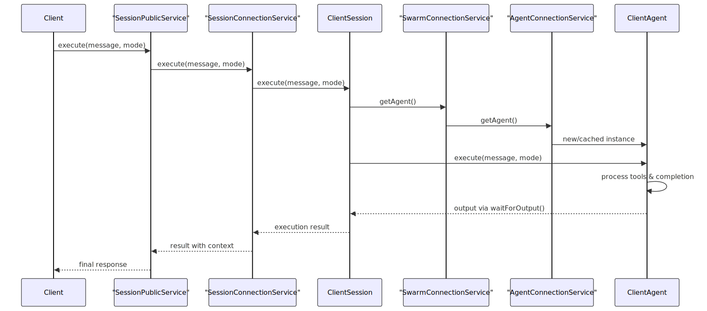

# Core Components

This page covers the primary architectural components that implement the agent execution model, session management, and service infrastructure in the agent-swarm-kit system. For information about the public API functions like `addAgent`, `session`, and `complete`, see [Core API Functions](./32_Core_API_Functions.md). For details about the dependency injection container and service layering, see [Service Architecture](./12_Service_Architecture.md).

## Agent Execution Engine

The agent execution engine consists of two primary components: `ClientAgent` for message processing and AI completion, and `ClientHistory` for conversation management.

### ClientAgent

`ClientAgent` is the core execution engine that processes incoming messages, executes tool calls, and generates AI completions. It implements the `IAgent` interface and serves as the primary orchestrator for agent behavior.

**Key responsibilities:**
- **Message Execution**: Processes user and tool messages through `execute()` method
- **Stateless Completion**: Provides quick completions via `run()` method without history updates
- **Tool Orchestration**: Validates, executes, and manages tool calls with abort signal support
- **AI Integration**: Coordinates with completion services for model responses
- **Event Emission**: Broadcasts execution events through the bus system

The `ClientAgent` uses a queued execution model to prevent overlapping operations and maintains internal subjects for managing tool execution flow, agent changes, and output cancellation.

### ClientHistory

`ClientHistory` manages conversation history for agents, providing filtered message arrays optimized for AI completion contexts and maintaining message persistence.

**Key features:**
- **Message Filtering**: Applies agent-specific filters to scope relevant messages
- **Tool Call Consistency**: Links tool outputs to their corresponding tool calls
- **History Limits**: Enforces message count limits via `keepMessages` parameter
- **Persistence Integration**: Handles message storage and retrieval through history adapters
- **Event Broadcasting**: Emits history events for system monitoring

The history system supports both raw message access and agent-optimized arrays that include system prompts and maintain tool call relationships for proper AI completion context.

## Session Management

### ClientSession

`ClientSession` orchestrates communication between clients, agents, and swarms while enforcing policies and managing message flows. It implements the `ISession` interface and serves as the primary coordination layer.

**Core capabilities:**
- **Message Execution**: Coordinates agent execution with policy validation
- **Policy Enforcement**: Validates input/output messages against configured policies
- **Communication Hub**: Manages message emission to swarms and notification channels
- **Agent Coordination**: Interfaces with swarm components to access and control agents
- **Event Integration**: Broadcasts session events for monitoring and logging

The session maintains separation between stateful execution (with history updates) and stateless completion, while ensuring all communications pass through policy validation layers.

## Service Infrastructure

The service infrastructure provides the foundation for component lifecycle management, dependency injection, and API exposure through a layered architecture.

### Connection Services

Connection services manage the instantiation and lifecycle of core components using memoization for efficient reuse.

**Service responsibilities:**
- **AgentConnectionService**: Creates and manages `ClientAgent` instances with tool and completion dependencies
- **SessionConnectionService**: Instantiates `ClientSession` with swarm and policy configurations  
- **HistoryConnectionService**: Provides `ClientHistory` instances with storage adapters
- **SwarmConnectionService**: Manages `ClientSwarm` instances for agent navigation and coordination

Each connection service uses `memoize` from functools-kit to cache instances by composite keys, ensuring efficient resource usage and consistent state management.

### Public Services

Public services provide the external API layer with context management and method scoping around connection services.

**Public service features:**
- **Context Scoping**: Wraps all operations with `MethodContextService.runInContext()` for proper context management
- **Method Delegation**: Delegates core functionality to connection services while adding context and logging
- **Performance Tracking**: Integrates with `PerfService` for execution monitoring
- **Validation Integration**: Coordinates with validation services for operation safety
- **Event Broadcasting**: Ensures proper event emission through the bus system

The public services layer provides a clean separation between external API and internal component management while ensuring consistent context propagation throughout the system.

## Component Integration

The core components work together through a well-defined integration pattern that ensures proper message flow, state management, and error handling.

**Integration patterns:**
- **Layered Delegation**: Public services delegate to connection services which manage component instances
- **Context Propagation**: Method context flows through all layers ensuring proper scoping
- **Event Broadcasting**: Components emit events at each layer for monitoring and coordination
- **Resource Sharing**: Memoization ensures efficient reuse of expensive component instances
- **Error Propagation**: Errors bubble up through layers with proper context preservation

This architecture provides clear separation of concerns while maintaining efficient resource usage and proper state management across the entire system.
