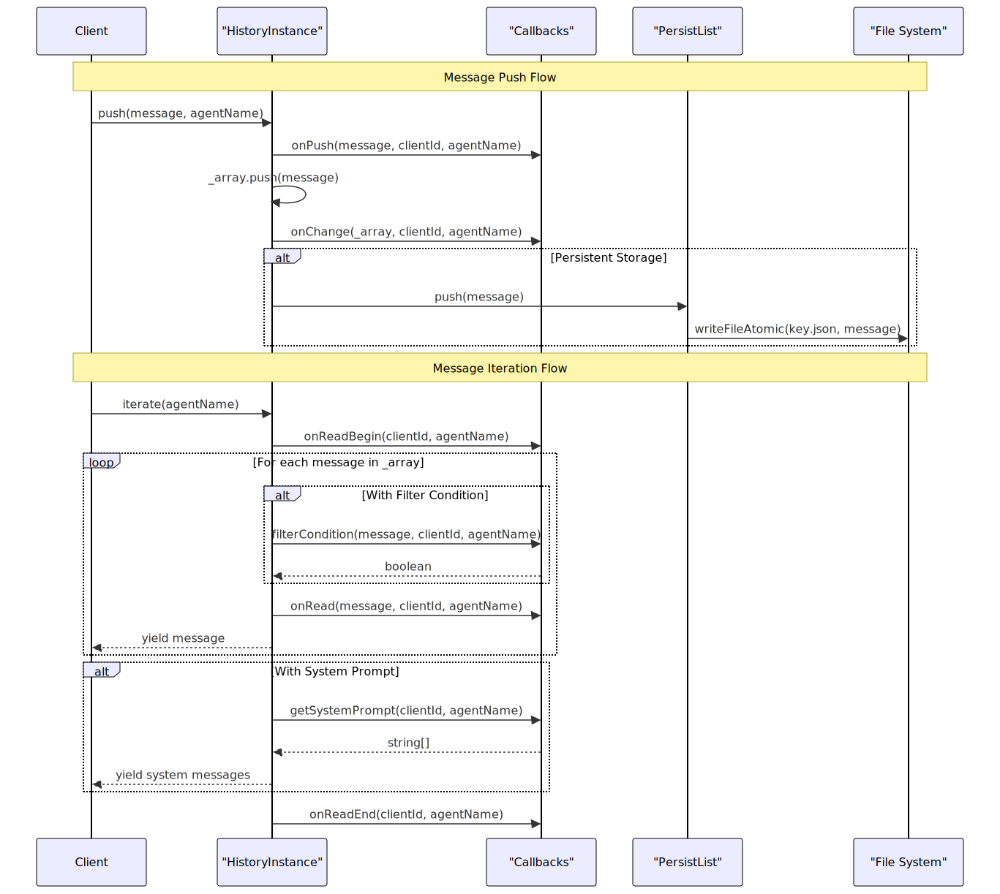

# Persistence and History

This page covers the persistence infrastructure and message history management systems in agent-swarm-kit. It focuses on the low-level persistence layer that stores entities as JSON files, the message history management for conversation continuity, and the logging infrastructure for debugging and monitoring.

For information about higher-level storage operations with embedding-based search, see [Storage and State Management](./08_Storage_and_State.md). For session lifecycle and chat management patterns, see [Session and Chat Management](./06_Session_and_Chat_Management.md).

## Persistence Infrastructure

The persistence layer provides a file-system based storage mechanism for various swarm entities. The core architecture is built around the `PersistBase` class which provides atomic JSON file operations with validation and cleanup capabilities.

### Core Persistence Architecture

### Entity Storage Patterns

The persistence system organizes data using a structured directory layout where each entity type gets its own subdirectory under the base directory (typically `./logs/data`).

### Persistence Utilities and Adapters

Each domain-specific persistence utility provides a higher-level interface over the core `PersistBase` functionality, with memoization and specialized data handling.

| Utility Class | Purpose | Entity Type | Storage Pattern |
|---------------|---------|-------------|-----------------|
| `PersistSwarmUtils` | Active agent and navigation stack | `SwarmName` → `{agentName}` or `{navigationStack}` | Per-swarm persistence |
| `PersistStateUtils` | Application state data | `StateName` → `{state}` | Per-state-name persistence |
| `PersistStorageUtils` | Storage data arrays | `StorageName` → `{data[]}` | Per-storage-name persistence |
| `PersistAliveUtils` | Client online status | `SessionId` → `{online}` | Per-client persistence |
| `PersistMemoryUtils` | Session memory data | `SessionId` → `{memory}` | Per-session persistence |

## Message History Management

Message history provides conversation continuity for agents through both in-memory and persistent storage mechanisms. The system supports filtering, system prompt injection, and lifecycle callbacks.

### History Architecture

### Message Storage and Retrieval Flow

The history system provides both transient and persistent storage options with configurable filtering and system prompt injection.

### History Lifecycle and Callbacks

The callback system allows extensive customization of history behavior including dynamic system prompts, message filtering, and lifecycle event handling.

| Callback | Purpose | Called When |
|----------|---------|-------------|
| `getSystemPrompt` | Inject dynamic system messages | During iteration after user messages |
| `filterCondition` | Filter messages during iteration | Before yielding each message |
| `getData` | Load initial history data | During `waitForInit` |
| `onChange` | React to history modifications | After push or pop operations |
| `onPush`/`onPop` | Handle individual message operations | During push/pop |
| `onRead`/`onReadBegin`/`onReadEnd` | Track read operations | During iteration |

## Logging Infrastructure

The logging system provides both global and client-specific logging capabilities with configurable output and lifecycle management.

### Logger Architecture

## Integration with Swarm Components

The persistence and history systems integrate deeply with the core swarm components to provide data continuity and debugging capabilities.

