# Schema Services

Schema Services provide centralized registry and validation for all schema types in the agent swarm system. They manage configuration schemas for agents, tools, completions, swarms, and resources using the ToolRegistry pattern from functools-kit. These services ensure schema integrity through validation and support dynamic schema overrides through SchemaContextService integration.

For connection lifecycle management of these schemas, see [Connection Services](./15_Connection_Services.md). For public API access to schemas, see [Public Services](./16_Public_Services.md).

## Architecture Overview

Schema Services form the configuration backbone of the swarm system, organizing schema management into distinct service classes that follow a consistent ToolRegistry-based pattern.

## ToolRegistry Pattern

All Schema Services implement a consistent pattern using ToolRegistry from functools-kit for schema storage and retrieval. Each service provides validation, registration, override, and retrieval operations.

## Core Schema Services

### AgentSchemaService

Manages `IAgentSchemaInternal` schemas that define agent behavior, dependencies, and resources. Validates agent configuration including completion references, prompt definitions, and resource arrays.

| Property | Type | Validation |
|----------|------|------------|
| `agentName` | `string` | Required |
| `completion` | `string` | Required (unless operator) |
| `prompt` | `string` | Required (unless operator) |
| `system` | `string[]` | Optional, unique values |
| `dependsOn` | `string[]` | Optional, unique values |
| `states` | `string[]` | Optional, unique values |
| `storages` | `string[]` | Optional, unique values |
| `tools` | `string[]` | Optional, unique values |
| `mcp` | `string[]` | Optional, unique values |

### ToolSchemaService

Manages `IAgentTool` schemas that define tool execution logic and validation. Ensures tools have proper call functions and metadata definitions.

### CompletionSchemaService

Manages `ICompletionSchema` instances that define AI model integration logic. Validates completion functions and optional flags for model behavior.

### SwarmSchemaService

Manages `ISwarmSchema` configurations that orchestrate multiple agents. Validates agent lists, default agent selection, and policy references.

## Resource Schema Services

### StateSchemaService

Manages `IStateSchema` instances for client and shared state management. Validates state initialization functions and middleware arrays.

### StorageSchemaService  

Manages `IStorageSchema` configurations for embedding-based data storage. Validates index creation functions and embedding references.

### EmbeddingSchemaService

Manages `IEmbeddingSchema` instances for similarity calculations and vector operations. Validates embedding creation and similarity functions.

## Schema Context Management

Schema Services integrate with `SchemaContextService` to support dynamic schema overrides during pipeline execution. When a schema context exists, services use context-specific registries instead of their private instances.

## Integration with Dependency Injection

Schema Services are registered in the `ISwarmDI` container and accessed by Connection Services, Public Services, and Validation Services throughout the system.

| Service | DI Key | Used By |
|---------|--------|---------|
| `AgentSchemaService` | `agentSchemaService` | `AgentConnectionService`, `DocService` |
| `ToolSchemaService` | `toolSchemaService` | `AgentConnectionService`, `DocService` |
| `CompletionSchemaService` | `completionSchemaService` | `AgentConnectionService` |
| `SwarmSchemaService` | `swarmSchemaService` | `SwarmConnectionService`, `DocService` |
| `StateSchemaService` | `stateSchemaService` | `StateConnectionService` |
| `StorageSchemaService` | `storageSchemaService` | `StorageConnectionService` |
| `EmbeddingSchemaService` | `embeddingSchemaService` | `StorageConnectionService` |
