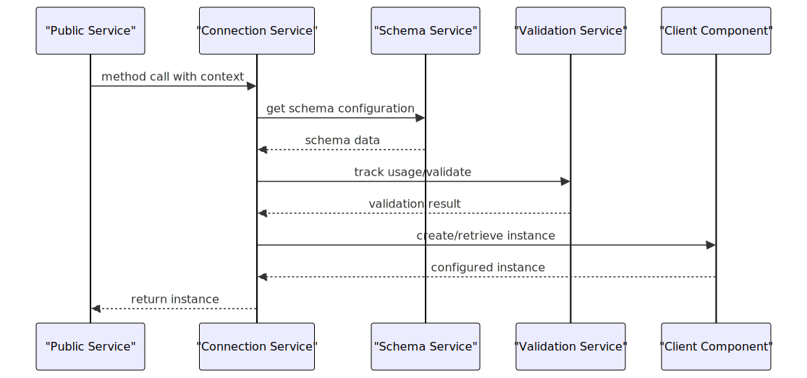

# Connection Services

Connection Services form a critical architectural layer in the agent-swarm-kit that manages the lifecycle and instantiation of core client components. These services act as a bridge between the schema configuration layer and the actual runtime client implementations, providing memoized instances and dependency injection for components like `ClientAgent`, `ClientSession`, `ClientSwarm`, and related storage/state managers.

For information about the public-facing APIs that wrap these connection services, see [Public Services](./16_Public_Services.md). For details about the underlying schema definitions these services consume, see [Schema Services](./14_Schema_Services.md).

## Service Architecture Overview

Connection Services sit between the Schema Services and the client implementation layer, providing lifecycle management and instance caching:



**Connection Services Architecture**

## Core Connection Services

### AgentConnectionService

The `AgentConnectionService` manages `ClientAgent` lifecycle and provides memoized agent instances:



**AgentConnectionService Workflow**

The service uses a memoization strategy with composite keys:

| Method | Cache Key | Purpose |
|--------|-----------|---------|
| `getAgent` | `${clientId}-${agentName}` | Creates cached `ClientAgent` instances per client-agent pair |

### SessionConnectionService 

The `SessionConnectionService` manages `ClientSession` instances with swarm integration:



**SessionConnectionService Workflow**

### SwarmConnectionService

Manages `ClientSwarm` instances and agent navigation within swarms:

| Component | Responsibility |
|-----------|----------------|
| `getSwarm()` | Creates memoized `ClientSwarm` instances per client-swarm pair |
| Navigation tracking | Maintains agent navigation stack via `CC_SWARM_STACK_CHANGED` |
| Agent resolution | Resolves current agent via `CC_SWARM_DEFAULT_AGENT` |

## Memoization Strategy

Connection Services implement a consistent memoization pattern using `functools-kit`:



**Memoization Key Strategy**

Example implementation pattern:
```typescript
public getAgent = memoize(
  ([clientId, agentName]) => `${clientId}-${agentName}`,
  (clientId: string, agentName: string) => {
    // Instance creation logic
  }
);
```

## Dependency Injection Patterns

Connection Services follow a consistent DI pattern for resource management:

| Service Type | Injection Pattern | Usage |
|--------------|-------------------|-------|
| Schema Services | `inject<AgentSchemaService>(TYPES.agentSchemaService)` | Configuration retrieval |
| Validation Services | `inject<SessionValidationService>(TYPES.sessionValidationService)` | Usage tracking |
| Base Services | `inject<LoggerService>(TYPES.loggerService)` | Logging and events |



**Dependency Injection Flow**

## Storage and State Connection Services

### StorageConnectionService

Manages `ClientStorage` instances with embedding integration:



**Storage Connection Workflow**

### StateConnectionService

Manages `ClientState` instances with middleware support:

| Feature | Implementation |
|---------|----------------|
| State caching | Memoized `ClientState` instances per client-state pair |
| Middleware pipeline | Applies `IStateMiddleware` functions during state operations |
| Persistence | Integrates with `CC_DEFAULT_STATE_GET`/`CC_DEFAULT_STATE_SET` |

## Integration with Client Components

Connection Services bridge schema configuration to client implementations:



**Service Integration Sequence**

The connection layer ensures:
- **Lifecycle Management**: Proper initialization and disposal of client components
- **Configuration Binding**: Schema data is properly injected into client constructors
- **Resource Efficiency**: Memoization prevents duplicate instance creation
- **Context Propagation**: Client and execution context flows through all layers
