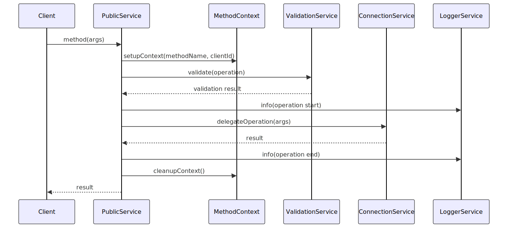

# Public Services

Public Services form the outermost API layer of the swarm system, providing a controlled interface to core functionality while managing execution context and excluding internal implementation details. These services wrap Connection Services with method-level context management, logging, and validation to create a clean separation between public APIs and internal operations.

For information about the underlying Connection Services that Public Services wrap, see [Connection Services](./15_Connection_Services.md). For details about the Schema Services that define configurations, see [Schema Services](./14_Schema_Services.md).

## Architecture Overview

Public Services implement a consistent pattern that filters internal methods from Connection Services and adds contextual wrapping to all public operations. This creates a controlled API surface while maintaining access to core functionality.

**Public Service Type Filtering Pattern**

## Core Public Services

### AgentPublicService

`AgentPublicService` provides the public interface for agent operations, excluding internal methods like `getAgent` while exposing execution, disposal, and messaging capabilities.

**AgentPublicService Method Filtering**

The service implements `TAgentConnectionService` which excludes `getAgent` from the public interface:

| Public Method | Purpose | Context Management |
|---------------|---------|-------------------|
| `createAgentRef` | Creates agent references | MethodContextService scoping |
| `execute` | Executes agent messages | Performance tracking via PerfService |
| `run` | Runs stateless completions | Execution validation |
| `dispose` | Cleans up agent resources | Resource tracking |

### SessionPublicService

`SessionPublicService` manages session-level operations with execution validation and navigation control, wrapping `SessionConnectionService` while excluding internal session management.

**SessionPublicService Validation Integration**

Key validation integrations include:

- **ExecutionValidationService**: Prevents recursive tool calls and manages execution limits
- **NavigationValidationService**: Controls agent navigation to prevent infinite loops
- **PerfService**: Tracks execution metrics and performance data

## Context Management Integration

Public Services integrate multiple context services to provide comprehensive execution tracking and method scoping.

**Context Management Flow**

| Context Service | Purpose | Data Tracked |
|----------------|---------|--------------|
| `MethodContextService` | Method-level scoping | clientId, agentName, methodName |
| `ExecutionContextService` | Execution tracking | clientId, executionId, processId |
| `PayloadContextService` | Payload access | Request/response data |
| `SchemaContextService` | Schema overrides | Temporary schema modifications |

## Performance and Logging Integration

Public Services integrate performance monitoring and logging services to provide comprehensive observability across the API layer.

**Performance Tracking Example**

## Public Service Catalog

### Core Entity Services

| Service | Purpose | Connection Service | Key Methods |
|---------|---------|-------------------|-------------|
| `AgentPublicService` | Agent operations | `AgentConnectionService` | `execute`, `run`, `dispose` |
| `SessionPublicService` | Session management | `SessionConnectionService` | `connect`, `emit`, `execute` |
| `SwarmPublicService` | Swarm operations | `SwarmConnectionService` | `getAgent`, `navigate`, `emit` |

### Data Services

| Service | Purpose | Connection Service | Key Methods |
|---------|---------|-------------------|-------------|
| `StoragePublicService` | Storage operations | `StorageConnectionService` | `take`, `upsert`, `remove` |
| `StatePublicService` | State management | `StateConnectionService` | `get`, `set`, `clear` |
| `ComputePublicService` | Compute operations | `ComputeConnectionService` | `calculate`, `update` |

### Specialized Services

| Service | Purpose | Connection Service | Key Methods |
|---------|---------|-------------------|-------------|
| `PolicyPublicService` | Policy enforcement | `PolicyConnectionService` | `validate`, `ban`, `unban` |
| `MCPPublicService` | External tool integration | `MCPConnectionService` | `callTool`, `listTools` |
| `HistoryPublicService` | Message history | `HistoryConnectionService` | `push`, `pop`, `flush` |

## Method Wrapping Pattern

Public Services implement a consistent method wrapping pattern that adds context management, validation, and logging to all operations.

**Method Wrapping Sequence**

The pattern ensures:
- **Context Isolation**: Each method call has isolated context
- **Validation**: Operations are validated before execution
- **Logging**: All operations are logged with context
- **Error Handling**: Consistent error handling and cleanup
- **Performance Tracking**: Execution metrics are captured
