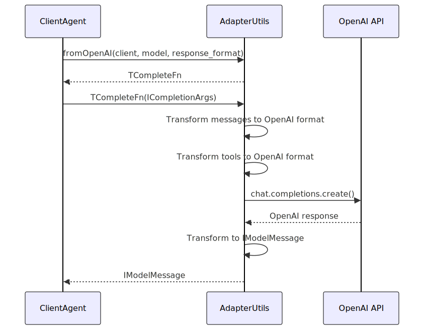

# Completion Adapters

## Purpose and Scope

Completion Adapters provide a standardized interface for integrating various AI completion providers (OpenAI, Ollama, Grok, Cohere, etc.) into the agent-swarm-kit system. These adapters handle the translation between the framework's internal message format and each provider's specific API requirements, including message transformation, tool call processing, and error handling.

For information about AI model performance monitoring, see [Performance Monitoring](./20_Performance_Monitoring.md). For details about agent-level completion configuration, see [Schema Services](./14_Schema_Services.md).

## Architecture Overview

The completion adapter system is built around the `AdapterUtils` class, which provides factory methods that return standardized completion functions. Each adapter method transforms the internal `ICompletionArgs` format into provider-specific requests and converts responses back to the framework's `IModelMessage` format.



## Core Components

### AdapterUtils Class

The `AdapterUtils` class serves as the primary factory for creating provider-specific completion functions. Each method returns a `TCompleteFn` that conforms to the standard completion interface.

| Component | Type | Purpose |
|-----------|------|---------|
| `AdapterUtils` | Class | Main factory for completion adapters |
| `TCompleteFn` | Type | Standard completion function signature |
| `TOOL_PROTOCOL_PROMPT` | Constant | XML-based tool call instruction template |
| `Adapter` | Singleton | Default instance of AdapterUtils |

### Configuration Constants

The adapter system uses several configuration constants for reliability and performance:

| Constant | Value | Purpose |
|----------|-------|---------|
| `EXECPOOL_SIZE` | 5 | Maximum concurrent executions |
| `EXECPOOL_WAIT` | 0 | Delay between executions (ms) |
| `RETRY_COUNT` | 5 | Maximum retry attempts |
| `RETRY_DELAY` | 5000 | Delay between retries (ms) |

## Provider Implementations

### OpenAI Adapter

The `fromOpenAI` method creates an adapter for OpenAI's chat completions API, supporting both GPT models and custom response formats.



### Ollama Adapter

The `fromOllama` method handles Ollama's local model API, including custom tool call protocol injection for models that don't natively support function calling.

Key features:
- Injects `TOOL_PROTOCOL_PROMPT` for tool call support
- Handles local model persistence with `keep_alive: "24h"`
- Generates tool call IDs using `randomString()`

### Other Provider Adapters

| Provider | Method | Key Features |
|----------|--------|--------------|
| Grok | `fromGrok` | X.AI's Grok model API integration |
| Cortex | `fromCortex` | Local Cortex server with message deduplication |
| Cohere | `fromCohereClientV2` | Cohere Command-R model support |
| LMStudio | `fromLMStudio` | OpenAI-compatible local server |

## Message Transformation

### Input Transformation

All adapters perform similar input transformations to convert from the internal `ICompletionArgs` format:



### Tool Call Processing

Tool calls require special handling to convert between the internal format and provider-specific representations:



## Reliability Features

### Retry Logic

All adapters implement retry logic using the `retry` utility with configurable attempts and delays:

```typescript
retry(
  async (args: ICompletionArgs) => {
    // Adapter implementation
  },
  RETRY_COUNT,    // 5 attempts
  RETRY_DELAY     // 5000ms delay
)
```

### Execution Pooling

Requests are managed through `execpool` to limit concurrency and prevent API rate limiting:

```typescript
execpool(
  retryFunction,
  {
    maxExec: EXECPOOL_SIZE,  // 5 concurrent
    delay: EXECPOOL_WAIT     // 0ms delay
  }
)
```

### Message Deduplication

Some adapters (like Cortex) implement message deduplication to handle consecutive messages of the same role:

## Integration Points

### Logging Integration

All adapters integrate with the `Logger` class for request tracking:

```typescript
Logger.logClient(
  clientId,
  "AdapterUtils fromOpenAI completion",
  JSON.stringify(rawMessages)
);
```

### Schema Service Integration

Completion adapters are registered and accessed through the completion schema services in the dependency injection system. The adapters are typically configured at the agent level through completion schema definitions.

### Performance Monitoring

Adapter executions are tracked by the performance monitoring system for metrics collection and analysis. See [Performance Monitoring](./04_Client_Agent.md) for details on how completion times and throughput are measured.
