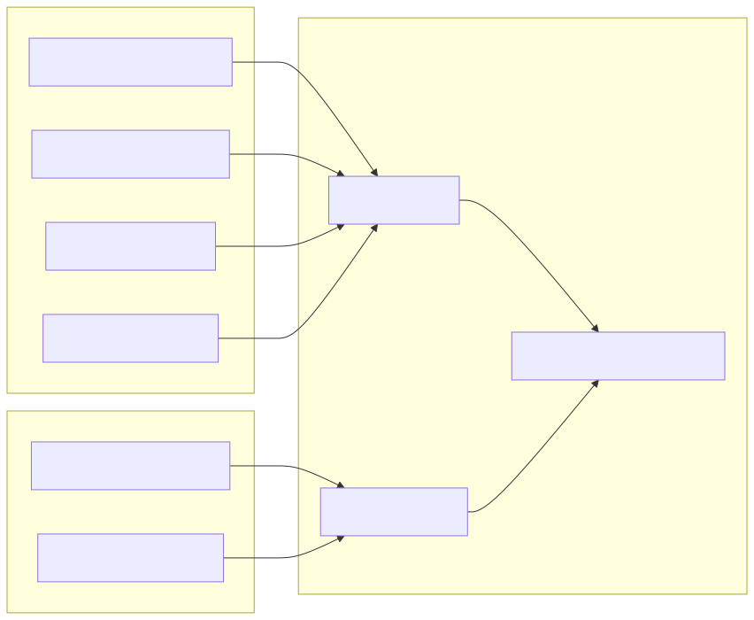

# Performance Monitoring

This document covers the performance monitoring system in agent-swarm-kit, which tracks execution metrics, response times, and system performance across client sessions and agent operations. The monitoring system provides detailed performance analytics for both individual clients and system-wide aggregation.

For information about AI completion adapters and their performance optimizations, see [Completion Adapters](./19_Completion_Adapters.md). For system introspection and documentation generation, see [Documentation Generation](./21_Documentation_Generation.md).

## Overview

The performance monitoring system centers around the `PerfService` class, which tracks execution metrics throughout the agent swarm lifecycle. It integrates with the dependency injection container to monitor client sessions, agent executions, and system-wide performance patterns.

The system captures metrics including:
- Execution counts and response times
- Input/output data volumes
- Session state and memory usage
- Client-specific and system-wide aggregations

## Core Architecture

The performance monitoring system follows a layered architecture within the service framework:


## PerfService Class Structure

The `PerfService` class manages performance tracking through several key components:


## Performance Metrics Tracked

The system tracks comprehensive performance metrics across multiple dimensions:

| Metric Category | Client-Level Metrics | System-Level Metrics |
|-----------------|---------------------|---------------------|
| **Execution Counts** | `executionCount` | `totalExecutionCount` |
| **Response Times** | `executionTimeTotal`, `executionTimeAverage` | `totalResponseTime`, `averageResponseTime` |
| **Data Volume** | `executionInputTotal`, `executionOutputTotal` | Aggregated across clients |
| **Data Throughput** | `executionInputAverage`, `executionOutputAverage` | Calculated per client |
| **Session Data** | `sessionMemory`, `sessionState` | Not applicable |
| **Temporal Context** | Tracked per execution | `momentStamp`, `timeStamp`, `date` |

### Execution Tracking Maps

The `PerfService` maintains several internal maps for tracking metrics:

- `executionScheduleMap`: Tracks start timestamps for active executions per client
- `executionCountMap`: Maintains execution counts per client
- `executionInputLenMap`: Tracks cumulative input data sizes
- `executionOutputLenMap`: Tracks cumulative output data sizes
- `executionTimeMap`: Accumulates total execution times per client

## Execution Lifecycle Integration

Performance monitoring integrates tightly with the agent execution lifecycle through start/end tracking:


### Start Execution Process

The `startExecution` method initializes tracking for a new execution:

```typescript
// From PerfService.startExecution
const startTime = Date.now();
if (!this.executionScheduleMap.has(clientId)) {
    this.executionScheduleMap.set(clientId, new Map());
}
// Initialize other maps and increment counters
```

### End Execution Process

The `endExecution` method calculates metrics and updates totals:

```typescript
// From PerfService.endExecution
const startTime = clientStack.pop()!;
const endTime = Date.now();
const responseTime = endTime - startTime;
this.totalResponseTime += responseTime;
this.totalRequestCount += 1;
```

## Performance Data Structures

The system uses two primary data structures for performance reporting:

### IPerformanceRecord Structure

System-wide performance aggregation:

```typescript
interface IPerformanceRecord {
    processId: string;           // Unique process identifier
    clients: IClientPerfomanceRecord[];  // Per-client records
    totalExecutionCount: number; // System-wide execution count
    totalResponseTime: string;   // Formatted total time
    averageResponseTime: string; // Formatted average time
    momentStamp: number;         // Days since epoch (UTC)
    timeStamp: number;          // Seconds since midnight UTC
    date: string;               // ISO date string
}
```

### IClientPerfomanceRecord Structure

Client-specific performance details:

```typescript
interface IClientPerfomanceRecord {
    clientId: string;
    sessionMemory: Record<string, unknown>;    // From MemorySchemaService
    sessionState: Record<string, unknown>;     // Computed client state
    executionCount: number;
    executionInputTotal: number;
    executionOutputTotal: number;
    executionInputAverage: number;             // Calculated average
    executionOutputAverage: number;            // Calculated average
    executionTimeTotal: string;               // Formatted with msToTime
    executionTimeAverage: string;             // Formatted with msToTime
}
```

## State and Memory Integration

The performance monitoring system integrates with session state and memory systems to provide comprehensive client context:



### Client State Computation

The `computeClientState` method aggregates state information:

```typescript
// From PerfService.computeClientState
const swarmName = this.sessionValidationService.getSwarm(clientId);
const agentName = await this.swarmPublicService.getAgentName(
    METHOD_NAME_COMPUTE_STATE, clientId, swarmName
);

const result: Record<string, unknown> = {
    swarmStatus: { swarmName, agentName },
    policyBans: Object.fromEntries(policyBans),
    // ... state values from agents
};
```

## Time Formatting and Utilities

The system uses several utility functions for data processing and formatting:

### msToTime Utility

Converts milliseconds to human-readable time format:

```typescript
// From msToTime utility
export const msToTime = (s: number) => {
    const ms = s % 1000;
    s = (s - ms) / 1000;
    const secs = String(s % 60);
    // ... format as "HH:MM:SS.ms"
};
```

### Usage in Performance Records

Time formatting is applied to duration metrics:

```typescript
// From PerfService.toClientRecord
return {
    // ... other fields
    executionTimeTotal: msToTime(executionTimeTotal),
    executionTimeAverage: msToTime(executionTimeAverage),
};
```

## Configuration and Logging Integration

Performance monitoring integrates with the global configuration and logging systems:

### Configuration Control

Performance logging is controlled by global configuration:

```typescript
// From PerfService methods
GLOBAL_CONFIG.CC_LOGGER_ENABLE_INFO &&
    this.loggerService.info(`perfService startExecution`, {
        executionId, clientId, inputLen
    });
```

### Process Identification

Performance records include process identification:

```typescript
// From PerfService.toRecord
return {
    processId: GLOBAL_CONFIG.CC_PROCESS_UUID,
    // ... other fields
};
```

### Disposal and Cleanup

The system provides cleanup methods for client termination:

```typescript
// From PerfService.dispose
public dispose = (clientId: string): void => {
    this.executionScheduleMap.delete(clientId);
    this.executionCountMap.delete(clientId);
    this.executionInputLenMap.delete(clientId);
    this.executionOutputLenMap.delete(clientId);
    this.executionTimeMap.delete(clientId);
};
```

## Performance Adapter Integration

The monitoring system works alongside performance optimizations in the `Adapter` class, which implements execution pooling and retry logic for AI completions:

### Execution Pooling Configuration

```typescript
// From Adapter class constants
const EXECPOOL_SIZE = 5;        // Maximum concurrent executions
const EXECPOOL_WAIT = 0;        // Delay between executions
const RETRY_COUNT = 5;          // Maximum retry attempts
const RETRY_DELAY = 5_000;      // Delay between retries
```

### Integration with Performance Tracking

Adapter operations can be monitored through the performance system when integrated with client operations that call `startExecution` and `endExecution`.
