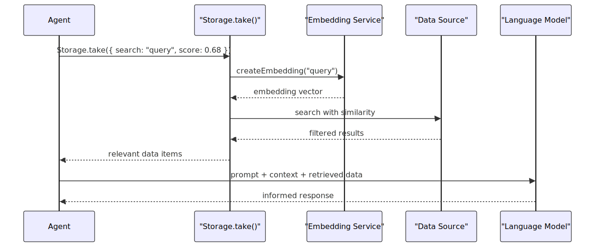

# Usage Patterns

This document describes common usage patterns and best practices for building multi-agent AI systems with agent-swarm-kit. It covers the fundamental patterns for setting up agents, orchestrating multi-agent workflows, integrating tools, and managing sessions. For specific API details, see [Core API Functions](./32_Core_API_Functions.md). For implementation examples, see [Examples and Testing](./27_Examples_and_Testing.md).

## Core Setup Patterns

The foundation of any agent swarm system involves defining agents, completions, and swarms. These components follow a dependency injection pattern where entities are registered by name and resolved at runtime.

### Basic Agent Definition Pattern

The typical setup sequence follows this pattern:

1. **Completion Definition**: Register AI model adapters using `addCompletion`
2. **Tool Registration**: Define custom tools with `addTool` 
3. **Agent Creation**: Combine completions and tools into agents with `addAgent`
4. **Swarm Assembly**: Group agents into coordinated swarms with `addSwarm`
5. **Session Initialization**: Create client sessions with `session`

### Dependency Injection Pattern

The library uses string-based dependency injection to enable modular agent definitions:

This pattern allows agents to be defined in separate modules and connected via string constants, enabling better code organization and testability.

## Multi-Agent Orchestration Patterns

Multi-agent orchestration involves coordinating multiple AI agents within a single conversation session, with agents able to hand off conversations to specialized counterparts.

### Navigation-Based Agent Switching

The navigation pattern uses specialized tools that call `changeAgent` to switch the active agent for a client session. All agents share the same message history (limited to the last 25 messages with `assistant` and `user` roles).

### Shared History Management

Each agent maintains its own system prompt and tool context while sharing conversational history, ensuring smooth handoffs between specialized agents.

## Background Processing Patterns

Background processing enables agents to perform complex computations or data processing independently from the main chat session, similar to POSIX fork behavior.

### Fork Pattern for Isolated Execution

The `fork` function creates completely isolated agent sessions for background processing, with automatic cleanup and error handling.

### Scope Pattern for Temporary Overrides

The `scope` pattern allows temporary schema modifications within a controlled context:

## Tool Integration Patterns

Tools provide extensibility by allowing agents to execute custom functions, integrate with external systems, and access specialized capabilities.

### Dynamic Tool Definition Pattern

Tools can adapt their behavior based on the calling agent and client context, enabling sophisticated integrations.

### Model Context Protocol (MCP) Integration

MCP integration allows agents to seamlessly interact with external tools and services written in different languages.

## Storage and Retrieval Patterns

Storage patterns enable agents to access persistent data and perform vector-based retrieval for RAG (Retrieval-Augmented Generation) applications.

### Vector Storage Setup Pattern

The storage pattern combines embedding models with data sources to enable semantic search capabilities within agent conversations.

### RAG Implementation Pattern

RAG implementation leverages embedding-based similarity search to provide agents with relevant context for more informed responses.

## Session Management Patterns

Session management handles the lifecycle of client connections, message processing, and resource cleanup in multi-user environments.

### WebSocket Session Pattern

The session pattern provides clean separation between transport layer (WebSocket) and business logic (agent execution).

### Connection Disposal Pattern

Proper connection disposal prevents memory leaks and ensures clean shutdown of agent sessions.

## Error Handling and Recovery Patterns

Error handling patterns ensure robust operation when agents produce invalid outputs, tools fail, or external services are unavailable.

### Model Recovery Pattern

The recovery algorithm progressively attempts to fix model outputs, finally falling back to a polite placeholder response when all recovery attempts fail.

### Validation Service Pattern

Validation services ensure system integrity by checking configurations, dependencies, and runtime state before execution.
