# Managing State and Storage

This document covers patterns and best practices for managing persistent storage and application state within the agent swarm system. It focuses on the `ClientStorage` and `ClientState` implementations, their associated services, and embedding-based retrieval patterns.

For information about session lifecycle management, see [Session and Chat Management](./06_Session_and_Chat_Management.md). For details about the persistence infrastructure and history management, see [Persistence and History](./09_Persistence_and_History.md).

## State Management Architecture

The state management system provides client-scoped and shared state with dispatch-based updates, middleware support, and optional persistence.

### State Service Hierarchy


### State Lifecycle and Operations


## Storage Management Architecture

The storage system provides embedding-based similarity search, CRUD operations, and client-scoped or shared storage with event-driven updates.

### Storage Service Hierarchy


### Embedding-Based Similarity Search



## Persistence Patterns

### State Persistence

State persistence is controlled by the `persist` flag in state schemas and uses either `PersistStateAdapter` or custom functions:

| Pattern | Configuration | Implementation |
|---------|--------------|----------------|
| **Auto Persistence** | `persist: true` | Uses `PersistStateAdapter.getState` and `PersistStateAdapter.setState` |
| **Custom Persistence** | Custom `getState`/`setState` | User-defined functions for state retrieval and storage |
| **Memory Only** | `persist: false` | Uses `GLOBAL_CONFIG.CC_DEFAULT_STATE_GET` and `CC_DEFAULT_STATE_SET` |
| **Shared State** | `shared: true` | Single instance across all clients with `clientId: "shared"` |

### Storage Persistence


## Client vs Shared Resource Management

### Resource Scoping Patterns

The system distinguishes between client-specific and shared resources through configuration and service delegation:



### Memoization and Lifecycle

Both state and storage services use memoization for efficient instance reuse:

| Service | Memoization Key | Lifecycle Management |
|---------|----------------|---------------------|
| `StateConnectionService` | `"${clientId}-${stateName}"` | Tracked in `SessionValidationService`, cleared on dispose |
| `StorageConnectionService` | `"${clientId}-${storageName}"` | Tracked in `SessionValidationService`, cleared on dispose |
| `SharedStateConnectionService` | `"${stateName}"` | No disposal - managed globally |
| `SharedStorageConnectionService` | `"${storageName}"` | No disposal - managed globally |

## Event-Driven Updates

### State Events

`ClientState` emits events for all state operations through `BusService`:

- `set-state`: Emitted after successful state updates
- `clear-state`: Emitted after state reset operations  
- `get-state`: Emitted after state retrieval operations

### Storage Events

`ClientStorage` emits events for all storage operations:

- `upsert`: Emitted after item insertion/updates
- `remove`: Emitted after item deletion
- `clear`: Emitted after storage reset
- `take`: Emitted after similarity search operations
- `get`: Emitted after item retrieval
- `list`: Emitted after listing operations with filters

## Best Practices

### State Management

1. **Use Dispatch Functions**: Always update state through dispatch functions for consistency:
   ```typescript
   await setState(async (prevState) => ({ ...prevState, newField: value }))
   ```

2. **Leverage Middlewares**: Apply cross-cutting concerns through state middlewares for validation, logging, or transformations.

3. **Shared vs Client-Specific**: Use `shared: true` for application-wide state, client-specific for user sessions.

### Storage Management

1. **Optimize Embeddings**: Cache embeddings using `writeEmbeddingCache` and `readEmbeddingCache` to avoid redundant computations.

2. **Batch Operations**: Use `execpool` configuration via `GLOBAL_CONFIG.CC_STORAGE_SEARCH_POOL` to control concurrent embedding operations.

3. **Score Thresholds**: Set appropriate similarity scores in `take()` operations to filter relevant results.

### Fork Operations for Background Processing

Use the `fork()` function for isolated state and storage operations in background contexts:

```typescript
const result = await fork(async (clientId, agentName) => {
  // Isolated storage/state operations
  return await processData(clientId);
}, { clientId: randomString(), swarmName: "ProcessingSwarm" });
```
