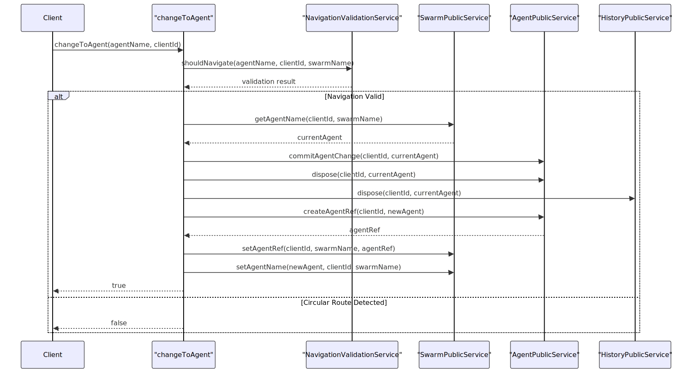
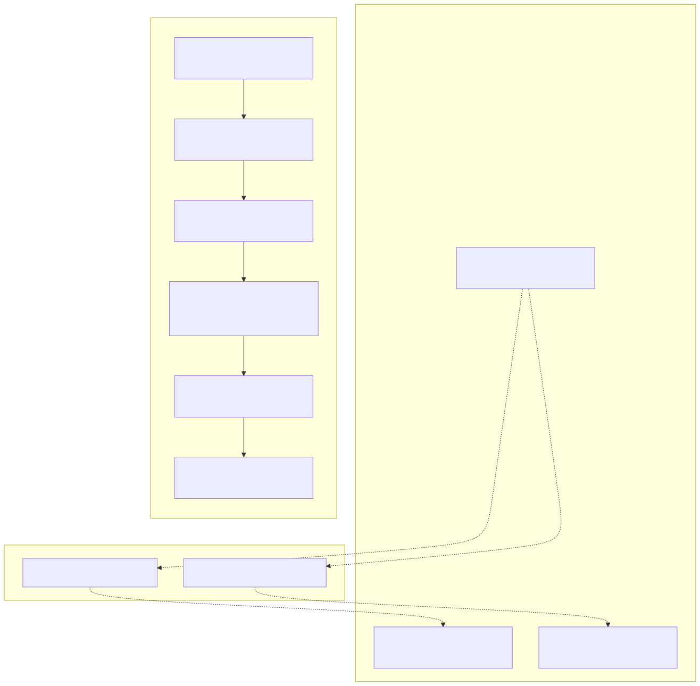
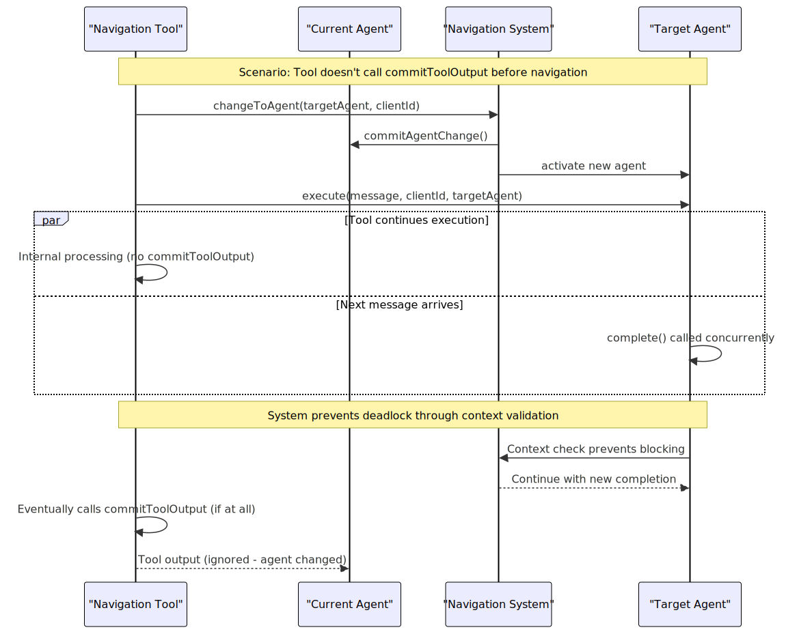

# Agent Navigation and Tool Execution

This document covers the dynamic orchestration of agent transitions and tool execution within multi-agent workflows. It explains how agents can navigate between each other, execute tools that trigger further navigation, and coordinate complex workflows through the pipeline system.

For basic agent and swarm setup, see [Building Multi-Agent Systems](./23_Building_Multi-Agent_Systems.md). For tool integration patterns, see [Tool Integration](./24_Tool_Integration.md). For session management fundamentals, see [Session and Chat Management](./06_Session_and_Chat_Management.md).

## Agent Navigation System

The agent navigation system enables dynamic switching between agents within a swarm during execution. The core navigation functions provide controlled transitions with validation, queuing, and circular route prevention.

### Core Navigation Functions

The system provides three primary navigation functions that handle agent transitions:

| Function | Purpose | Key Behavior |
|----------|---------|--------------|
| `changeToAgent` | Switch to specific agent | Validates dependencies, prevents circular routes |
| `changeToDefaultAgent` | Return to swarm default agent | Uses swarm schema default agent |
| `changeToPrevAgent` | Navigate to previous agent | Uses navigation stack with fallback to default |

### Navigation Implementation Details

Each navigation function uses a memoized, queued execution pattern to prevent race conditions and ensure sequential processing per client:

## Tool Execution Framework

Tools can trigger agent navigation and execute complex workflows. The tool execution system integrates with the navigation system to enable sophisticated multi-agent interactions.

### Navigation Tools Pattern

Navigation tools are a common pattern where tool execution triggers agent transitions:

### Tool Execution Lifecycle

The tool execution lifecycle involves validation, execution, and result commitment, with navigation capabilities:

## Pipeline-Based Workflows

The pipeline system enables complex workflows with agent navigation and automated execution patterns. Pipelines can switch agents during execution and restore the original agent afterward.

### Pipeline Execution with Navigation

The `startPipeline` function demonstrates advanced agent orchestration:

### Pipeline Schema Structure

Pipeline schemas define execution logic and lifecycle callbacks:

| Component | Purpose | Type |
|-----------|---------|------|
| `pipelineName` | Unique identifier | `string` |
| `execute` | Main execution function | `(clientId, agentName, payload) => Promise<T>` |
| `callbacks.onStart` | Pre-execution callback | `(clientId, pipelineName, payload) => void` |
| `callbacks.onEnd` | Post-execution callback | `(clientId, pipelineName, payload, isError) => void` |
| `callbacks.onError` | Error handling callback | `(clientId, pipelineName, payload, error) => void` |

## Complex Navigation Patterns

Real-world scenarios involve intricate navigation patterns with multiple agents, tool chains, and error handling.

### Multi-Agent Workflow Example

This example shows a triage agent that routes users to specialized agents:

### Deadlock Prevention Mechanisms

The system includes several mechanisms to prevent deadlocks and race conditions:

## Testing and Validation

The system includes comprehensive testing patterns for navigation and tool execution scenarios.

### Connection Orchestration Tests

The test suite validates that multiple concurrent connections maintain separate navigation states:

### Queue Management Tests

Message queuing ensures proper execution order even with concurrent operations:

| Test Scenario | Validation | Key Behavior |
|---------------|------------|--------------|
| Sequential message processing | `["foo", "bar", "baz"]` order maintained | Messages queued per client |
| Concurrent client isolation | Each client processes independently | No cross-client interference |
| Agent state consistency | History reflects correct agent transitions | Agent changes don't corrupt history |
