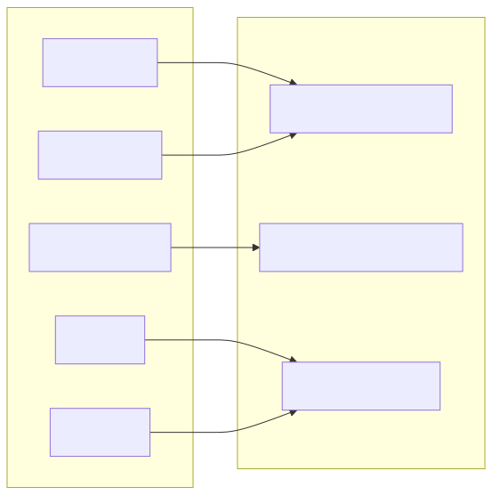
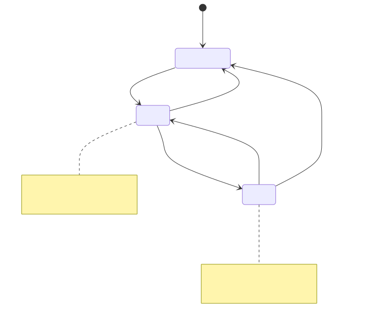
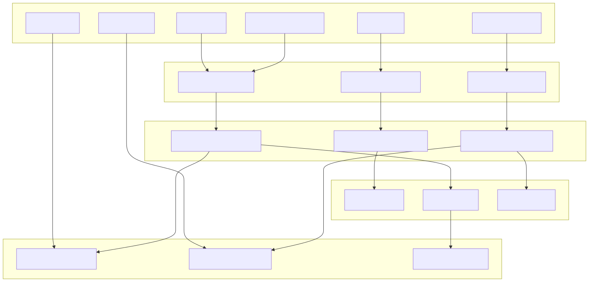

# Core API Functions

This document covers the primary public API functions that developers use to build multi-agent AI systems with agent-swarm-kit. These functions provide the main interface for defining agents, managing sessions, executing messages, and orchestrating swarm behavior.

For information about the underlying service architecture that powers these APIs, see [Service Architecture](./12_Service_Architecture.md). For detailed configuration options and global settings, see [Configuration and Global Settings](./33_Configuration_and_Global_Settings.md).

## Overview

The core API functions are organized into several categories based on their primary purpose:

- **Setup Functions**: Define agents, swarms, tools, and other system components
- **Session Management**: Create and manage client sessions with swarms  
- **Execution Functions**: Execute messages and manage agent interactions
- **Commit Functions**: Manually control message history and state
- **Navigation Functions**: Control agent transitions within swarms
- **Override Functions**: Modify system behavior for testing and customization

All core API functions are exported from the main entry point and can be imported directly from the `agent-swarm-kit` package.

## Core API Function Categories

### Setup Functions

The setup functions define the building blocks of the agent swarm system. These functions register schemas and configurations that are later resolved at runtime through the dependency injection system.


| Function | Purpose | Returns | Key Parameters |
|----------|---------|---------|----------------|
| `addAgent()` | Define an agent with prompt, tools, and completion | `AgentName` | `agentName`, `prompt`, `completion`, `tools` |
| `addSwarm()` | Define a swarm containing multiple agents | `SwarmName` | `swarmName`, `agentList`, `defaultAgent` |
| `addTool()` | Define a tool that agents can call | `ToolName` | `toolName`, `call`, `validate`, `function` |
| `addCompletion()` | Define an AI model completion provider | `CompletionName` | `completionName`, `getCompletion` |
| `addMCP()` | Define Model Context Protocol integration | `MCPName` | `mcpName`, `connect`, `callTool` |

### Session Management Functions

Session management functions create and control client sessions within swarms. The `session()` function is the primary entry point for establishing a connection between a client and a swarm.


The `session()` function returns an object with four key methods:

| Method | Purpose | Parameters | Returns |
|--------|---------|------------|---------|
| `complete()` | Execute a message and return the response | `message: string` | `Promise<string>` |
| `dispose()` | Clean up session resources | None | `Promise<void>` |
| `emit()` | Send a message to session listeners | `message: string` | `Promise<void>` |
| `notify()` | Send a notification to session listeners | `message: string` | `Promise<void>` |

### Execution Functions

Execution functions provide different ways to interact with agents and process messages. These functions offer varying levels of control over how messages are processed and whether they affect conversation history.



| Function | History Update | Context | Use Case |
|----------|----------------|---------|----------|
| `execute()` | Yes | Current session | Standard message processing |
| `complete()` | Yes | Current session | Session-based completion |
| `runStateless()` | No | Current session | Preview/test without affecting history |
| `fork()` | Yes | New isolated session | Background processing |
| `scope()` | Yes | Temporary modified context | Testing with schema overrides |

### Message Commit Functions

Commit functions provide fine-grained control over conversation history by allowing manual insertion of specific message types. These functions bypass normal execution flow and directly manipulate the message history.


### Navigation Functions

Navigation functions control agent transitions within swarms. These functions change which agent is currently active for processing messages in a client session.



| Function | Purpose | Parameters | Behavior |
|----------|---------|------------|----------|
| `changeToAgent()` | Switch to a specific agent | `agentName`, `clientId` | Pushes current agent to navigation stack |
| `changeToPrevAgent()` | Return to previous agent | `clientId` | Pops from navigation stack |
| `changeToDefaultAgent()` | Return to swarm's default agent | `clientId`, `swarmName` | Clears navigation stack |

## API Function Implementation Mapping

This diagram shows how the core API functions map to their underlying implementation classes and services:



## Function Usage Patterns

### Basic Agent and Swarm Setup

```typescript
// Define completion provider
const completion = addCompletion({
  completionName: "my-completion",
  getCompletion: async (args) => { /* implementation */ }
});

// Define tools
const navigateTool = addTool({
  toolName: "navigate-tool",
  call: async ({ clientId, params }) => {
    await changeToAgent(params.targetAgent, clientId);
  },
  function: {
    name: "navigate-tool",
    description: "Navigate to another agent",
    parameters: { /* schema */ }
  }
});

// Define agents
const triageAgent = addAgent({
  agentName: "triage-agent",
  completion,
  prompt: "You are a triage agent...",
  tools: [navigateTool]
});

const salesAgent = addAgent({
  agentName: "sales-agent", 
  completion,
  prompt: "You are a sales agent...",
  tools: [navigateTool]
});

// Define swarm
const mySwarm = addSwarm({
  swarmName: "customer-service",
  agentList: [triageAgent, salesAgent],
  defaultAgent: triageAgent
});
```

### Session Management and Execution

```typescript
// Create session
const { complete, dispose, emit, notify } = session(clientId, mySwarm);

// Execute messages
const response = await complete("I need help with my order");

// Manual message commits
await commitUserMessage("Hello", clientId);
await commitAssistantMessage("Hi there!", clientId);

// Navigation
await changeToAgent("sales-agent", clientId);
const salesResponse = await complete("What products do you have?");

// Cleanup
await dispose();
```

### Advanced Execution Patterns

```typescript
// Background processing with fork
const report = await fork(
  async (clientId, agentName) => {
    // Isolated execution context
    return await complete("Generate monthly report", clientId);
  },
  { clientId: "background-client", swarmName: mySwarm }
);

// Stateless execution for testing
const preview = await runStateless("Test message", clientId, agentName);

// Temporary schema modifications with scope
await scope(async () => {
  overrideAgent({
    agentName: "test-agent",
    prompt: "Modified prompt for testing"
  });
  
  const result = await complete("Test with modified agent");
  return result;
});
```

## Error Handling and Validation

The core API functions include built-in validation and error handling mechanisms:


Common validation patterns include:
- Session existence checking before operations
- Agent and swarm name validation against registered schemas
- Navigation recursion prevention
- Maximum execution depth limits
- Client ID format validation

## Context Management

Core API functions operate within execution contexts managed by the dependency injection system:


The context system ensures that:
- Function calls have access to the correct client and agent context
- Schema overrides are properly scoped to their execution context
- Payloads are preserved across function calls within the same context
- Execution tracking works correctly across nested function calls