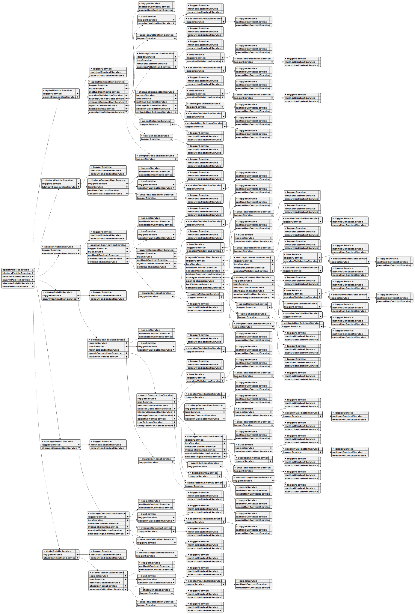

# agent-swarm-kit api reference

**Overall Architecture:**

This system built around a distributed, asynchronous architecture. Agents communicate via a message queue, and their interactions are orchestrated through a series of tools and processes. The core concept is to allow agents to perform tasks independently while still being part of a larger, coordinated system.

**Core Concepts & Relationships**

* **Swarm Orchestration:** The entire framework is built around orchestrating agents to perform tasks.
* **Agent as the Central Unit:** The `IAgent` is the fundamental building block – the individual agent that executes tasks.
* **Communication (Bus):** The `IAgentParams` interface highlights the importance of the `bus` (a messaging system) for agents to communicate and coordinate.
* **History Management:** The `IAgent` and `IAgentParams` emphasize the agent's ability to operate without relying on conversation history (using the `run` method).
* **Tool Execution:** The `IAgent`’s `call` and `execute` methods are central to running tools within the agent.
* **Schema & Configuration:** The `IAgentSchema` defines the configuration for each agent, including its tools, prompt, and completion mechanism.

**Interface Breakdown & Key Responsibilities**

Here’s a summary of each interface and its role:

* **`IAgent`:** The core runtime agent.  Handles independent execution, tool calls, message commitment, and lifecycle management.
* **`IAgentParams`:**  Provides the agent with the necessary parameters for operation, including its ID, logging, communication channel, and history management.
* **`IAgentSchema`:** Defines the configuration settings for an agent (tools, prompt, completion mechanism).
* **`IAgentSchemaCallbacks`:**  Provides callbacks for managing different stages of an agent’s lifecycle (init, run, output, etc.).
* **`IAgentConnectionService`:** A type definition for an `AgentConnectionService` – a service that manages connections between the agents.

**Workflow Implications**

Based on these interfaces, here’s a workflow:

1. **Agent Configuration:** An `IAgentSchema` is created to define the agent’s settings.
2. **Agent Instantiation:** An `IAgent` instance is created based on the schema.
3. **Agent Execution:** The `IAgent`’s `execute` method is called to initiate independent operation.
4. **Tool Calls:**  The `IAgent` uses `call` to execute tools.
5. **Message Handling:** The `IAgent` uses `commitToolOutput`, `commitSystemMessage`, and `commitUserMessage` to manage messages.
6. **Communication:** The `IAgent` uses the `bus` (via `IAgentParams`) to communicate with other agents.

**Key Concepts & Implications:**

* **State Management:** Agents maintain their own state (conversation history, tool outputs, etc.).
* **Decoupling:** The interfaces are designed to decouple different components of the system. This allows for flexibility and easier maintenance.
* **Event-Driven Architecture:** The use of callbacks suggests an event-driven architecture, where components communicate through events rather than direct calls.
* **State Management:** The interfaces highlight the importance of managing the agent's state, including conversation history, tool output, and system messages.
* **Tool Integration:** The `tools` property in `IAgentParams` indicates a system designed to integrate with external tools.
* **Asynchronous Communication:** Agents communicate asynchronously via a bus, allowing them to operate independently.
* **Flexibility:** The system is designed to be flexible, a

**Potential Use Cases:**

This architecture could be used for a wide range of applications, including:

* **Chatbots:**  Agents could be used to power conversational AI systems.
* **Content Generation:** Agents could be used to generate text, images, or other content.
* **Data Analysis:** Agents could be used to analyze data and generate insights.

# agent-swarm-kit classes

## Class ToolValidationService

The ToolValidationService is a core component of the swarm system, responsible for ensuring the integrity of tool configurations. It maintains a record of all registered tools and their associated schemas, preventing duplicates and verifying their presence. This service works closely with other key components, including the ToolSchemaService for tool registration, the AgentValidationService for agent tool validation, and the ClientAgent for tool usage.  It leverages dependency injection to manage logging, using the logger service to record validation activities and errors, and employs memoization to optimize the performance of tool existence checks. The `addTool` method registers new tools with their schemas, while the `validate` method efficiently checks for tool existence, providing a robust mechanism for managing tool configurations within the swarm.

## Class ToolSchemaService

The ToolSchemaService is the core service responsible for managing tool definitions within the swarm system. It acts as a central repository, utilizing the ToolRegistry from functools-kit to store and retrieve IAgentTool instances. This service performs shallow validation on each tool schema to guarantee its integrity, ensuring that key properties like toolName, call, validate, and function are correctly defined.

The service integrates seamlessly with several other components, including AgentSchemaService (managing tool references in agent schemas), ClientAgent (facilitating tool usage during execution), AgentConnectionService (handling agent instantiation with tools), and SwarmConnectionService (orchestrating swarm-level agent execution).  It leverages a LoggerService for logging operations at the INFO level, controlled by the GLOBAL_CONFIG.CC_LOGGER_ENABLE_INFO setting, aligning with logging practices in other services.

The ToolSchemaService provides a robust mechanism for defining and managing the tools that agents use to perform their tasks.  It supports the registration of new tool schemas via the `register` method, which validates the schema before adding it to the registry.  Retrieval of tool schemas is handled by the `get` method, ensuring efficient access to tool definitions.  The service’s design promotes consistency and maintainability within the swarm ecosystem.

## Class SwarmValidationService

The SwarmValidationService is a core component responsible for ensuring the integrity of the swarm system. It manages a record of all registered swarms, meticulously verifying their uniqueness, existence, and the validity of the agents and policies associated with each. 

This service leverages dependency injection, utilizing services like AgentValidationService and PolicyValidationService to perform detailed checks.  It maintains a central map of swarms, populated and queried to efficiently validate configurations. 

Key functionalities include registering new swarms, retrieving agent and policy lists, and performing comprehensive validation checks. The validation process is optimized through memoization, ensuring fast checks for each swarm.  The service integrates closely with other components, such as ClientSwarm and SwarmSchemaService, to maintain operational consistency and enforce swarm definitions.  Logging is handled via a dedicated logger service, providing detailed records of all validation operations and any encountered errors.

## Class SwarmSchemaService

The SwarmSchemaService is a core service responsible for managing all swarm configurations within the system. It acts as a central repository for storing and retrieving ISwarmSchema instances, utilizing a ToolRegistry for efficient storage and retrieval.  This service validates each schema on registration, ensuring it meets basic integrity requirements like a valid swarm name and agent list.

The service integrates with several other key components, including the SwarmConnectionService, AgentConnectionService, PolicySchemaService, ClientAgent, SessionConnectionService, and SwarmPublicService.  It leverages a LoggerService for logging operations at the info level, configurable via GLOBAL_CONFIG.CC_LOGGER_ENABLE_INFO.

Key functionalities include registering new schemas with validation, retrieving existing schemas by name, and maintaining a consistent collection through the ToolRegistry.  The service is designed to support ClientSwarm instantiation, providing validated configurations for the SwarmConnectionService and facilitating coordination among agents within the swarm.  It plays a crucial role in defining and managing the fundamental settings used to orchestrate agent execution.

## Class SwarmPublicService

This `SwarmPublicService` class is a core component for managing interactions within a swarm system. It acts as a public interface, allowing external components to interact with the swarm. The class implements `TSwarmConnectionService` to handle the underlying swarm operations, delegating to `SwarmConnectionService` and wrapping calls with `MethodContextService` for precise scoping.

Key functionalities include emitting messages to the session for specific clients and swarms, navigating the swarm’s agent flow, canceling output, waiting for output, retrieving agent names and instances, and ultimately disposing of the swarm. Each of these operations is carefully scoped to a client and swarm, ensuring proper context and logging.

The class utilizes a `LoggerService` for informational logging, controlled by the `GLOBAL_CONFIG.CC_LOGGER_ENABLE_INFO` setting, providing consistent logging patterns across the system, mirroring those used by `SessionPublicService` and `PerfService`.

The `SwarmPublicService` provides methods like `emit`, `navigationPop`, `cancelOutput`, `waitForOutput`, `getAgentName`, `getAgent`, `setAgentRef`, `setAgentName`, and `dispose`, each leveraging `SwarmConnectionService` and `MethodContextService` for robust and context-aware swarm interaction. These methods are essential for managing agent execution, output control, and overall swarm lifecycle.

## Class SwarmMetaService

The SwarmMetaService is a core service within the swarm system, responsible for managing and representing the overall structure of the swarm. It primarily focuses on translating the swarm’s configuration data – obtained through the SwarmSchemaService – into a standardized format suitable for visualization.

This service achieves this by constructing IMetaNode trees, essentially creating a hierarchical representation of the swarm’s components. It leverages the AgentMetaService to generate individual agent nodes within these trees, mirroring the relationships defined by ClientAgent.

To produce a format suitable for diagrams, the SwarmMetaService utilizes a serialization function created by AgentMetaService, converting the IMetaNode trees into UML strings. These strings are then used by DocService, specifically within the writeSwarmDoc function, to generate UML diagrams like swarm_schema_[swarmName].svg.  The service incorporates logging via LoggerService, controlled by GLOBAL_CONFIG.CC_LOGGER_ENABLE_INFO, and supports the creation of nodes for ClientAgent relationships and agent metadata.  Ultimately, the SwarmMetaService plays a vital role in documenting and understanding the complex relationships within the swarm.

## Class SwarmConnectionService

The SwarmConnectionService is a core component responsible for managing connections and operations within a swarm system. It implements the `ISwarm` interface, providing a foundational layer for swarm instance management, agent navigation, output handling, and lifecycle operations, all scoped to a specific client ID and swarm name.

This service integrates with several key components, including ClientAgent (for agent execution), SwarmPublicService (for public API access), AgentConnectionService (for agent management), SessionConnectionService (for linking swarms to sessions), and PerfService (for performance tracking via BusService).  To optimize performance, it utilizes memoization via functools-kit’s memoize, caching `ClientSwarm` instances by a composite key (clientId-swarmName) to avoid redundant creation.

The service leverages the LoggerService for info-level logging (controlled by GLOBAL_CONFIG.CC_LOGGER_ENABLE_INFO) and coordinates with the SwarmSchemaService for retrieving swarm configurations and the AgentConnectionService for agent instantiation.  It utilizes persistence through PersistSwarmAdapter or defaults from GLOBAL_CONFIG.

Key methods include `getSwarm`, which retrieves or creates a memoized `ClientSwarm` instance; `navigationPop`, used for managing agent navigation within the swarm; `waitForOutput`, which waits for and retrieves output from the active agent; and `dispose`, which cleans up the connection and clears the memoized instance. These methods delegate to the `ClientSwarm` component, utilizing context from the MethodContextService and logging activity via the LoggerService when appropriate.

## Class StorageValidationService

The StorageValidationService is a core component of the swarm system, responsible for ensuring the integrity of all storage configurations. It maintains a record of every registered storage, verifying that each one is unique, properly defined, and that its associated embeddings are valid. 

This service works closely with several other key components. It utilizes the StorageSchemaService to initially register storage schemas and relies on the ClientStorage for operational checks.  Furthermore, it collaborates with the AgentValidationService and EmbeddingValidationService to guarantee the correct setup and validation of agent and embedding data.

The StorageValidationService employs dependency injection to manage its interactions with these services and uses memoization to optimize the performance of validation checks, specifically by caching validation results based on storage name.  The service’s logging is handled through the LoggerService, with logging enabled based on GLOBAL_CONFIG.CC_LOGGER_ENABLE_INFO.  It achieves this by maintaining a dynamic map of storage names and their corresponding schemas, which is populated and queried during registration and validation processes.

## Class StorageUtils

The StorageUtils class provides a centralized way to manage data storage within an agent swarm. It acts as an interface to the swarm’s storage service, ensuring that all interactions with storage are consistent and properly authenticated.  This class offers several key methods: `take` for retrieving a specific number of items from storage based on a search query, `upsert` for inserting or updating individual items, `remove` to delete items by their ID, `get` to retrieve a single item by ID, `list` to list all items within a storage, and `clear` to remove all items from a storage.  Each method validates the client session, storage name, and agent-storage registration before interacting with the storage service, and all operations are executed within a logging context for monitoring and debugging.

## Class StorageSchemaService

The StorageSchemaService is a core service within the swarm system, responsible for managing and organizing storage schemas. It acts as a central registry, utilizing ToolRegistry from functools-kit to store IStorageSchema instances. This service performs shallow validation on each schema, ensuring it meets basic integrity requirements like a valid storage name, a provided createIndex function, and a referenced EmbeddingName.

The service integrates with several other components, including StorageConnectionService, SharedStorageConnectionService, EmbeddingSchemaService, AgentSchemaService, ClientAgent, and StoragePublicService. It leverages a LoggerService for logging operations at the info level, controlled by the GLOBAL_CONFIG.CC_LOGGER_ENABLE_INFO setting, mirroring logging patterns in related services.

Key functionalities include registering new schemas via the `register` method, which validates them before adding them to the registry, and retrieving existing schemas using the `get` method.  The service’s design supports ClientStorage instantiation within StorageConnectionService and SharedStorageConnectionService, providing the necessary storage configuration details for ClientAgent execution.  Ultimately, it’s a foundational element for defining and managing storage configurations across the swarm.

## Class StoragePublicService

The StoragePublicService class is a core component within the AI agent swarm framework, designed to manage client-specific storage operations. It implements the `TStorageConnectionService` interface, providing a public API for interacting with storage while delegating the underlying storage logic to a dedicated `StorageConnectionService`. This separation of concerns allows for a flexible and modular system.

The class is primarily used to store and retrieve data associated with individual client agents, differentiating itself from the `SharedStoragePublicService` which handles system-wide storage.  It achieves this scoping using the `clientId` parameter, ensuring data isolation and security.

Key functionalities include retrieving, inserting, updating, deleting, and listing items within this client-specific storage.  These operations are wrapped with the `MethodContextService` for context scoping and are accompanied by logging via the `LoggerService` (enabled by `GLOBAL_CONFIG.CC_LOGGER_ENABLE_INFO`).  This logging supports operations like searching, storing, and deleting data within the `ClientAgent` (e.g., during `EXECUTE_FN` execution) and tracking storage usage via `PerfService` and documenting storage schemas through `DocService`.

The class utilizes dependency injection to provide access to the `loggerService` and `storageConnectionService`.  The `take`, `upsert`, `remove`, `get`, `list`, `clear`, and `dispose` methods leverage the `StorageConnectionService` for the core storage operations, while the `MethodContextService` ensures proper context is maintained.  The `dispose` method is crucial for resource cleanup, aligning with best practices for managing resources within the swarm environment.

## Class StateUtils

The StateUtils class is a core component of the AI agent swarm orchestration framework, designed to manage the individual state information associated with each agent. It acts as a central point for retrieving, updating, and clearing state data, ensuring consistency and organization across the swarm.

This utility class provides methods for getting state – retrieving data for a specific client, agent, and state name – validating the agent's session and registration before accessing the swarm's state service.  It also offers a `setState` method, allowing you to either directly assign a new state value or, more commonly, use a function to calculate the new state based on the previous one. Finally, the `clearState` method resets the state data for a given agent, ensuring a clean slate. All operations are executed within a logging context for monitoring and debugging purposes.

## Class StateSchemaService

The StateSchemaService is a core service within the swarm system, responsible for managing all state schemas. It acts as a central registry, utilizing ToolRegistry from functools-kit to store and retrieve IStateSchema instances. This service performs shallow validation on each schema to guarantee integrity, ensuring that state configurations are consistent and reliable.

The StateSchemaService integrates seamlessly with other key components, including StateConnectionService, SharedStateConnectionService, ClientAgent, AgentSchemaService, and StatePublicService. It leverages a LoggerService for logging operations at the info level, controlled by GLOBAL_CONFIG.CC_LOGGER_ENABLE_INFO, aligning with logging patterns used by related services.

The service’s primary functions are registration and retrieval of state schemas. The `register` method adds a new schema to the registry after validation, while the `get` method retrieves an existing schema based on its name. These operations are crucial for configuring ClientState within StateConnectionService and SharedStateConnectionService, and for providing state references within AgentSchemaService. The validation process supports ClientAgent execution by ensuring that state configurations are valid before being used in agent schemas.

## Class StatePublicService

This class, StatePublicService, is a core component for managing client-specific state within the swarm system. It extends the `TStateConnectionService` to provide a public interface for interacting with state data, offering a flexible way to handle state operations tailored to individual clients.

The service utilizes a LoggerService for logging operations at the info level, controlled by the GLOBAL_CONFIG.CC_LOGGER_ENABLE_INFO setting, ensuring consistent logging patterns with other services like SessionPublicService and PerfService.  It relies on a StateConnectionService for the underlying state operations and incorporates MethodContextService for scoping and context management.

Key functionalities include:

*   **setState:**  This method allows you to set or update client-specific state data. It uses a provided dispatch function to update the state, which is identified by a stateName and a clientId. This is frequently used within the ClientAgent during execution (EXECUTE_FN) and by PerfService to track state changes.
*   **clearState:** This method resets the client-specific state to its initial value, again identified by stateName and clientId. It mirrors the functionality of setState but specifically clears the state.
*   **getState:** This method retrieves the current client-specific state, providing access to the latest state data.
*   **dispose:** This method cleans up resources associated with the client-specific state, aligning with ClientAgent’s cleanup routines and PerfService’s disposal mechanisms.

The StatePublicService distinguishes itself from SharedStatePublicService (which manages system-wide state) and SharedStoragePublicService (which handles persistent storage) by focusing on state scoped to individual clients via their unique clientId. This design promotes modularity and efficient state management within the swarm.

## Class StateConnectionService

The StateConnectionService is a core component within the swarm system, designed to manage individual state instances and their connections. It implements the `IState<T>` interface, providing a structured way to handle state data, manipulation, and lifecycle operations, all scoped to a specific client ID and state name.

This service intelligently delegates between client-specific states and shared states, tracked through a `_sharedStateSet`. It leverages memoization via functools-kit’s memoize to efficiently cache `ClientState` instances, reducing redundant creation and ensuring thread-safe modifications.

Key integrations include the `ClientAgent`, `StatePublicService`, `SharedStateConnectionService`, and `AgentConnectionService`. The service utilizes a `loggerService` for logging operations (when enabled), a `busService` for event propagation, and a `methodContextService` to access execution context.  It also integrates with `StateSchemaService` for state configuration and `SessionValidationService` for tracking state usage.

The `getStateRef` method is central, providing a memoized access point to either create or retrieve a `ClientState` instance. This method handles state serialization and deserialization, ensuring thread safety.  The `setState` and `clearState` methods similarly manage state updates and resets, delegating to the underlying `ClientState` while utilizing the `methodContextService` for context and logging.  Finally, the `dispose` method cleans up resources and clears the memoized cache, ensuring proper lifecycle management, particularly for shared states which are handled separately by the `SharedStateConnectionService`.

## Class SharedStorageUtils

The SharedStorageUtils class is a core utility designed to interact with the shared storage system within an agent swarm. It acts as a central point for managing data stored across the swarm, providing methods for retrieving, inserting, updating, deleting, and listing items. 

This class offers a `take` method to fetch a specific number of items from the storage based on a search query, along with an `upsert` method for adding or modifying existing data.  You can also use the `remove` method to delete items by their unique ID.

Furthermore, the `get` method allows you to retrieve individual items, and the `list` method enables you to browse all items within a storage location, with the option to filter the results. Finally, the `clear` method provides a way to completely empty a storage location. 

All these operations are executed within a controlled context, incorporating logging and validation to ensure the integrity and security of the shared storage interactions.

## Class SharedStoragePublicService

The SharedStoragePublicService class is a core component within the AI agent swarm orchestration framework, designed to manage interactions with shared storage. This service implements the `TSharedStorageConnectionService` interface, providing a public API for accessing and manipulating data stored in shared storage. It acts as a central point for operations like retrieving, updating, deleting, and listing storage items.

The service leverages a `SharedStorageConnectionService` instance for the underlying storage operations, while also integrating with the `ClientAgent`, `PerfService`, and `DocService`.  Specifically, it’s used in scenarios like searching storage within `EXECUTE_FN` (ClientAgent), tracking storage usage in `sessionState` (PerfService), and documenting storage schemas via `storageName` (DocService).

Key functionalities include the `take`, `upsert`, `remove`, `get`, `list`, and `clear` methods. These methods are wrapped with `MethodContextService` for scoping and utilize a `LoggerService` (enabled by `GLOBAL_CONFIG.CC_LOGGER_ENABLE_INFO`) for logging operations at the info level. The service is injected with its dependencies – the `SharedStorageConnectionService` and the `LoggerService` – ensuring loose coupling and testability.  The `take` method, for example, retrieves a list of items based on a search, while `upsert` performs inserts or updates, all with robust logging and integration with other services within the swarm.

## Class SharedStorageConnectionService

This class, `SharedStorageConnectionService`, acts as the central management point for shared storage instances within the swarm system. It implements the `IStorage` interface, providing a consistent API for accessing and manipulating shared data. The service utilizes memoization via `functools-kit’s memoize` to ensure a single, shared `ClientStorage` instance is maintained across all clients, identified by a fixed `clientId` of "shared".

The `SharedStorageConnectionService` integrates with several key components, including `ClientAgent`, `StoragePublicService`, `SharedStoragePublicService`, and `AgentConnectionService`. It leverages the `LoggerService` for informational logging (controlled by `GLOBAL_CONFIG.CC_LOGGER_ENABLE_INFO`) and coordinates with `StorageSchemaService` and `EmbeddingSchemaService` to manage storage configurations and embedding functionality.

Key methods include `getStorage`, which creates or retrieves a memoized `ClientStorage` instance, and `take`, `upsert`, `remove`, `get`, and `list`, which mirror the functionality of the `SharedStoragePublicService`. These methods delegate to the underlying `ClientStorage` after initialization, utilizing the `MethodContextService` for scoping and the `LoggerService` for logging. The `clear` method resets the shared storage to its default state.  The service’s design promotes a consistent and efficient way to manage shared data access within the swarm.

## Class SharedStateUtils

The SharedStateUtils class is a core utility designed to manage shared data across an agent swarm. It acts as an interface to the swarm’s shared state service, providing methods for retrieving, updating, and resetting state information.  You can use `getState` to access the current shared state for a specific state name, receiving a promise that resolves to the state data.  The `setState` method allows you to either directly assign a new state value or, more powerfully, execute a function that calculates the new state based on the previous one. Finally, `clearState` resets the shared state for a given name back to its initial, empty state. All these operations are executed within a context, enabling logging and ensuring proper delegation to the shared state service.

## Class SharedStatePublicService

The SharedStatePublicService class is a core component of the swarm system, responsible for managing interactions with shared state. It implements the `TSharedStateConnectionService` interface, providing a public API for accessing and modifying shared state data. This service acts as a central point for operations like setting, clearing, and retrieving state, supporting generic types for flexible data handling.

It leverages dependency injection to integrate with other key services, including the LoggerService for detailed logging (enabled by GLOBAL_CONFIG.CC_LOGGER_ENABLE_INFO), the SharedStateConnectionService for the underlying state operations, and the ClientAgent and PerfService. The service’s methods, such as `setState`, `clearState`, and `getState`, are carefully wrapped to ensure proper context scoping and logging. These methods are frequently used within the ClientAgent during state management within execution functions (EXECUTE_FN) and by the PerfService for tracking and monitoring state changes, particularly in sessionState. The service’s design promotes consistency and maintainability across the swarm system.

## Class SharedStateConnectionService

The SharedStateConnectionService is a core component of the swarm system, responsible for managing shared state connections between agents. It acts as a central hub, providing an interface for agents to access and modify shared data.  This service implements `IState<T>`, where `T` extends `IStateData`, offering a flexible way to define the structure of shared state.

Key features include:

*   **Centralized State Management:** It manages shared state instances, ensuring a single source of truth for data accessible across the swarm.
*   **Client-Scoped Access:**  It uses a fixed client ID of "shared" to ensure that all clients access the same state instance.
*   **Efficient Operations:**  It utilizes memoization (via functools-kit’s memoize) to cache `ClientState` instances by state name, minimizing redundant creation and ensuring thread-safe modifications.
*   **Integration:** It seamlessly integrates with several other services, including ClientAgent, StatePublicService, SharedStatePublicService, AgentConnectionService, PerfService, and StateSchemaService.
*   **Logging & Configuration:** It leverages the LoggerService for informational logging (controlled by GLOBAL_CONFIG.CC_LOGGER_ENABLE_INFO) and utilizes the StateSchemaService for retrieving state configuration data.
*   **Serialization & Dispatching:** It serializes state updates and uses a dispatch function (`setState`) to handle state transformations, ensuring thread-safe updates and supporting state evolution.
*   **Clear State Functionality:** Provides a `clearState` function to reset the shared state to its initial value.

The service provides methods for retrieving, setting, and clearing the shared state, all while maintaining efficient operation and integration with the broader swarm architecture. It utilizes caching, serialization, and dispatching to optimize performance and ensure data consistency.

## Class SessionValidationService

This `SessionValidationService` is a core component within the swarm system, responsible for meticulously managing and verifying the state of each session. It diligently tracks a session’s relationships with various elements – swarms, modes, agents, histories, and storage – ensuring everything aligns with the system’s defined rules.

The service achieves this through a series of maps, each meticulously recording the usage of a specific resource (storage, history, state) within a session.  It leverages dependency injection, primarily for the logger, and memoization to optimize validation checks, significantly improving performance.

Key functionalities include:

*   **Session Registration:** The `addSession` method registers a new session, linking it to its associated swarm and mode.
*   **Resource Tracking:** Methods like `addAgentUsage`, `addHistoryUsage`, `addStorageUsage`, and `addStateUsage` record the utilization of agents, histories, storage, and states within a session.
*   **Data Retrieval:**  Methods like `getSessionMode`, `getSwarm`, `getSessionAgentList`, `getSessionHistoryList` provide access to session information.
*   **Validation & Cleanup:** The `validate` method performs thorough existence checks, while `removeSession` cleans up associated data and clears the validation cache.

The service is designed to integrate seamlessly with other components like `SessionConnectionService`, `ClientSession`, `ClientAgent`, `ClientHistory`, and `SwarmSchemaService`, forming a robust and reliable system for managing session state within the swarm.

## Class SessionPublicService

This `SessionPublicService` class is the central component for managing interactions within a swarm’s AI sessions. It implements the `TSessionConnectionService` interface, providing a public API for operations like sending messages, executing commands, and tracking session performance.  The class leverages several supporting services – including a `loggerService` for detailed logging (controlled by `GLOBAL_CONFIG.CC_LOGGER_ENABLE_INFO`), a `perfService` for execution metrics, and a `busService` for event emission.  Key methods include `emit`, `execute`, and `run` for sending messages and commands, along with `connect` to establish the messaging channel.  These operations are wrapped with `ExecutionContextService` and `MethodContextService` for scoping and context management.  The class integrates tightly with the `ClientAgent` (mirroring `EXECUTE_FN`, `RUN_FN`, and `TOOL_EXECUTOR`), `AgentPublicService`, and `PerfService` to ensure comprehensive session monitoring and control.  The `commitToolOutput`, `commitSystemMessage`, `commitAssistantMessage`, `commitUserMessage`, `commitFlush`, `commitStopTools`, and `dispose` methods handle the lifecycle management of the session, including tool output, system messages, assistant responses, user messages, session resets, tool execution control, and final cleanup.  The class is designed for robust and flexible AI session management within a swarm environment.

## Class SessionConnectionService

The `SessionConnectionService` is the core component for managing individual sessions within the AI agent swarm. It’s responsible for establishing and maintaining connections to a specific session, handling all communication and execution within that session. Think of it as the central hub for a single AI agent’s interactions.

**Key Features:**

*   **Session Management:** It creates and manages a single session, allowing the agent to interact with a specific context.
*   **Communication:** It handles sending and receiving messages to and from the agent within the session, using a defined `SendMessageFn`.
*   **Tool Execution:** It facilitates the execution of tools (like OpenAI tools) within the session, managing the flow of information and responses.
*   **History Tracking:** It keeps track of all messages exchanged within the session, allowing for history retrieval and analysis.
*   **Caching for Efficiency:** The service uses caching to quickly retrieve existing sessions, avoiding redundant setup and improving performance.
*   **Integration with Other Components:** It integrates seamlessly with other parts of the swarm, such as the `SwarmService` for overall coordination and the `HistoryPublicService` for accessing session history.

**How it Works:**

The `SessionConnectionService` acts as a bridge, translating requests from the agent into messages that can be understood by the underlying AI model and vice versa. It manages the lifecycle of the session, from its initial connection to its eventual disposal. It leverages caching to ensure efficient access to existing sessions, and it provides a consistent interface for interacting with the agent’s session.

## Class SchemaUtils

The SchemaUtils class offers a set of tools for working with client session memory and data formatting. It’s designed to simplify operations like storing and retrieving data within a client’s session, as well as converting objects into standardized string representations.

Key functionalities include:

*   **writeSessionMemory:** This method allows you to store data within a client’s session memory. It handles validation and logging within a defined context to maintain session integrity.
*   **readSessionMemory:**  This method retrieves data from a client’s session memory, again with built-in validation and logging for reliable access.
*   **serialize:** This method converts objects – whether single objects or arrays of objects – into formatted strings. It provides flexibility through optional mapping functions, enabling customized string representations based on your specific needs.

## Class RoundRobin

The RoundRobin class provides a flexible way to repeatedly execute a function across a set of instances. It works by cycling through a list of tokens, using each token to invoke a provided factory function.  This factory function is called with the current token as an argument. The class maintains a current index to track the iteration and logs the token count if logging is enabled.  The `create` static method allows you to instantiate a RoundRobin function, specifying the tokens to cycle through and the factory function to use for each token. This factory function should accept the token as an argument and return a function that takes any arguments and returns the desired result.

## Class PolicyValidationService

The PolicyValidationService is a core component of the swarm system, responsible for ensuring that all policies are correctly defined and available for enforcement. It maintains a record of all registered policies, preventing duplicates and facilitating efficient validation checks. This service works closely with other key components, including the PolicySchemaService for initial policy registration, the ClientPolicy service for actual policy enforcement, and the AgentValidationService.  It leverages dependency injection to manage logging, using the GLOBAL_CONFIG.CC_LOGGER_ENABLE_INFO setting to control logging levels, and employs memoization to speed up policy existence checks. The service’s primary functions are to register new policies via the `addPolicy` method and to validate the existence of a policy name using the `validate` method, ensuring consistency across the swarm.

## Class PolicyUtils

The PolicyUtils class offers a set of tools for managing client bans within a swarm policy system. It provides methods to safely and reliably handle banning, unbanning, and checking for bans on clients. Each method, such as `banClient`, `unbanClient`, and `hasBan`, validates the input data – including the client ID, swarm name, and policy name – to ensure data integrity. These validations are performed before delegating the operation to the underlying policy service, which allows for centralized logging and tracking of all actions.  The class is designed to provide a consistent and robust interface for interacting with the swarm’s policy enforcement mechanisms.

## Class PolicySchemaService

The PolicySchemaService is the core service responsible for managing all policy schemas within the swarm system. It acts as a central repository, utilizing the ToolRegistry from functools-kit to store and retrieve IPolicySchema instances.  This service ensures the integrity of the schemas through shallow validation, specifically checking for a valid policyName and the presence of a getBannedClients function.

The service integrates closely with several other components, including PolicyConnectionService for policy enforcement, ClientAgent for applying policies during agent execution, SessionConnectionService for session-level checks, and PolicyPublicService for exposing policy information.  It leverages a LoggerService for logging operations at the INFO level, controlled by GLOBAL_CONFIG.CC_LOGGER_ENABLE_INFO, aligning with logging practices in related services.

Key functionalities include registering new schemas via the `register` method, which validates them before adding them to the ToolRegistry, and retrieving existing schemas using the `get` method.  The `validateShallow` function performs initial integrity checks, supporting the validation needs of ClientAgent and SessionConnectionService, ultimately providing a robust foundation for access control and policy management within the swarm.

## Class PolicyPublicService

The PolicyPublicService class is a core component within the AI agent swarm system, designed to manage public policy operations. It implements the `TPolicyConnectionService` interface, providing a public API for interacting with policies. This service acts as a central point for checking, validating, and managing client access based on defined policies.

Key features of the class include integration with several services: PerfService for policy enforcement, ClientAgent for pre-execution checks and output validation, DocService for policy documentation, and SwarmMetaService for swarm context information.  It leverages a LoggerService for logging operations at the INFO level, controlled by the GLOBAL_CONFIG.CC_LOGGER_ENABLE_INFO setting.

The class offers several methods for managing policy restrictions: `hasBan` to check for bans, `getBanMessage` to retrieve ban reasons, `validateInput` and `validateOutput` for data validation, and `banClient` and `unbanClient` for managing bans. These methods utilize the `PolicyConnectionService` for the underlying policy operations, wrapped with `MethodContextService` for scoping and logging.  This design ensures consistent policy enforcement across various components of the swarm system.

## Class PolicyConnectionService

The PolicyConnectionService is a core component within the AI agent swarm orchestration framework, designed to manage policy connections and operations. This service acts as an interface for interacting with policy instances, handling ban status checks, and validating both incoming and outgoing data. It’s built to operate within a specific policy’s scope, defined by its `policyName`, `clientId`, and `swarmName`.

The service integrates seamlessly with several other key components, including the ClientAgent for policy enforcement during execution, SessionPublicService for session-level policy checks, and PolicyPublicService for public API access. It also leverages the PerfService for performance tracking via the BusService. To optimize performance, the PolicyConnectionService utilizes memoization through functools-kit’s memoize, caching `ClientPolicy` instances by `policyName` to avoid redundant creation.

Key functionalities include retrieving or creating policy instances via the `getPolicy` method, checking for bans using `hasBan`, retrieving ban messages with `getBanMessage`, and validating input and output data with `validateInput` and `validateOutput`. These operations are delegated to the `ClientPolicy` and utilize the `MethodContextService` for scoping and the `LoggerService` for logging, controlled by `GLOBAL_CONFIG.CC_LOGGER_ENABLE_INFO`. Furthermore, the service facilitates actions like banning and unbanning clients with `banClient` and `unbanClient`, all while maintaining consistency with the broader framework through its integration with components like BusService and PolicySchemaService.

## Class PersistSwarmUtils

The `PersistSwarmUtils` class provides a centralized mechanism for managing the active agents and navigation stacks within an AI agent swarm. It implements the `IPersistSwarmControl` interface, offering utility functions to retrieve and update agent and stack data based on client (`SessionId`) and swarm (`SwarmName`).

This class includes memoized functions, `getActiveAgentStorage` and `getNavigationStackStorage`, to efficiently create or retrieve persistence instances, ensuring a single storage instance is used per swarm.  It offers methods like `getActiveAgent` and `setActiveAgent` to manage the active agent for a given session and swarm, and `getNavigationStack` and `setNavigationStack` to track and modify navigation stacks.

Furthermore, `PersistSwarmUtils` allows for customization through the `usePersistActiveAgentAdapter` and `usePersistNavigationStackAdapter` methods. These methods enable the use of custom constructors, such as `PersistBase`, to tailor the persistence logic, for example, by utilizing alternative storage solutions or in-memory data structures specific to a particular swarm. This flexibility enhances the adaptability of the swarm orchestration framework.

## Class PersistStorageUtils

The PersistStorageUtils class is a core utility designed to manage data persistence within the AI agent swarm system. It acts as a central point for accessing and modifying data, specifically tailored to each client’s session (`SessionId`) and the designated storage (`StorageName`).  This class provides a streamlined way to retrieve and save data, utilizing a configurable persistence adapter to support various storage backends.

Key features include a memoized `getPersistStorage` function, which ensures only one persistence instance is created for a given `StorageName`, improving resource efficiency.  The `getData` method allows retrieval of data, gracefully falling back to a default value if the data isn’t already present.  Conversely, the `setData` method enables the saving of data to persistent storage.

Furthermore, the `usePersistStorageAdapter` method offers flexibility by allowing developers to supply a custom constructor for the underlying persistence logic, providing control over storage configuration and advanced options for specific `StorageName` configurations, such as database integration.

## Class PersistStateUtils

The PersistStateUtils class is a core component of the swarm system, designed to manage the persistence of state information for individual clients. It acts as a utility, providing methods to reliably get and set state data, tailored to each client’s unique `SessionId` and the specific `StateName` being used.  At its heart, it utilizes a `PersistStateFactory` to create and manage persistence instances, ensuring only one storage instance is created per state name – this optimizes resource usage.

The class offers two primary methods: `setState`, which allows you to store state data for a client under a given state name, and `getState`, which retrieves that data.  Crucially, `getState` includes a default state value, allowing for graceful handling when a state hasn't been previously set.

Furthermore, the `usePersistStateAdapter` method provides the flexibility to customize the underlying state persistence mechanism. You can supply a custom constructor, enabling you to integrate with different storage solutions – such as in-memory or database-backed persistence – directly within the swarm system. This adapter configuration is central to adapting the swarm’s state management to diverse operational environments.

## Class PersistPolicyUtils

The PersistPolicyUtils class is a core utility designed to manage policy data persistence within the AI agent swarm system. It acts as a central point for retrieving and updating information about banned clients associated with specific policies.  This class implements the `IPersistPolicyControl` interface, ensuring consistent control over policy data.

Key functionalities include a memoized function, `getPolicyStorage`, which creates or retrieves a single persistence instance for each swarm, optimizing resource usage.  The `getBannedClients` method allows you to reliably check the ban status of clients for a given policy and swarm, defaulting to an empty list if no bans are defined.  Conversely, the `setBannedClients` method persistently updates the list of banned clients, ensuring that these changes are retained across swarm operations.

Furthermore, the `usePersistPolicyAdapter` method provides flexibility by allowing you to customize the underlying persistence mechanism. You can supply a custom constructor, enabling advanced tracking options like in-memory or database-backed storage, tailoring the persistence strategy to your specific needs.

## Class PersistMemoryUtils

The `PersistMemoryUtils` class is a core component of the swarm system, designed to manage memory persistence for each client, identified by its unique `SessionId`. It acts as a utility, providing methods to both retrieve and store memory data, utilizing a configurable persistence adapter.  A key feature is the `getMemoryStorage` function, which memoizes the creation of a single persistence instance per `SessionId`, maximizing efficiency and preventing resource duplication.  This class offers a `setMemory` method to persistently store data associated with a client, and a `getMemory` method to reliably retrieve it, including a default state if the data isn't already present.  Finally, the `dispose` method allows for cleanup of the memory instance when a `SessionId` is no longer active.  The `usePersistMemoryAdapter` method provides flexibility, letting you customize the underlying persistence mechanism – for example, switching between in-memory and database storage – based on your swarm’s requirements.

## Class PersistList

The PersistList class provides a way to manage a persistent collection of entities, each assigned a unique numeric key. It builds upon the PersistBase framework, ensuring that entities are stored and accessed in a consistently ordered manner.  This class utilizes a system of sequential numeric keys to track each item within the list.

Key features include a dedicated function (`__@LIST_CREATE_KEY_SYMBOL@526`) for generating unique keys, even when multiple calls are happening simultaneously.  It also offers atomic `pop` operations, guaranteeing data integrity under concurrent access.

The PersistList supports adding new entities to the end of the list using the `push` method, assigning them a fresh, unique numeric key.  Conversely, the `pop` method allows you to retrieve and remove the last added entity from the list.  The class is designed for robust management of ordered collections of entities, providing both adding and removing capabilities with built-in concurrency safeguards.

## Class PersistEmbeddingUtils

The PersistEmbeddingUtils class is a core tool within the AI agent swarm system, designed to handle the storage and retrieval of embedding data. It acts as a utility, providing methods to read and write embedding vectors, and crucially, it manages these operations with a flexible adapter.  This adapter allows for customization of the persistence mechanism, letting you choose between different storage options like in-memory or database-backed solutions.

The class utilizes a memoized function, `getEmbeddingStorage`, to ensure that only one persistence instance is created for each embedding name. This optimizes resource usage by preventing redundant setup.  It offers a `readEmbeddingCache` function to quickly check if a particular embedding vector has already been computed and stored in the cache.  Finally, the `writeEmbeddingCache` method is used to persistently store newly computed embeddings, making them available for future use. The `usePersistEmbeddingAdapter` method allows you to integrate custom persistence logic, providing fine-grained control over how embeddings are stored and retrieved within the swarm.

## Class PersistBase

The `PersistBase` class serves as the foundation for storing and retrieving entities persistently using files. It’s designed to manage JSON files within a specified directory, providing methods for reading, writing, and deleting entities based on their unique identifiers.

The class takes an `entityName` and a `baseDir` as input, defining the naming convention and location for the entity files.  It internally tracks the directory where these files are stored.

Key functionalities include generating the correct file path for each entity using `_getFilePath`, and initiating the storage setup and validation process with `waitForInit`. This method ensures the directory exists and removes any invalid entities.

You can retrieve individual entities using `readValue`, check for their existence with `hasValue`, and manage the overall count of stored entities with `getCount`.  Data is written to storage using `writeValue`, employing atomic file writing to maintain data integrity.

The `PersistBase` class also offers methods for removing individual entities with `removeValue` and all entities with `removeAll`.  It provides an asynchronous iterator (`values` and the underlying `__@asyncIterator@482`) to efficiently iterate over all stored entities, sorted by their IDs.  Furthermore, a `filter` method allows you to retrieve a subset of entities based on a given criteria.

## Class PersistAliveUtils

The PersistAliveUtils class is a core component of the swarm system, designed to reliably manage the online status of individual clients. It implements the `IPersistAliveControl` interface, providing a centralized way to track client availability.  This utility class offers methods to mark clients as either online or offline, specifically within a defined `SwarmName`.  A key feature is the `getAliveStorage` function, which ensures that only one persistence instance is created for each client ID, improving efficiency.  You can customize the underlying persistence mechanism using the `usePersistAliveAdapter` method, allowing integration with various storage solutions like in-memory or database-backed systems.  The class provides methods for marking clients as online (`markOnline`) and offline (`markOffline`), and for retrieving their current online status (`getOnline`), defaulting to offline if no status is recorded.  Ultimately, PersistAliveUtils is crucial for maintaining accurate client availability information throughout swarm operations.

## Class PerfService

This class is designed to track and record the performance metrics of individual client sessions and overall system performance. It acts as a central hub for collecting data during execution and aggregating it for reporting. It's heavily influenced by the `ClientAgent` pattern, suggesting a focus on monitoring and measuring the performance of individual client interactions.

**Key Features & Method Breakdown (with Enhancements):**

* **Core Tracking & Measurement:** The class's primary function is to meticulously track execution times, input/output lengths, and related data for each client session. This is achieved through the use of maps (e.g., `executionTime`, `inputLen`, `outputLen`) to store and accumulate these metrics.

* **`startExecution(executionId, clientId, inputLen)`:**
    * **Purpose:** Initiates the tracking of a specific execution for a given client.
    * **Details:**  This method is crucial for starting the measurement process. It sets up the initial state for the execution, recording the input length. It  triggers the start of the timer and updates the relevant maps.
    * **Relationship to `endExecution`:** This method is the counterpart to `endExecution`.

* **`endExecution(executionId, clientId, outputLen)`:**
    * **Purpose:**  Marks the end of an execution and calculates the response time.
    * **Details:** This method calculates the duration of the execution (response time) and updates the accumulated metrics. It's the counterpart to `startExecution`.
    * **Key Logic:**  The response time is calculated by subtracting the start time (recorded during `startExecution`) from the end time.

* **`toClientRecord()`:**
    * **Purpose:** Creates an `IClientPerfomanceRecord` for a single client.
    * **Details:** This method aggregates all the individual execution metrics (times, input/output lengths, memory usage, state information) for a specific client. It's the building block for generating client-specific performance reports.
    * **Promise-Based:** The use of a `Promise` indicates that the aggregation process might involve asynchronous operations (e.g., fetching data from a database or external service).

* **`toRecord()`:**
    * **Purpose:** Creates an `IPerformanceRecord` containing aggregated metrics for *all* clients.
    * **Details:** This method takes the individual `IClientPerfomanceRecord` objects and combines them to produce a comprehensive overview of system performance. This is used for generating high-level reports or dashboards.

* **`getActiveSessionExecutionCount(clientId)`:**
    * **Purpose:**  Returns the number of active executions for a client's session.
    * **Details:**  This is used to monitor execution frequency, which can be an indicator of performance issues or user activity.

* **`getActiveSessionExecutionTotalTime(clientId)`:**
    * **Purpose:** Returns the total execution time for a client's session.
    * **Details:**  This provides a measure of the overall time spent processing a client's requests.

* **`getActiveSessionAverageInputLength(clientId)`:**
* **`getActiveSessionAverageOutputLength(clientId)`:**
    * **Purpose:** Calculates the average input/output length for a client's session.
    * **Details:** These metrics are useful for analyzing data throughput and identifying potential bottlenecks.

* **`getActiveSessionTotalInputLength(clientId)`:**
* **`getActiveSessionTotalOutputLength(clientId)`:**
    * **Purpose:** Retrieves the total input/output length for a client's session.
    * **Details:** These metrics are useful for tracking data volume and identifying trends.

* **`getActiveSessions()`:**
    * **Purpose:** Returns a list of active session client IDs.
    * **Details:** This method relies on the `sessionValidationService` to determine which sessions are currently active.

* **`getAverageResponseTime()`:**
* **`getTotalExecutionCount()`:**
* **`getTotalResponseTime()`:**
    * **Purpose:** Calculates the average and total response times across all clients.
    * **Details:** These metrics provide a system-wide view of performance.

* **`dispose(clientId)`:**
    * **Purpose:** Cleans up all performance data associated with a client.
    * **Details:** This is crucial for releasing resources and preventing memory leaks.  It's used when a client session ends or is terminated.

**Important Considerations & Potential Enhancements:**

* **Dependency Injection:** The class heavily relies on external services (e.g., `sessionValidationService`).  Using dependency injection would make the class more testable and flexible.
* **Error Handling:**  The class should include robust error handling to gracefully handle unexpected situations (e.g., network errors, invalid data).
* **Configuration:**  Consider adding configuration options (e.g., sampling rate, logging level) to allow for customization.
* **Metrics Types:**  Expand the types of metrics tracked to include more relevant information (e.g., CPU usage, memory usage, network latency).

## Class MemorySchemaService

The MemorySchemaService is a core component within the swarm system, responsible for managing temporary in-memory data for individual sessions. It functions as a simple key-value store, utilizing a Map to associate each session’s unique identifier (SessionId, acting as a clientId) with any associated data. This service provides a lightweight, non-persistent memory layer, distinct from more robust storage or state management systems.

The service integrates closely with other system components, including the SessionConnectionService for session-specific data management, the ClientAgent for potential runtime agent memory, and PerfService for performance tracking via logging.  It leverages the LoggerService for logging operations at the INFO level, controlled by the GLOBAL_CONFIG.CC_LOGGER_ENABLE_INFO setting, ensuring consistent logging patterns across the swarm.

Key functionalities include writing data to the memoryMap using the `writeValue` method, which merges new values with existing data for a given clientId, and reading data using the `readValue` method, which retrieves the stored value or returns an empty object if no data exists. The `dispose` method removes session-specific data from the memoryMap when a session ends. This service is designed to provide a flexible, session-scoped memory store, supporting ClientAgent’s runtime data needs and aligning with the logging and cleanup requirements of other system services.

## Class LoggerService

The LoggerService provides centralized logging functionality throughout the swarm system. It implements the ILogger interface, enabling consistent logging across various components like ClientAgent, PerfService, and DocService.  This service manages both client-specific and common logging, routing messages based on configurable flags (GLOBAL_CONFIG.CC_LOGGER_ENABLE_DEBUG, GLOBAL_CONFIG.CC_LOGGER_ENABLE_INFO, GLOBAL_CONFIG.CC_LOGGER_ENABLE_LOG).

It leverages method and execution context services (methodContextService, executionContextService) to attach relevant metadata – such as the client ID – to log messages, facilitating traceability and debugging.  The LoggerService uses a client-specific logger adapter (getLoggerAdapter) to route logs appropriately, drawing from GLOBAL_CONFIG.CC_GET_CLIENT_LOGGER_ADAPTER.

Key features include the ability to set a custom common logger via the `setLogger` method, offering flexibility for different environments or advanced configurations.  The service supports logging at different levels – normal, debug, and info – and utilizes context services to enrich log messages with valuable information for debugging and monitoring.

## Class LoggerInstance

The `LoggerInstance` class provides a client-specific logging mechanism within the AI agent swarm orchestration framework. It’s designed to manage logging operations tailored to a particular client, offering flexibility through customizable callbacks and console output control.  The class implements the `ILoggerInstance` interface, ensuring adherence to the framework’s logging standards.

Key features include:

*   **Client-Specific Logging:**  Each client receives its own `LoggerInstance` for targeted logging.
*   **Callback Integration:**  You can define callbacks to handle logging events, allowing for custom behavior.
*   **Console Control:** Logging to the console is governed by `GLOBAL_CONFIG`, specifically `CC_LOGGER_ENABLE_CONSOLE`.
*   **Lifecycle Management:** The `waitForInit` method ensures the logger instance is initialized only once, using a memoized initialization process.
*   **Disposable:** The `dispose` method provides a way to cleanly remove the logger instance and its associated callbacks when no longer needed.

The `LoggerInstance` provides a robust and configurable logging solution for your AI agent swarm components.

## Class HistoryPublicService

The HistoryPublicService class is a core component within the swarm system, responsible for managing public history interactions. It implements the `THistoryConnectionService` interface, acting as a public API layer for accessing and manipulating agent history. This service provides a structured way to interact with agent history data, delegating the underlying operations to the `HistoryConnectionService` while adding context management through the `MethodContextService`.

Key features of this service include integration with several other system components: `ClientAgent` (for message history within `EXECUTE_FN`), `AgentPublicService` (for operations like commit messages), `PerfService` (for session tracking via client ID), and `DocService` (for generating history documentation).  The service utilizes the `LoggerService` for logging operations at an info level, controlled by the `GLOBAL_CONFIG.CC_LOGGER_ENABLE_INFO` setting.

The class offers several methods for managing history:

*   **`push`**: Adds a message to the agent’s history, wrapping the `HistoryConnectionService.push` call with the `MethodContextService` for scoping and logging. This is used in scenarios like `AgentPublicService` and `ClientAgent`.
*   **`pop`**: Retrieves the most recent message from the agent’s history, also wrapped with the `MethodContextService` and logging. This method supports `ClientAgent` and `AgentPublicService`.
*   **`toArrayForAgent`**: Converts the agent’s history into an array, incorporating a prompt for agent processing. This method is used in `ClientAgent` and `DocService`.
*   **`toArrayForRaw`**: Converts the agent’s history into a raw array of items, supporting use cases in `ClientAgent` and `PerfService`.
*   **`dispose`**: Cleans up resources associated with the agent’s history, aligning with `AgentPublicService` and `PerfService` disposal patterns.

The service relies on injected dependencies: a `loggerService` for logging and a `historyConnectionService` for handling the core history operations. These dependencies are injected via the Dependency Injection framework.

## Class HistoryPersistInstance

The `HistoryPersistInstance` class provides a persistent history management system for AI agents. It’s designed to store message interactions, ensuring data is retained across agent restarts.  This class implements the `IHistoryInstance` interface and utilizes both in-memory storage (`_array`) and persistent disk storage (`_persistStorage`) to maintain the history.

The `HistoryPersistInstance` is initialized using a constructor that accepts a client ID and a set of callbacks for managing history events. Key methods include `waitForInit`, which handles the initial loading of history data from persistent storage, and `iterate`, which allows you to asynchronously browse the history messages, applying any configured filters or system prompts.

You can add new messages to the history with the `push` method, which persists the message to storage and triggers callbacks if they are defined.  The `pop` method retrieves and removes the last message, also updating the persistent storage. Finally, the `dispose` method cleans up the history, removing all data if no agent name is provided.  The class is designed to provide a robust and reliable way to track agent interactions for analysis and debugging.

## Class HistoryMemoryInstance

The `HistoryMemoryInstance` class provides a simple, in-memory history for AI agent messages. It’s designed to manage message logs without requiring persistent storage.  The class is built to implement the `IHistoryInstance` interface.

You initialize a `HistoryMemoryInstance` by providing a unique `clientId` and an optional set of callbacks through the constructor.  The core of the class is the `_array` property, which holds the list of `IModelMessage` objects.

The `waitForInit` method is a memoized initialization function, ensuring that the history is set up only once per agent.  The `iterate` method allows you to asynchronously browse the history, applying any configured filters and system prompts.  It also triggers `onRead` callbacks if they are defined.

You can add new messages to the history using the `push` method, which also invokes `onPush` and `onChange` callbacks if configured.  Similarly, the `pop` method retrieves and removes the last message, again triggering callbacks when appropriate. Finally, the `dispose` method clears the history, either completely or just for a specific agent, and invokes the `onDispose` callback if one is provided.

## Class HistoryConnectionService

The HistoryConnectionService is a core component within the swarm system, designed to manage and interact with agent history data. It implements the `IHistory` interface, providing an abstraction for handling history instances, message manipulation, and conversion, all scoped to a specific client and agent. This service integrates with several other key components, including ClientAgent (for history within agent execution), AgentConnectionService (for history provisioning), HistoryPublicService (for a public history API), SessionPublicService, and PerfService.

To optimize performance, the service utilizes memoization via functools-kit’s memoize, caching `ClientHistory` instances by a composite key of `clientId` and `agentName`. This ensures efficient reuse of history instances across calls, reducing redundant object creation. The service leverages the LoggerService for info-level logging (controlled by `GLOBAL_CONFIG.CC_LOGGER_ENABLE_INFO`), and coordinates with SessionValidationService for tracking usage and with BusService for event emission.

Key operations include `getHistory`, which retrieves or creates a memoized `ClientHistory` instance; `push`, which adds messages to the agent’s history; `pop`, which retrieves the most recent message; `toArrayForAgent`, which converts the agent’s history to an array formatted for agent use, incorporating a prompt; and `toArrayForRaw`, which converts the agent’s history to a raw array of messages.  Each operation utilizes the `MethodContextService` to access the `clientId` and `agentName` for scoping.  The service also provides a `dispose` method for cleaning up resources and clearing the memoized instance, aligning with logging patterns established by HistoryPublicService and PerfService.

## Class EmbeddingValidationService

The EmbeddingValidationService is a core component of the AI agent swarm orchestration framework, responsible for ensuring the integrity of embedding names within the system. It maintains a record of all registered embeddings and their associated schemas, preventing duplicates and verifying their existence. This service works closely with other key components, including the EmbeddingSchemaService for initial registration, ClientStorage for embedding usage in similarity searches, and AgentValidationService for potential agent-level validation.  It leverages dependency injection for logging, utilizing the LoggerService to record validation operations and errors based on the GLOBAL_CONFIG.CC_LOGGER_ENABLE_INFO setting.  The service employs a map, _embeddingMap, to track registered embeddings and utilizes memoization to efficiently validate embedding names, optimizing performance.  The `validate` method checks for the existence of an embedding name, supporting validation needs from ClientStorage.  The `addEmbedding` method registers new embeddings, ensuring uniqueness and integrating with the EmbeddingSchemaService’s registration process.

## Class EmbeddingSchemaService

The EmbeddingSchemaService is a core service within the swarm system, responsible for managing all embedding schemas. It acts as a central registry, utilizing ToolRegistry from functools-kit to store and retrieve IEmbeddingSchema instances.  This service performs shallow validation of each schema, ensuring that essential fields like embeddingName and the presence of calculateSimilarity and createEmbedding functions are correctly defined.

The service integrates closely with other components, including StorageConnectionService, SharedStorageConnectionService, ClientAgent, and AgentSchemaService.  It leverages a LoggerService for logging operations at the INFO level, controlled by GLOBAL_CONFIG.CC_LOGGER_ENABLE_INFO, mirroring logging patterns used by StorageConnectionService and PerfService.

Key functionalities include registering new schemas via the `register` method, which validates them before adding them to the registry, and retrieving existing schemas using the `get` method.  Ultimately, the EmbeddingSchemaService provides the foundational embedding logic – specifically, the calculateSimilarity and createEmbedding functions – that’s essential for storage similarity searches and referenced within agent schemas, supporting operations within the swarm’s storage ecosystem.

## Class DocService

The DocService is a core component responsible for generating and writing comprehensive documentation for the entire swarm system. It handles documentation for both swarms and individual agents, producing Markdown files and JSON performance records.  The service leverages dependency injection to manage its various schema and service instances, including the loggerService, perfService, and multiple schema services (swarmSchemaService, agentSchemaService, etc.).  It utilizes a thread pool (THREAD_POOL_SIZE) to manage concurrent documentation generation, ensuring efficient processing of the system's extensive documentation needs.  The service organizes output into a structured directory hierarchy (SUBDIR_LIST), facilitating easy navigation and understanding of the generated documentation. Key functionalities include generating UML diagrams for visual representation of agent and swarm schemas, and serializing performance data into JSON files for analysis.  The DocService integrates directly with ClientAgent, documenting its schema and performance metrics, and it’s controlled by global configuration settings, specifically GLOBAL_CONFIG.CC_LOGGER_ENABLE_INFO, which governs logging behavior.  The service provides methods for generating complete system documentation (dumpDocs), client-specific performance data (dumpClientPerfomance), and system-wide performance data (dumpPerfomance), all while managing concurrency and logging activities.

## Class CompletionValidationService

The CompletionValidationService is a core component within the swarm system, responsible for managing and verifying completion names. It maintains a record of all registered completion names, ensuring they are unique and available for use. This service integrates closely with other key systems, including the CompletionSchemaService for initial registration, the AgentValidationService for agent-level checks, and the ClientAgent for completion utilization.  It leverages dependency injection to manage logging, utilizing the LoggerService and its configuration settings, and employs memoization to optimize the performance of validation checks. The service’s primary functions are to register new completion names via the `addCompletion` method and to validate existing names using the `validate` method, providing a robust mechanism for ensuring data integrity within the swarm.

## Class CompletionSchemaService

The CompletionSchemaService is the core service responsible for managing all completion schemas within the swarm system. It acts as a central registry, utilizing ToolRegistry from functools-kit to store and retrieve ICompletionSchema instances. This service performs shallow validation on each schema to ensure basic integrity, specifically checking the completionName and the presence of a valid getCompletion function – crucial for the reliable execution of agents using these completion functions.

The service integrates seamlessly with other key components, including AgentSchemaService (to manage references to completions within agent schemas), ClientAgent (for executing completion functions), AgentConnectionService (for instantiating agents with their associated completions), and SwarmConnectionService (for orchestrating agent execution at the swarm level).

It leverages a LoggerService for logging operations at the INFO level, controlled by the GLOBAL_CONFIG.CC_LOGGER_ENABLE_INFO setting, mirroring logging patterns used in AgentSchemaService and PerfService.  The registry itself is an immutable collection, updated primarily through the register method.  The get method provides efficient retrieval of schemas based on their completionName, supporting the dynamic execution of completion logic across the swarm.

## Class ClientSwarm

The `ClientSwarm` class is a core component within the swarm system, responsible for managing and orchestrating a collection of agents. It implements the `ISwarm` interface, providing a central point for controlling agent interactions and output handling. This class manages agent switching, ensuring that only one agent is actively executing at a time, and it handles the retrieval of agent outputs through the `waitForOutput` method.

Key features of the `ClientSwarm` include:

*   **Agent Management:** It maintains a map of agents (accessible via `params.agentMap`) and manages their lifecycle, including switching between them.
*   **Output Handling:** The `waitForOutput` method provides a robust mechanism for waiting for and retrieving output from agents, incorporating cancellation and dynamic agent updates.
*   **Navigation Stack:** It utilizes a navigation stack to track the sequence of agents to be executed, allowing for complex workflows.
*   **Event-Driven Architecture:** The class leverages Subjects and BusService for asynchronous communication, enabling real-time updates and coordination among agents and external connectors.
*   **Dynamic Updates:** The `setAgentRef` method allows for dynamic updates to agent references, ensuring that the swarm remains responsive to changes in the environment.

The `ClientSwarm` utilizes several internal components to achieve its functionality:

*   `_agentChangedSubject`: A Subject that emits notifications when an agent reference changes, ensuring that subscribers (like `waitForOutput`) are informed of updates.
*   `_activeAgent`: Tracks the currently active agent, managing its lifecycle and ensuring only one agent is executing at a time.
*   `_navigationStack`: Manages the sequence of agents to be executed, providing a mechanism for complex workflows.
*   `_emitSubject` and `_cancelOutputSubject`: Subjects used for asynchronous communication, enabling real-time updates and coordination.

Methods like `emit`, `navigationPop`, and `cancelOutput` provide the core functionality for controlling agent interactions and managing the swarm’s state. The `getAgentName` method facilitates agent identification, while `setAgentRef` enables dynamic updates to agent references. The `ClientSwarm` class is a critical component for building scalable and resilient swarm applications.

## Class ClientStorage

The `ClientStorage` class is a core component within the AI agent swarm orchestration framework, designed to manage data storage operations. It implements the `IStorage<T>` interface, providing functionalities for adding, removing, clearing, and searching data within the swarm. This class integrates seamlessly with several key services, including `StorageConnectionService`, `EmbeddingSchemaService`, `ClientAgent`, `SwarmConnectionService`, and `BusService`, facilitating a robust and interconnected data management system.

The `ClientStorage` utilizes an internal `_itemMap` to efficiently store and retrieve items based on their unique identifiers. It employs a `dispatch` mechanism to queue and execute storage actions sequentially, ensuring thread-safe updates from various agents.  A crucial feature is the `_createEmbedding` method, which memoizes embedding generation for items, optimizing performance by caching results and clearing them upon updates. The `waitForInit` method handles the asynchronous initialization process, loading initial data and creating embeddings.

When searching for data, the `take` method leverages embeddings and similarity calculations to retrieve items based on a search string, utilizing concurrent execution for efficiency.  Operations like `upsert`, `remove`, and `clear` are queued and executed sequentially, supporting the needs of the `ClientAgent` for data persistence.  The `get` method provides direct access to items via the `_itemMap`, and the `list` method allows for querying the entire storage or a filtered subset. Finally, the `dispose` method ensures proper cleanup and resource release when the storage is no longer required.

## Class ClientState

The ClientState class is a core component of the AI agent swarm system, responsible for managing the individual state of a single agent. It implements the `IState<State>` interface, providing a structured way to handle state data, read/write operations, and updates within the swarm.

This class manages a single state object, initially set to null and populated during the `waitForInit` process. It integrates with several key services: `StateConnectionService` for state instantiation, `ClientAgent` to drive state-driven behavior, `SwarmConnectionService` for swarm-level state management, and `BusService` for event-based communication.

The `dispatch` function is central to the ClientState’s operation, queuing read and write actions that are then executed through a designated `DISPATCH_FN`. This ensures thread-safe state updates, accommodating concurrent access from the ClientAgent or other tools.

Key methods include `setState`, which allows you to update the state using a provided dispatch function, and `clearState`, which resets the state to its initial value. Both methods trigger callbacks and emit events via the `BusService`. The `waitForInit` function waits for the state to be initialized, leveraging the `WAIT_FOR_INIT_FN` and ensuring a single initialization. Finally, the `dispose` method handles cleanup and resource release when the ClientState is no longer needed.

## Class ClientSession

The `ClientSession` class is a core component within the AI agent swarm orchestration framework. It acts as the interface for a client’s interaction with the swarm, managing message execution, emission, and communication with agents.  Essentially, it’s how a client sends instructions and receives results within the swarm.

Here’s a breakdown of its key functions:

*   **Message Handling:** The `ClientSession` handles the sending and receiving of messages. It uses the `emit` method to send messages to subscribers, and the `execute` method to trigger agent execution based on those messages.
*   **Agent Coordination:** It integrates closely with the `ClientAgent` to actually run the messages, along with the `ClientPolicy` for validation and the `BusService` for event logging.
*   **Swarm Integration:** The `ClientSession` leverages the `SwarmConnectionService` to access and manage agents and the swarm itself, ensuring seamless communication and coordination.
*   **History Management:** It provides methods like `commitToolOutput` and `commitUserMessage` to track the history of interactions within the session, allowing for context-aware responses.
*   **Lifecycle Management:** The `connect` and `dispose` methods manage the session’s connection and disconnection, ensuring proper resource cleanup.

Key methods include:

*   `emit`: Sends a validated message to subscribers.
*   `execute`: Runs a message through the agent, validating it with the policy.
*   `commit...`: Methods for managing the agent’s history, including tool outputs and user messages.
*   `connect`: Establishes a connection for real-time message exchange.
*   `dispose`: Cleans up resources when the session is no longer needed.

## Class ClientPolicy

The ClientPolicy class is a core component of the swarm system, responsible for managing the security and compliance of individual clients. It implements the IPolicy interface, providing a centralized mechanism for controlling client access and behavior. This class handles client bans, carefully validating incoming and outgoing messages to ensure adherence to swarm-level policies.

Key features include a lazy-loaded ban list, managed through the `_banSet` property, which is populated only when needed, optimizing performance. The `hasBan` method checks if a client is banned for a specific swarm, while `validateInput` and `validateOutput` methods perform detailed message validation, potentially triggering automatic bans based on configuration.

The ClientPolicy integrates seamlessly with other system services, including the `SwarmConnectionService` for enforcing swarm-level restrictions, the `ClientAgent` for message validation and feedback, and the `BusService` for event emission.  Methods like `banClient` and `unbanClient` manage the ban list, ensuring updates are persistent and events are triggered appropriately.  This robust design allows for dynamic policy adjustments and a secure, compliant swarm environment.

## Class ClientHistory

The ClientHistory class manages the record of client messages within the swarm system, acting as an implementation of the IHistory interface. It’s designed to store, retrieve, and filter messages specifically for an individual agent.

This class integrates with several key services, including HistoryConnectionService for initial history instantiation, ClientAgent for logging and completion context, BusService for event emission, and SessionConnectionService for tracking session history.

The ClientHistory utilizes a filter condition, derived from GLOBAL_CONFIG, to tailor message arrays based on the agent’s needs, applying limits and transformations to ensure relevant data is retained.

Key operations include pushing new messages into the history and emitting events via BusService, as well as popping the most recent message for inspection or undoing actions.  The `toArrayForAgent` method is particularly important, as it converts the history into a filtered and formatted array for use by the ClientAgent during completion processes, incorporating prompts and system messages for context.  Finally, the `dispose` method handles resource cleanup when the agent is no longer needed, ensuring proper management of the history data.

## Class ClientAgent

The `ClientAgent` class is a core component of the AI agent swarm system, designed to handle individual agent execution and interaction within the swarm. It implements the `IAgent` interface, managing message processing, tool calls, and history updates to prevent overlapping operations.

Key features include:

*   **Queued Execution:**  The `execute` and `run` methods utilize functools-kit’s queued decorator to ensure that tool calls and completion requests are processed sequentially, avoiding conflicts.
*   **Resurrection and Recovery:** The `_resurrectModel` method provides error recovery by attempting to revive the model after failures, leveraging configured strategies.
*   **Event Emission:** The agent emits outputs and signals changes via subjects and the BusService, facilitating communication within the swarm and with external consumers like the SwarmConnectionService.
*   **Integration with Services:** It seamlessly integrates with several services, including `AgentConnectionService`, `HistoryConnectionService`, `ToolSchemaService`, `CompletionSchemaService`, and `SwarmConnectionService`, to manage agent state, history, and communication.

The `ClientAgent` provides methods for:

*   Retrieving completions using `getCompletion`.
*   Committing user messages with `commitUserMessage`.
*   Flushing the agent’s history with `commitFlush`.
*   Signaling agent changes with `commitAgentChange`.
*   Stopping tool executions with `commitStopTools`.
*   Committing tool outputs with `commitToolOutput`.
*   Disposing of the agent with `dispose`.

## Class ChatUtils

The `ChatUtils` class provides a central point for managing and interacting with chat instances within an AI agent swarm. It implements the `IChartControl` interface, offering methods for creating, sending messages to, and disposing of chat sessions for individual clients.

Key features include the ability to create chat instances on demand using the `ChatInstanceFactory`, and to handle lifecycle events like disposal through the `listenDispose` method.  The `useChatAdapter` method allows you to customize the chat instance creation process.

The class provides direct control over sending messages to clients via the `sendMessage` method, and offers a mechanism to manage the lifecycle of chat sessions with the `dispose` method.  It also includes a `useChatCallbacks` method to integrate custom callback functions for handling events related to individual clients.

## Class ChatInstance

The ChatInstance class is a core component of the AI agent swarm orchestration framework. It’s designed to manage individual chat sessions within the swarm.

This class is built upon the `IchatInstance` interface, providing a flexible way to interact with a specific chat.

When creating a `ChatInstance`, you’ll specify a unique `clientId` to identify the session and the `swarmName` to indicate which swarm it belongs to. You also provide an `onDispose` callback function to handle cleanup when the instance is no longer needed, and a set of optional `callbacks` for additional event handling.

Key methods include `checkLastActivity`, which allows you to verify if the chat has been recently active, `beginChat` to initiate a new session, `sendMessage` to send text to the chat, and `dispose` to gracefully release resources.  The `listenDispose` method enables you to register a function that will be called when the chat instance is disposed of.

## Class BusService

The BusService class is a core component within the swarm system, responsible for managing and facilitating event-driven communication between various agents and services. It implements the IBus interface, providing a robust mechanism for subscribing to and emitting events. The service utilizes memoized Subject instances for each client and event source combination, optimizing performance by reusing Subjects across subscribe and emit operations.

Key functionalities include subscribing to events from ClientAgents (e.g., monitoring execution events) and PerfService (e.g., tracking execution metrics), as well as emitting events to these services. The BusService integrates with the SessionValidationService to ensure events are only emitted to active client sessions, aligning with ClientAgent’s session management.

The class supports wildcard subscriptions (using clientId="*") to broadcast events to all subscribers of a particular event source, enhancing system-wide monitoring capabilities. It also provides methods for emitting single events (once) and managing the lifecycle of subscriptions through the dispose method, which cleans up resources and aligns with session termination processes. The BusService leverages a LoggerService for logging operations at the INFO level, consistent with logging patterns used by PerfService and DocService.

## Class AliveService

The AliveService is a core component designed to track the status of individual clients participating in an AI agent swarm. It offers methods to easily mark clients as either online or offline, streamlining swarm management.  This service utilizes a `PersistAliveAdapter` to reliably store these status changes, ensuring consistency across the swarm.  The `markOnline` method specifically updates a client's status to online, logging the action and persisting the change if configured. Similarly, the `markOffline` method handles marking clients as offline, also logging the action and persisting the status.  A `loggerService` is included for detailed tracking of these operations.

## Class AgentValidationService

The `AgentValidationService` is a core component within the AI agent swarm system, responsible for ensuring the integrity and compatibility of agents. It manages agent schemas, tracks dependencies between agents, and validates configurations related to tools, completions, and storage.

This service utilizes dependency injection to manage its internal components, including the `LoggerService`, `ToolValidationService`, `CompletionValidationService`, `StorageValidationService`, and `AgentSchemaService`.  It employs memoization techniques to optimize validation checks, particularly the `validate` method, which is central to its operation.

The service maintains internal data structures like `_agentMap` (a map of agent names to their schemas) and `_agentDepsMap` (a map of agent names to their dependency lists) to efficiently manage agent relationships. Key methods include `getAgentList` for retrieving a list of registered agents, `getStorageList` and `getStateList` for querying associated storage and state information, and `addAgent` for registering new agents.

The `validate` method is the primary validation point, checking agent existence, completion configurations, tool availability, and storage validity, leveraging the other validation services as needed.  It’s designed to integrate seamlessly with the broader `SwarmSchemaService` framework.  The service also provides memoized checks for `hasStorage` and `hasDepenency` for performance optimization.

## Class AgentSchemaService

The AgentSchemaService is the core service responsible for managing agent schemas within the swarm system. It acts as a central repository, utilizing the ToolRegistry from functools-kit to store and retrieve IAgentSchema instances. This service ensures the integrity of agent definitions by performing shallow validation on each schema, checking for required fields like agentName, completion, and prompt, as well as verifying the structure of associated properties such as system, dependsOn, states, storages, and tools.

The service integrates closely with other key components, including AgentConnectionService for agent instantiation, SwarmConnectionService for swarm agent configuration, ClientAgent for schema-driven execution, and AgentMetaService for agent management.  It leverages a LoggerService for logging operations at the info level, controlled by GLOBAL_CONFIG.CC_LOGGER_ENABLE_INFO.

Key functionalities include registering new schemas via the `register` method, which validates them before adding them to the registry, and retrieving existing schemas using the `get` method.  The `register` method is crucial for populating the ToolRegistry, while the `get` method provides access to schemas for use in agent instantiation and configuration processes.  This service is a foundational element for defining and managing agent behavior and dependencies within the swarm ecosystem.

## Class AgentMetaService

The AgentMetaService is a core component of the swarm system, responsible for managing and visualizing agent metadata. It operates by building detailed or common agent nodes from agent schemas, using the AgentSchemaService to retrieve this data.  The service then converts these nodes into a UML format, primarily for documentation and debugging purposes, working closely with the DocService to generate UML diagrams like agent_schema_[agentName].svg.

It utilizes a LoggerService for logging operations at the info level, controlled by GLOBAL_CONFIG.CC_LOGGER_ENABLE_INFO.  The service manages dependencies and states within agent nodes, employing a `seen` set to prevent infinite loops during tree construction.  It integrates with ClientAgent to access agent metadata and PerfService to analyze client states.  The `toUML` method is particularly important, as it’s used by DocService to create the visual UML representations of agents and their relationships.

## Class AgentConnectionService

The `AgentConnectionService` is a foundational component within the swarm system, responsible for managing connections and interactions with individual agents. It implements the `IAgentConnectionService` interface, ensuring a standardized approach to agent instantiation, execution, and lifecycle management, all scoped to a specific client ID and agent name.

This service integrates seamlessly with several critical components to facilitate agent operations:
- **ClientAgent**: Executes agent-specific tasks and processes.
- **AgentPublicService**: Provides a public API for external interaction with agents.
- **SwarmConnectionService**: Coordinates agent activities within the broader swarm context.
- **SessionConnectionService**: Links agents to their respective client sessions.
- **PerfService**: Tracks performance metrics via the `BusService`.

To enhance efficiency, the `AgentConnectionService` employs memoization through the `functools-kit` library’s `memoize` function. This caches `ClientAgent` instances using a composite key (`clientId-agentName`), preventing redundant instantiation and ensuring rapid access to existing agents.

The service relies on the `LoggerService` for detailed logging of operations, with info-level logging enabled via the `GLOBAL_CONFIG.CC_LOGGER_ENABLE_INFO` setting. It collaborates with the `AgentSchemaService` to retrieve agent configurations and uses the `MethodContextService` to maintain execution context for all operations. Persistence is managed through a configurable adapter, defaulting to settings in `GLOBAL_CONFIG`, though it can be customized as needed.

### Key Methods
- **`getAgent`**: Retrieves or creates a memoized `ClientAgent` instance based on the provided `clientId` and `agentName`. This method ensures consistent agent access and initializes new instances using the configuration from `AgentSchemaService`.
- **`call`**: Executes a specific tool or function within the agent, passing necessary parameters and returning the result. It leverages the `ClientAgent`’s execution capabilities.
- **`execute`**: Triggers the agent’s primary execution logic, processing input and updating state as defined by the agent’s schema. This method handles both stateless and stateful operations.
- **`dispose`**: Terminates the agent connection, cleans up associated resources, and removes the instance from the memoization cache. This ensures proper lifecycle management and resource release.

The `AgentConnectionService` provides a robust and efficient framework for managing individual agents, ensuring seamless integration with the swarm ecosystem while maintaining performance and scalability through caching and structured configuration.

## Class AdapterUtils

The AdapterUtils class offers a set of helpful functions for working with different AI completion services. It provides a standardized way to interact with services like Cohere, OpenAI, LMStudio, and Ollama.

Specifically, the class includes functions named `fromCohereClientV2`, `fromOpenAI`, `fromLMStudio`, and `fromOllama`. Each of these functions takes an instance of the relevant AI client (e.g., a CohereClientV2 instance) and, optionally, a model name.  They are designed to create a reusable function that can be used to call the completion API of that service, allowing for easy integration across various AI agents.

# agent-swarm-kit interfaces

## Interface IToolCall

The IToolCall interface represents a single request to execute a tool within the AI agent swarm. It’s a core component used by agents, like ClientAgent, to translate what the model is saying into actual actions. Each IToolCall has a unique identifier, often a randomly generated string, to track the specific tool invocation. 

A tool call is contained within an IModelMessage and is handled by agents to trigger the tool execution, send out events like confirming a tool output (using IBus), and record the interaction in the agent’s history (through IHistory).

Currently, every IToolCall is defined as a function call, specifying the tool’s name and the arguments needed to run it. Agents use this information to find the correct tool and then execute it, typically by calling a function based on the provided details.

## Interface ITool

The `ITool` interface is a core component of the swarm orchestration framework, defining how agents interact with the model’s capabilities. It represents a specific tool that an agent can call, providing the model with a clear understanding of what’s available.  Each `ITool` includes a `type` (currently always "function") and a detailed `function` object. This `function` object specifies the tool’s name, a description of its purpose, and a schema outlining the expected input parameters, including their data types and whether they are required.  This information is used by the model, specifically within the `ClientAgent`, to generate the correct requests for executing the tool, ensuring that the model can accurately invoke and utilize the defined functionalities within the swarm.

## Interface ISwarmSessionCallbacks

The `ISwarmSessionCallbacks` interface defines the structure for handling events that occur during a swarm session. It provides a set of optional callback functions that you can use to respond to various events, such as when a client connects, a command is executed, a message is emitted, or the session is initialized or disposed of.

Specifically, you can register callbacks for:

*   `onConnect`:  This function is called when a new client joins the swarm, allowing you to perform actions like logging or initial setup.
*   `onExecute`:  This callback is invoked whenever a command is executed within the swarm, giving you access to details about the command.
*   `onRun`:  This is triggered during stateless completion runs.
*   `onEmit`:  This callback is called when a message is sent from the swarm.
*   `onInit`:  This function is executed when a new session is established.
*   `onDispose`:  This callback is executed when a session is disconnected or shut down.

## Interface ISwarmSchema

The `ISwarmSchema` interface defines the blueprint for creating and managing an AI agent swarm. It’s used to configure how the swarm operates, including its movement and how it handles individual agents.

You can control whether the swarm saves its navigation history and current agent state to persistent storage using the `persist` flag.  A descriptive `docDescription` can be provided to clarify the swarm’s purpose and usage.

The `policies` property lets you specify access control rules, potentially using "banhammer" restrictions.  You can customize the swarm’s initial navigation with the `getNavigationStack` function, which accepts a client ID and swarm name.

Similarly, you can persist updated navigation stacks using the `setNavigationStack` function.  The `getActiveAgent` function allows you to retrieve the currently active agent, and the `setActiveAgent` function lets you update this agent dynamically.  A `defaultAgent` is specified to use when no active agent is explicitly chosen.

Finally, the `swarmName` uniquely identifies the swarm, and `agentList` contains the names of all available agents within it.  The `callbacks` property provides a way to hook into various lifecycle events, offering flexibility for custom behavior.

## Interface ISwarmParams

The `ISwarmParams` interface defines the configuration needed to create and manage an AI agent swarm. It builds upon a base swarm schema, adding runtime-specific details.  This interface specifies essential properties like a unique `clientId` for each client, a logger (`ILogger`) for tracking swarm events and errors, and a communication bus (`IBus`) for agents to interact.  Crucially, it includes an `agentMap` – a record that maps agent names to their individual agent instances, allowing for dynamic access and control within the swarm.

## Interface ISwarmDI

The core principle is modularity – each service has a specific responsibility, making the system easier to understand, develop, test, and scale.

**Key Service Categories & Their Roles:**

1. **Agent Services:**
   - `AgentPublicService`:  The primary API for interacting with agents – executing tasks, running stateless operations.
   - `AgentMetaService`:  Manages metadata *about* agents (e.g., version, status, configuration).
   - `AgentValidationService`:  Ensures agents meet requirements (e.g., correct configuration, valid credentials).

2. **Swarm Services:**
   - `SwarmPublicService`:  The main API for managing swarms – navigation, orchestration, and potentially overall swarm health.
   - `SwarmMetaService`:  Manages metadata *about* swarms (e.g., swarm size, topology).
   - `SwarmValidationService`:  Ensures swarms are configured correctly and adhere to rules.

3. **Data Management Services:**
   - `HistoryPublicService`:  Handles historical data for auditing, analysis, or replay.
   - `SessionPublicService`: Manages sessions for user authentication, state persistence, and session lifecycle.
   - `StoragePublicService`: Provides a public API for interacting with the storage system.
   - `SharedStoragePublicService`:  Provides a public API for shared storage.

4. **AI/ML Services (Potentially):**
   - `CompletionValidationService`:  Validates responses from completion models (e.g., large language models).
   - `EmbeddingValidationService`: Validates embeddings for similarity searches or other embedding-based operations.

5. **Core Infrastructure Services:**
   - `BusService`: (Implied) A message bus or event streaming system (like Kafka or RabbitMQ) is *essential* for communication between these services.  This is the backbone of the system.
   - `ValidationService`: (Implied) A general validation service that could be used by multiple services.

**Important Considerations & Implications:**

* **Loose Coupling:** The design emphasizes loose coupling. Services communicate through well-defined APIs and a message bus, reducing dependencies and making the system more resilient.
* **Scalability:**  Microservices are inherently scalable.  Individual services can be scaled independently based on their specific load.
* **Resilience:**  If one service fails, the others can continue to operate (assuming proper error handling and retry mechanisms).
* **Technology Diversity:**  Each service can be built using the most appropriate technology stack for its specific needs.
* **Complexity:**  Microservices architectures can be more complex to manage than monolithic applications.  Requires robust monitoring, logging, and deployment strategies.
* **Data Consistency:** Maintaining data consistency across multiple services can be challenging.  Requires careful consideration of data synchronization strategies (e.g., eventual consistency).
* **API Management:** A robust API gateway is crucial for managing access to the services and enforcing security policies.

## Interface ISwarmConnectionService

The `ISwarmConnectionService` interface builds upon the `SwarmConnectionService` to provide a clear definition for the public-facing aspects of the swarm connection service. It’s designed to ensure that only the intended, accessible operations are exposed, creating a consistent and reliable public service. This interface focuses on the elements that agents and external systems need to interact with, excluding any internal implementation details.

## Interface ISwarmCallbacks

The `ISwarmCallbacks` interface defines the functions that your code can use to respond to changes happening within an AI agent swarm. It builds upon standard session callbacks and adds specific functions related to individual agents.

Key among these is the `onAgentChanged` callback. This function is automatically called whenever the currently active agent within the swarm shifts. 

The callback receives three pieces of information: the unique ID of the new active agent (`clientId`), the name of that agent (`agentName`), and the name of the swarm the agent belongs to (`swarmName`).  This allows you to track agent movement, update your application's state, or perform other actions based on the agent's current position.

## Interface ISwarm

The ISwarm interface defines how to interact with a group of AI agents working together. It offers a set of methods for controlling the agents’ movement and behavior.  You can use `navigationPop` to remove the most recently used agent, returning its output.  If needed, `cancelOutput` immediately stops any ongoing output generation.  The `waitForOutput` method waits for the active agent to complete its task and provides the resulting output.  To manage the agents, you can retrieve the currently active agent’s name or instance using `getAgentName` and `getAgent`, respectively.  The `setAgentRef` method allows you to register or update an agent’s reference within the swarm. Finally, the `emit` method facilitates communication with the broader session.

## Interface IStorageSchema

The `IStorageSchema` interface defines the configuration for a storage component within the AI agent swarm. It controls how data is saved and accessed, including whether data is persistently stored on a drive. You can specify if the storage is shared across all agents, and provide a custom function to retrieve data based on a client ID and storage name.  

This interface allows you to define a unique name for the storage within the swarm.  It also includes optional callbacks to handle storage events, and a function to generate an index for each stored item, facilitating efficient searching and retrieval.  Finally, you can provide a default set of data to be used during persistence operations.

## Interface IStorageParams

The `IStorageParams` interface defines the configuration settings for managing storage within the AI agent swarm. It extends the core storage schema and adds details specific to the client and embedding processing. This interface includes a unique client ID, a function to calculate similarity between embeddings – crucial for search functionality – and methods for storing and retrieving embeddings from a cache. Specifically, `writeEmbeddingCache` persists computed embeddings for efficient reuse, while `readEmbeddingCache` checks for existing cached embeddings.  Furthermore, `IStorageParams` provides a function to create new embeddings, a storage name for identification within the swarm, and instances of the logger and bus for monitoring and communication.

## Interface IStorageData

The `IStorageData` interface defines the basic structure for data stored within the AI agent swarm orchestration framework. It establishes the core properties needed for any storage item.  Each item has a unique identifier, represented by the `id` property, which is of type `StorageId`. This `id` is crucial for locating and managing individual storage entries within the system.

## Interface IStorageConnectionService

The `IStorageConnectionService` interface acts as a specific type definition, building upon the broader `StorageConnectionService`. Its primary purpose is to clearly delineate the public-facing aspects of a storage connection service. By excluding any internal implementation details, it guarantees that the `StoragePublicService` consistently represents only the operations accessible to external users or systems. This approach promotes a clean separation of concerns and a stable API.

## Interface IStorageCallbacks

The `IStorageCallbacks` interface defines a set of functions to handle key events related to the storage system. It allows you to react to changes in the storage data, such as updates, searches, and when the storage is initialized or disposed of.

Specifically, you can use the `onUpdate` callback to receive notifications whenever the storage data is modified. This is helpful for logging these changes or keeping your application synchronized.

The `onSearch` callback is invoked during a search operation, providing you with details about the search itself.

The `onInit` callback is executed once the storage is successfully initialized.

Finally, the `onDispose` callback is triggered when the storage is being shut down, enabling you to perform any necessary cleanup tasks.

## Interface IStorage

The IStorage interface defines the core API for managing data within the AI agent swarm orchestration framework. It provides a set of methods to interact with the underlying storage system.

You can use the `take` method to retrieve a specific number of items from the storage, leveraging embeddings for efficient similarity-based searches based on a provided search query. The `upsert` method allows you to either insert a new item or update an existing one in the storage, managing the index and persisting the data if the framework is configured to do so.

The `remove` method enables you to delete an item from the storage using its unique ID, and the `get` method retrieves a single item by its ID.  For listing items, the `list` method provides the ability to retrieve all items, optionally filtered using a custom predicate function. Finally, the `clear` method resets the entire storage to an empty state, persisting any changes that have been made.

## Interface IStateSchema

The `IStateSchema` interface is central to managing the state of individual agents within the swarm. It defines the structure and behavior of a state, allowing for configuration of how that state is stored and accessed.  A state can be marked as persistent, meaning its values are saved to external storage for later retrieval.  Each state is uniquely identified by a `stateName`, and the `getDefaultState` function provides a mechanism to retrieve or calculate the initial state value for a given state and client ID.  The `getState` and `setState` functions offer flexible ways to access and modify the state, with the ability to override the default behavior using provided functions.  Finally, the `middlewares` and `callbacks` properties enable the integration of additional processing logic and lifecycle event handling, providing a robust system for managing state within the swarm.

## Interface IStateParams

The `IStateParams` interface defines the runtime settings needed for managing state within the AI agent swarm. It builds upon a core state schema, adding details specific to each client involved. This interface includes several key properties: a unique client identifier (`clientId`) to distinguish between agents, a logger (`ILogger`) for tracking state operations and troubleshooting, and an `IBus` instance to facilitate communication and event handling across the swarm. Essentially, it provides the necessary infrastructure for a client to interact with and update its state within the larger system.

## Interface IStateMiddleware

The `IStateMiddleware` interface defines a reusable component for managing the state of an AI agent swarm. It provides a standardized way to intercept and modify the state as it transitions through different stages of operation. This middleware can be used to enforce rules, perform calculations, or simply alter the state based on specific conditions.  Essentially, it offers a flexible layer for controlling and shaping the state of the swarm, ensuring consistency and desired behavior across all agents.

## Interface IStateConnectionService

The `IStateConnectionService` interface acts as a specific type definition, building upon the broader `StateConnectionService`. Its primary purpose is to clearly delineate the public-facing aspects of a state connection service. By excluding any internal details, it guarantees that the `StatePublicService` remains focused solely on the operations accessible to external systems, promoting a clean and well-defined API.

## Interface IStateCallbacks

The `IStateCallbacks` interface defines a set of functions to handle events throughout the lifecycle of an AI agent’s state. It provides hooks for various stages, including when the state is initially set up (`onInit`), when it’s being cleaned up (`onDispose`), and when it’s loaded or updated.  Specifically, you can register callbacks for when the state is loaded from storage or initialized (`onLoad`), when the state is read (`onRead`), and when the state is written or updated (`onWrite`). These callbacks allow you to perform actions like logging, setting up resources, or reacting to changes within the agent’s state management system.

## Interface IState

The `IState` interface defines how the system manages the runtime state for the AI agent swarm. It offers a straightforward way to retrieve, modify, and reset the state.

The `getState` method allows you to access the current state value, incorporating any pre-defined middleware or custom logic specified in the schema.

The `setState` method is used to update the state, requiring you to provide a function that calculates the new state based on the previous state – this is crucial for managing state transitions and incorporating middleware.

Finally, the `clearState` method provides a way to revert the state back to its initial, default value, ensuring a clean slate for subsequent operations.

## Interface ISharedStorageConnectionService

The `ISharedStorageConnectionService` interface is designed to provide a clear and focused definition for services that manage connections to shared storage. It extends the broader `SharedStorageConnectionService` but specifically excludes any internal implementation details. This ensures that the `ISharedStorageConnectionService` represents only the public-facing operations and interfaces, promoting a cleaner and more maintainable codebase by isolating the service's core functionality from its internal workings. It’s a key component in structuring the orchestration framework’s shared storage interactions.

## Interface ISharedStateConnectionService

The `ISharedStateConnectionService` interface is designed to provide a clear and focused definition for services that interact with the shared state. It extends the broader `SharedStateConnectionService` but specifically excludes any internal details. This ensures that the resulting type, `TSharedStateConnectionService`, represents only the public-facing operations and data accessible to external agents within the swarm orchestration framework. Essentially, it’s a streamlined type definition for services that need to communicate and synchronize state information.

## Interface ISessionSchema

The `ISessionSchema` interface is designed to be a foundational structure for defining the data expected within AI agent swarm sessions.  Right now, it’s intentionally empty, acting as a placeholder.  This allows for future expansion to accommodate session-specific configurations and data requirements as the framework evolves. It provides a clear and organized way to manage and potentially extend session data schemas in the future.

## Interface ISessionParams

The `ISessionParams` interface defines the configuration needed to establish a session within the AI agent swarm orchestration framework. It bundles together essential elements like the session’s structure, the callbacks to be executed by agents, and any runtime dependencies required. 

Key properties include a unique `clientId` identifying the client, a `logger` for tracking session events and errors, a `policy` object that governs session behavior, an `IBus` for communication between agents, a reference to the `ISwarm` managing the session, and the `swarmName` which distinguishes this session from others within the swarm. This comprehensive set of parameters ensures that each session is properly initialized and operates within the broader swarm context.

## Interface ISessionContext

The `ISessionContext` interface provides a central point for accessing information about a client session within the AI agent swarm orchestration framework. It’s designed to hold key details like the unique identifier for the client (`clientId`), the process ID currently running, and contextual data related to the method being executed (`methodContext`).  Furthermore, it includes the `executionContext` object, which contains details about the overall execution environment of the swarm. This structured approach allows for consistent access to critical session data across the system.

## Interface ISessionConnectionService

The `ISessionConnectionService` interface acts as a specific type definition, building upon the broader `SessionConnectionService`. Its primary purpose is to clearly delineate the public-facing aspects of a session connection service. By excluding internal details, it guarantees that the `TSessionConnectionService` type represents only the services accessible to external systems, maintaining a consistent and well-defined contract for public operations.

## Interface ISessionConfig

The `ISessionConfig` interface defines the settings for managing individual sessions within an AI agent swarm. It allows you to control the timing and cleanup of each session. Specifically, the `delay` property sets the duration, in milliseconds, before a session is executed. The `onDispose` property provides a callback function that’s automatically called when the session is finished or cancelled, giving you a chance to perform any necessary cleanup actions. This configuration is crucial for orchestrating the behavior of multiple agents working together.

## Interface ISession

The `ISession` interface represents a single communication channel within the AI agent swarm. It provides methods for managing interactions within the session, including sending messages, executing commands, and controlling the flow of information.

Key features include:

*   **Message Emission:** The `emit` method allows you to send messages to the session, initiating responses or actions.
*   **Command Execution:** The `run` and `execute` methods enable you to run commands within the session, potentially updating the chat history depending on the execution mode.
*   **State Management:**  Methods like `commitToolOutput`, `commitAssistantMessage`, and `commitSystemMessage` allow you to record and manage the session's state, including tool outputs and assistant/system messages.
*   **Control Flow:** The `commitFlush` and `commitStopTools` methods provide control over the session's execution, allowing you to clear history or prevent further tool calls.
*   **Connection:** The `connect` method establishes a bidirectional communication channel between the session and a message sender, returning a receiver function for receiving messages.

## Interface IPolicySchema

The `IPolicySchema` interface defines the structure for configuring policies within the AI agent swarm orchestration framework. It’s essentially a blueprint for how rules are enforced and how clients are managed through bans.

Key aspects of this schema include:

*   **`persist`**:  A boolean flag that, when enabled, allows the framework to save banned client IDs to persistent storage like a hard drive, ensuring bans aren't lost when the swarm restarts.
*   **`docDescription`**:  A descriptive string that can be used for documentation, helping users understand the purpose and behavior of the policy.
*   **`policyName`**:  A unique identifier for the policy, ensuring it can be referenced consistently across the swarm.
*   **`banMessage`**:  A default message displayed when a client is banned, which can be overridden by a custom message provided through the `getBanMessage` callback.
*   **`autoBan`**:  A flag that, when set to `true`, automatically bans a client immediately after a validation attempt fails.
*   **`getBanMessage`**:  A function that allows you to dynamically generate a custom ban message based on the client ID, policy name, and swarm name.
*   **`getBannedClients`**:  A function to retrieve the list of currently banned clients associated with this policy.
*   **`setBannedClients`**:  A function to manage the list of banned clients, providing an alternative to the default ban management.
*   **`validateInput`**:  A function to validate incoming messages against the policy's rules, offering a way to customize validation logic.
*   **`validateOutput`**:  A function to validate outgoing messages against the policy's rules, providing another layer of customization.
*   **`callbacks`**:  An optional set of callbacks that trigger events related to policy validation and ban actions, enabling further customization and event handling.

## Interface IPolicyParams

The `IPolicyParams` interface defines the configuration needed to start a policy within the AI agent swarm orchestration framework. It builds upon the core policy schema, allowing you to include dynamic information and fully support callback functions.  This interface provides access to a logger instance, enabling detailed tracking of the policy’s actions and any errors that might occur.  It also incorporates an `IBus` object, facilitating communication between agents through the swarm’s event bus. Essentially, `IPolicyParams` is the foundational structure for setting up and managing individual policies within the swarm.

## Interface IPolicyConnectionService

The `IPolicyConnectionService` interface acts as a specific type definition, building upon the broader `PolicyConnectionService`. Its primary purpose is to clearly delineate the public-facing aspects of a PolicyConnectionService, specifically by omitting any internal implementation details. This ensures that the `PolicyPublicService` remains focused solely on the operations accessible to external systems, promoting a clean and well-defined API.

## Interface IPolicyCallbacks

The IPolicyCallbacks interface defines a set of callbacks used to manage and monitor the lifecycle of policies within the AI agent swarm orchestration framework. It provides hooks that can be triggered during various stages, including when a policy is initialized, when incoming or outgoing messages are validated, and when a client is banned or unbanned.

Specifically, the interface offers the following callback functions:

*   `onInit`: This function is called automatically when the policy is initialized, allowing you to perform setup tasks or log initialization details. It receives the policy name as an argument.
*   `onValidateInput`:  This callback is invoked to validate incoming messages. You can use it for logging, monitoring, or implementing custom validation logic. It takes the incoming message, client ID, swarm name, and policy name as input.
*   `onValidateOutput`: Similar to `onValidateInput`, this callback is triggered to validate outgoing messages, providing a mechanism for logging and monitoring output validation. It receives the outgoing message, client ID, swarm name, and policy name.
*   `onBanClient`: This callback is executed when a client is banned, enabling you to log the ban event or perform any necessary actions related to banning a client. It receives the client ID, swarm name, and policy name.
*   `onUnbanClient`: This callback is triggered when a client is unbanned, allowing you to log the unban event or perform any related actions. It receives the client ID, swarm name, and policy name.

## Interface IPolicy

The `IPolicy` interface defines the core functionality for managing policy enforcement within the AI agent swarm. It’s responsible for handling client bans and ensuring that all communication – both incoming and outgoing messages – adheres to the swarm’s established rules.

Key methods include `hasBan`, which checks if a specific client is currently banned, and `getBanMessage`, which retrieves the reason for a client’s ban.  The `validateInput` method scrutinizes incoming messages, while `validateOutput` performs the same check on messages being sent out.

Furthermore, the interface provides the ability to actively manage bans with `banClient` and `unbanClient`, allowing for dynamic control over client access within the swarm.  These methods work together to create a robust system for maintaining policy compliance and security.

## Interface IPersistSwarmControl

The `IPersistSwarmControl` interface provides a flexible way to manage how swarm data is persistently stored. It enables you to inject custom persistence adapters tailored to the specific needs of your swarm, particularly when dealing with active agents and navigation stacks associated with a given `SwarmName`.

You can use the `usePersistActiveAgentAdapter` method to replace the standard persistence behavior for active agents. This allows you to implement specialized storage solutions, such as in-memory storage, directly within your swarm logic.

Similarly, the `usePersistNavigationStackAdapter` method lets you customize the persistence of navigation stacks. This is useful for scenarios where you require a different storage mechanism, like database integration, while still maintaining the connection to the `SwarmName`. Effectively, it gives you control over how data related to the swarm's navigation is stored and retrieved.

## Interface IPersistStorageData

The `IPersistStorageData` interface outlines the structure needed for storing data within the AI agent swarm system. It’s designed to hold an array of storage data, which could include things like key-value pairs or records. This data is managed by the `PersistStorageUtils` component to ensure consistent persistence across the swarm. Essentially, it provides a container for the data that needs to be saved and retrieved reliably.

## Interface IPersistStorageControl

The `IPersistStorageControl` interface provides a way to manage how data is persistently stored. It gives you the flexibility to inject a custom adapter when working with storage identified by `StorageName`.  This adapter allows you to override the standard `PersistBase` implementation, letting you tailor storage operations to specific needs, such as using a different database or implementing specialized logic for that particular storage type. The `usePersistStorageAdapter` method is the key, taking a constructor for your custom adapter and applying it to the storage persistence process.

## Interface IPersistStateData

The `IPersistStateData` interface provides a standardized way to store and retrieve state information within the AI agent swarm. It acts as a wrapper around any type of state data, making it compatible with the `PersistStateUtils` functionality.  Essentially, it holds the actual state data – for example, the configuration of individual agents or the ongoing state of a session – that needs to be saved. This interface ensures a consistent approach to persisting data across the swarm system.

## Interface IPersistStateControl

The `IPersistStateControl` interface provides a way to manage how state information is saved and retrieved. It gives you the flexibility to tailor the persistence process to specific needs.

Specifically, the `usePersistStateAdapter` method lets you inject a custom adapter. This adapter replaces the standard `PersistBase` implementation, allowing you to customize how states associated with a particular `StateName` are stored – for example, you could use a different database or a specialized storage mechanism. This offers a powerful way to adapt the persistence behavior to your application’s requirements.

## Interface IPersistPolicyData

The `IPersistPolicyData` interface describes the data structure used to store information about policy persistence within the AI agent swarm. It focuses on managing a list of banned client sessions. Specifically, it tracks which `SessionId` values are considered banned, associating them with a particular `SwarmName` and the policy itself. The core of this data is represented by the `bannedClients` property, which is an array of strings – each string representing a banned session ID. This allows the swarm system to maintain a record of which clients have been restricted under a given policy.

## Interface IPersistPolicyControl

The `IPersistPolicyControl` interface provides a way to manage how policy data is saved and retrieved, specifically tied to a `SwarmName`. It offers a flexible approach by allowing you to inject a custom persistence adapter. This adapter can be used to tailor the behavior of policy data storage, such as implementing specialized techniques like in-memory tracking for the `SwarmName`. The `usePersistPolicyAdapter` method is the key, taking a constructor for your custom adapter and applying it to the persistence process.

## Interface IPersistNavigationStackData

The `IPersistNavigationStackData` interface defines how data is stored to track a client’s navigation history within a swarm. It’s primarily used by the `PersistSwarmUtils` to maintain a record of the agents a client has interacted with, essentially creating a stack of agent names.

This interface contains a single property:

*   **agentStack:** An array of strings, where each string represents the name of an agent currently active within the swarm.  These agent names, like "agent1" or "agent2", are used to track the sequence of agents involved in a `SessionId` within a specific `SwarmName`.

## Interface IPersistMemoryData

The `IPersistMemoryData` interface provides a standardized way to store memory data within the AI agent swarm framework. It acts as a wrapper, allowing `PersistMemoryUtils` to handle the storage of various types of data, such as session context or temporary state.  The core of the interface is the `data` property, which holds the actual memory data that needs to be persisted. This ensures a consistent approach to managing and saving information across the swarm system.

## Interface IPersistMemoryControl

The `IPersistMemoryControl` interface provides a way to manage how memory is saved and retrieved, particularly for sessions identified by a `SessionId`. It offers the ability to inject a custom adapter that handles this persistence process.

Specifically, the `usePersistMemoryAdapter` method lets you replace the standard `PersistBase` implementation with your own tailored adapter. This is useful if you need to store session data in a specific location or with custom logic, such as using in-memory storage instead of a traditional database.  This customization allows for flexible memory management within the agent swarm framework.

## Interface IPersistEmbeddingData

The `IPersistEmbeddingData` interface outlines the structure for storing embedding data within the AI agent swarm framework. It’s designed to hold numerical representations – specifically, an array of numbers – that form an embedding vector.  Each embedding is associated with a unique identifier, represented by the `EmbeddingName`. This interface provides a standardized way to manage and persist these numerical embeddings, crucial for the swarm’s ability to understand and process information. The `embeddings` property holds the actual numerical values of the vector.

## Interface IPersistEmbeddingControl

The `IPersistEmbeddingControl` interface provides a way to manage how embedding data is saved and retrieved. It gives you the flexibility to customize the embedding persistence process. Specifically, the `usePersistEmbeddingAdapter` method lets you inject a custom adapter. This adapter can be used to tailor the behavior, such as using a different storage mechanism or adding specialized tracking, like keeping track of embeddings associated with a `SwarmName`.  You can override the standard `PersistBase` implementation to implement custom logic for embedding data persistence.

## Interface IPersistBase

The `IPersistBase` interface is the foundation for managing persistent data within the AI agent swarm system. It provides a standardized way to interact with data stored as JSON files on the file system. This interface offers key methods for handling data integrity and reliability.

Specifically, `waitForInit` prepares the storage environment by creating the necessary directory and validating existing data, ensuring the persistence layer is ready for use. The `readValue` method retrieves individual entities from storage based on their unique IDs, allowing access to persisted information like agent states.  `hasValue` efficiently checks for the existence of an entity without loading the entire data structure. Finally, `writeValue` reliably saves entities to persistent storage, utilizing atomic writes to maintain data consistency during swarm operations.

## Interface IPersistAliveData

The `IPersistAliveData` interface defines how the swarm system keeps track of the status of individual clients, often referred to as Sessions. It’s designed to reliably determine if a client, identified by its `SwarmName`, is currently active or not.

The core of this interface is the `online` property, a boolean value.  When set to `true`, it signifies that the client is considered online. Conversely, a value of `false` indicates the client is offline. This data is crucial for the swarm’s overall health monitoring and decision-making processes.

## Interface IPersistAliveControl

The `IPersistAliveControl` interface provides a way to manage how the swarm tracks the active status of its agents. It gives you the flexibility to customize this tracking process.

Specifically, the `usePersistAliveAdapter` method lets you inject a custom adapter. This adapter would handle storing and retrieving the alive status information, potentially tied to a specific `SwarmName`.  You can use this to tailor the behavior, for example, by using an in-memory tracker instead of a more traditional persistence solution. This allows for specialized tracking based on your swarm's needs.

## Interface IPersistActiveAgentData

The `IPersistActiveAgentData` interface defines the data structure used to keep track of active agents within a swarm. This information is managed by the `PersistSwarmUtils` component, allowing it to monitor which agents are currently active for each client and swarm.  Each agent is identified by a unique `agentName`, which is a string like "agent1" and represents a specific instance of an agent associated with a particular `SwarmName`. This structure provides a way to persistently record and manage the state of active agents within the swarm system.

## Interface IPerformanceRecord

This interface, IPerformanceRecord, is designed to track the operational efficiency of processes within the swarm system. It consolidates performance data from multiple clients – like individual agent sessions – to give a system-wide view.

The record contains a unique identifier, `processId`, to distinguish it from other processes, such as a specific ClientAgent execution cycle.  It also includes an array, `clients`, of IClientPerfomanceRecord objects, each detailing the performance metrics for a particular client involved in the process.

Key metrics tracked include `totalExecutionCount`, representing the total number of times a process was executed, and `totalResponseTime`, which is the cumulative response time across all clients, formatted for easy readability.  The `averageResponseTime` provides a normalized view of the typical response time per execution.

For temporal context, the record stores `momentStamp`, a Unix timestamp representing the date of the record's creation, and `timeStamp`, a more granular timestamp representing the time of day. Finally, the `date` property holds the date and time of the record in UTC format, providing a complete timestamp for logging and reporting.

## Interface IPayloadContext

The `IPayloadContext` interface provides a standardized way to manage data related to AI agent execution. It’s designed to hold both the actual data being processed – represented by the `payload` property – and important contextual information. Specifically, each `IPayloadContext` includes a `clientId`, which is a unique identifier for the client generating or consuming the payload. This allows for tracking and potentially managing multiple agents or clients interacting with the same data. The `payload` itself conforms to a generic `Payload` type, offering flexibility in the data structures supported.

## Interface IOutgoingMessage

The `IOutgoingMessage` interface defines how messages are sent out from the swarm system. It represents a single message directed to a client, often an agent’s response or output.  This interface encapsulates the details needed to deliver the message, including the recipient, the data itself, and the originating agent.

Specifically, each `IOutgoingMessage` includes:

*   **`clientId`**: A unique identifier for the client receiving the message. This ensures the message is delivered to the correct client session, matching identifiers used in the system’s parameters.
*   **`data`**: The actual content of the message, typically a string representing the result or response generated by an agent.
*   **`agentName`**: The name of the agent that created the message, providing context about the source of the information.

Essentially, `IOutgoingMessage` provides a standardized way to structure and transmit information between agents and their clients within the swarm system.

## Interface IMethodContext

The `IMethodContext` interface provides a standardized structure for tracking method calls within the swarm system. It’s a central component used across various services, including ClientAgent, PerfService, and LoggerService.  Essentially, it bundles together critical metadata related to each method invocation.

Key properties include:

*   `clientId`: A unique identifier connecting the method call to the ClientAgent and PerfService’s execution tracking.
*   `methodName`: The name of the method being called, utilized for logging by LoggerService and for identifying method names within PerfService.
*   `agentName`: The name of the agent involved, sourced from the Agent interface, and used for agent-specific execution within ClientAgent and documentation within DocService.
*   `swarmName`: The name of the swarm where the method is running, obtained from the Swarm interface, and used in PerfService for tasks like `computeClientState` and in DocService for swarm-related documentation.
*   `storageName`: The name of the storage resource being accessed, sourced from the Storage interface, and used in ClientAgent for storage operations and within DocService for storage documentation.
*   `stateName`: The name of the state resource involved, sourced from the State interface, and utilized in PerfService for session state tracking and within DocService for state documentation.
*   `policyName`: The name of the policy associated with the method call, sourced from the Policy interface, and used in PerfService for policy-related computations and within DocService for policy documentation.

This consistent context allows for efficient monitoring, debugging, and analysis of method calls across the entire swarm.

## Interface IMetaNode

The `IMetaNode` interface is a core component of the AI agent swarm orchestration framework. It’s designed to represent the relationships between agents and resources within a swarm.  Essentially, it creates a hierarchical structure, much like a UML diagram, to visualize how agents depend on each other and what attributes they possess.  Each `IMetaNode` has a `name` property, which identifies the node – the name of an agent or a resource label like "States."  Furthermore, it can contain an optional `child` array, allowing you to nest related nodes to represent complex dependencies and relationships within the swarm.

## Interface IMakeDisposeParams

The `IMakeDisposeParams` interface defines the settings used when disposing of AI agents within a swarm. It provides a way to control the process of removing agents from the system.

Key properties include:

*   **timeoutSeconds:** This number specifies the maximum time (in seconds) the disposal process will attempt to complete. If the agents aren't removed within this timeframe, the operation will be cancelled.
*   **onDestroy:** This is a callback function that’s executed when an agent is successfully disposed of. It receives the agent’s unique ID (`clientId`) and the name of the swarm (`swarmName`) to which the agent belonged. This allows the system to perform any necessary cleanup or logging related to the agent’s removal.

## Interface IMakeConnectionConfig

The `IMakeConnectionConfig` interface defines the settings used when configuring how messages are sent or managed within the AI agent swarm orchestration framework. Primarily, it focuses on controlling the timing of message delivery.  The `delay` property allows you to specify a numerical delay, representing the time (in milliseconds) before a message is sent. This provides a mechanism for rate-limiting or introducing pauses within the swarm’s communication patterns.

## Interface ILoggerInstanceCallbacks

The `ILoggerInstanceCallbacks` interface defines the methods used to manage the lifecycle of a logger instance and to handle log events. These callbacks are used by the `LoggerInstance` to provide hooks for initialization, cleanup, and logging.

Specifically, the interface offers the following callback functions:

*   `onInit`: This function is invoked when the logger instance is initialized, typically during the `waitForInit` process. It receives the client ID to identify the logging source.
*   `onDispose`:  This function is called when the logger instance is being disposed, allowing for resource cleanup. It also receives the client ID.
*   `onLog`:  This callback is triggered whenever a standard log message is recorded using the `log` method. It receives the client ID and the log topic along with any associated arguments.
*   `onDebug`: This callback is invoked when a debug message is logged using the `debug` method. It receives the client ID, the log topic, and any arguments.
*   `onInfo`: This callback is triggered when an info message is logged using the `info` method. It receives the client ID, the log topic, and any arguments.

## Interface ILoggerInstance

The `ILoggerInstance` interface provides a standardized way to manage logger instances, building upon the core functionality of the `ILogger`. This interface is primarily used by `LoggerInstance` to offer client-specific logging capabilities.

It includes methods for controlling the lifecycle of the logger. The `waitForInit` method allows for asynchronous initialization, executing an `onInit` callback when the logger is ready.  The `dispose` method handles cleanup, executing an `onDispose` callback and releasing any resources tied to the client. These methods ensure proper initialization and graceful shutdown of the logger.

## Interface ILoggerControl

The `ILoggerControl` interface provides a central point for managing and customizing logger behavior within the swarm orchestration framework. It’s primarily implemented by `LoggerUtils` to handle common logging adapters and callbacks, offering flexibility for centralized logging operations.

Key methods include:

*   `useCommonAdapter`: This allows you to set a common logger adapter, overriding the default behavior of `swarm.loggerService` for consistent logging across the swarm.
*   `useClientCallbacks`:  You can configure lifecycle callbacks specific to each logger instance, managed by the `LoggerFactory`.
*   `useClientAdapter`: This method lets you replace the default logger instance constructor with a custom one, providing client-specific logging behavior.
*   `logClient`, `infoClient`, and `debugClient`: These methods facilitate logging messages for individual clients, incorporating session validation and method context tracking via the common adapter (swarm.loggerService).  They provide different logging levels (client, info, debug) tailored to the specific client and message type.

## Interface ILoggerAdapter

The `ILoggerAdapter` interface provides a standardized way to interact with client-specific logging. This interface is implemented by `LoggerUtils` to handle logging operations tailored to each client. It defines methods for logging messages at different severity levels – `log`, `debug`, and `info` – each accepting a client ID, a topic, and any associated arguments.  Crucially, each logging method includes session validation and initialization to guarantee proper setup before recording messages.  Finally, the `dispose` method allows for the cleanup of the client-specific logger instance, removing it from a cache and ensuring proper resource management.

## Interface ILogger

The ILogger interface is the core logging component within the swarm system. It provides a standardized way for various parts of the system – including agents, sessions, states, and more – to record messages.  Essentially, it allows you to track important events like agent startup and shutdown, detailed information about tool calls, and the results of policy checks.  The ILogger offers several logging methods, including a general ‘log’ function for recording significant events, a ‘debug’ function for detailed diagnostic information, and an ‘info’ function for tracking high-level system activity.  These logging capabilities are crucial for debugging, monitoring the swarm’s operation, and conducting audits.

## Interface IIncomingMessage

IIncomingMessage

This interface defines the structure of an incoming message that enters the swarm system. It represents data originating from an external source, such as a user or another system component.

Each message contains three key pieces of information: a unique identifier for the sender, the message content itself, and the name of the agent responsible for handling it.

Specifically, the `clientId` property stores the identifier of the client that sent the message, allowing the system to track the origin of the data. The `data` property holds the actual message content, which can vary depending on the message type (e.g., a user command, a query). Finally, the `agentName` property specifies the agent that should process the message, facilitating routing and context management within the swarm. This structure ensures that incoming messages are correctly associated with their originating source and intended recipient, enabling efficient processing and interaction within the system.

## Interface IHistorySchema

The `IHistorySchema` interface defines the structure for configuring how a model’s history is managed. It’s the blueprint for storing and accessing the messages exchanged by a model.

Specifically, it centers around the `items` property, which is an `IHistoryAdapter`. This adapter is the core component responsible for actually handling the storage and retrieval of those model messages – essentially, it’s the engine that keeps track of the conversation history.

## Interface IHistoryParams

The `IHistoryParams` interface defines the settings needed when creating a history record for an AI agent within a swarm. It builds upon the core history schema, adding specific details relevant to how each agent manages its own data.

Key properties include:

*   `agentName`: A unique identifier for the agent generating the history record.
*   `clientId`: The unique ID of the client that initiated the history creation.
*   `logger`:  An instance of the logger, used to track and log any history-related events or errors.
*   `bus`:  The swarm's event bus, enabling communication and coordination during history management.

## Interface IHistoryInstanceCallbacks

The `IHistoryInstanceCallbacks` interface defines the methods for controlling and reacting to changes within an AI agent’s history instance. It provides a set of callback functions that allow you to dynamically manage the agent’s conversational context.

Specifically, you can use `getSystemPrompt` to retrieve updated system prompts for the agent, ensuring the agent always has the most current instructions. The `filterCondition` callback lets you selectively decide which messages are included in the history iteration, offering fine-grained control over the context.

Furthermore, `getData` is used to initially fetch the agent’s history data, while `onChange` is triggered whenever the history array changes.  You can also utilize `onPush` when a new message is added, and `onPop` when the last message is removed.

Beyond message handling, `onRead` and `onReadBegin`/`onReadEnd` provide control during history iteration. Finally, `onDispose` handles cleanup, `onInit` manages instance initialization, and `onRef` gives you a direct reference to the history instance itself.

## Interface IHistoryInstance

The `IHistoryInstance` interface provides a structured way to manage and interact with an agent’s historical data. It offers several key methods for working with this data. The `iterate` method allows you to step through all the messages recorded for a specific agent, providing access to the entire history.  The `waitForInit` method is used to load initial data for an agent’s history, ensuring the history is ready for use.  You can add new messages to the history for an agent using the `push` method, and retrieve the most recent message with the `pop` method. Finally, the `dispose` method allows you to cleanly release the resources associated with an agent’s history, potentially clearing the data as part of the process.

## Interface IHistoryControl

The `IHistoryControl` interface provides a way to manage the behavior of a history system within an AI agent swarm orchestration framework. It offers control over the lifecycle of history instances.

Specifically, you can use the `useHistoryCallbacks` method to set up callbacks that trigger at various points during the history instance's lifecycle. This allows you to react to events like history start, stop, or data updates.

Additionally, the `useHistoryAdapter` method lets you specify a custom constructor for the history adapter, giving you fine-grained control over how the adapter is created and configured. This is useful for tailoring the history system to specific needs within your swarm.

## Interface IHistoryConnectionService

The `IHistoryConnectionService` interface acts as a specific type definition, building upon the broader `HistoryConnectionService` interface. Its primary purpose is to clearly delineate the public-facing aspects of the service. By excluding any internal keys, it guarantees that the `HistoryPublicService` implementation focuses solely on the operations intended for external use, promoting a clean and well-defined public API.

## Interface IHistoryAdapter

The `IHistoryAdapter` interface provides a standardized way to interact with a system that manages the history of messages exchanged between agents and clients. It offers several key methods for controlling and accessing this history.

The `push` method allows you to add a new message to the history, identified by the client ID and agent name.  The `pop` method retrieves and removes the most recent message associated with a specific client and agent.

Furthermore, the `dispose` method provides a way to clean up the history data for a particular client and agent, potentially clearing all associated records.

Finally, the `iterate` method enables you to asynchronously loop through all the historical messages for a given client and agent, providing a flexible way to process the entire history.

## Interface IHistory

The `IHistory` interface defines how to manage the conversation history within the AI agent swarm. It’s designed to track the sequence of messages exchanged with a model, allowing for analysis and potential reuse.

Key features include:

*   **`push(message)`:**  Adds a new model message to the end of the history, updating the record asynchronously.
*   **`pop()`:** Removes and returns the most recent message from the history.
*   **`toArrayForAgent(prompt)`:** Converts the history into an array of messages, specifically formatted for a given agent. This allows filtering based on a prompt to focus on relevant interactions.
*   **`toArrayForRaw()`:** Retrieves the entire history as a raw array of model messages, without any agent-specific formatting.

This interface provides a flexible way to store and access model interactions, supporting various analysis and operational needs within the swarm.

## Interface IGlobalConfig

The constants and default functions used within a system (an AI assistant)

**I. Logging & Debugging**

*   **`CC_SKIP_POSIX_RENAME`**:  `boolean` -  Determines whether POSIX-style file renaming operations are used.  Disabled by default (false) to ensure standard renaming behavior.  This is related to file system interactions within the persistence layer.
*   **`CC_SKIP_POSIX_RENAME`**:  `boolean` -  Determines whether POSIX-style file renaming operations are used.  Disabled by default (false) to ensure standard renaming behavior.  This is related to file system interactions within the persistence layer.

**II. Storage & Data Persistence**

*   **`CC_PERSIST_MEMORY_STORAGE`**: `boolean` - Enables persistent storage for `Schema.readValue` and `Schema.writeValue`. Enabled by default (true) to ensure memory storage persistence unless overridden.
*   **`CC_PERSIST_EMBEDDING_CACHE`**: `boolean` - Enables persistent cache for `embeddings`. Enabled by default (true) to reduce costs while using openai.
*   **`CC_DEFAULT_STORAGE_GET`**: `<T extends IStorageData = IStorageData>` - Default function to get storage data, used in `IStorage.take` for storage retrieval. Returns `defaultValue` by default, allowing storage retrieval to be customized via `setConfig`, though not directly in `ClientAgent`.
*   **`CC_DEFAULT_STORAGE_SET`**: `<T extends IStorageData = IStorageData>` - Default function to set storage data, used in `IStorage.upsert` for storage persistence. No-op by default, allowing storage updates to be customized via `setConfig`, though not directly in `ClientAgent`.

*   **`CC_DEFAULT_READ_EMBEDDING_CATCH`**: `(embeddingName: string, stringHash: string) => number[] | Promise<number[]>` - Retrieves the embedding vector for a specific string hash, returning null if not found. Used to check if a precomputed embedding exists in the cache.
*   **`CC_DEFAULT_WRITE_EMBEDDING_CATCH`**: `(embeddings: number[], embeddingName: string, stringHash: string) => void | Promise<void>` - Stores an embedding vector for a specific string hash, persisting it for future retrieval. Used to cache computed embeddings to avoid redundant processing.

**III.  Tool Validation & Execution**

*   **`CC_DEFAULT_AGENT_TOOL_VALIDATE`**: `{ clientId: string; agentName: string; toolCalls: IToolCall[]; params: unknown; }` - Validates the tool parameters before execution. Can return synchronously or asynchronously based on validation complexity.

**IV.  Configuration & Defaults**

*   **`CC_DEFAULT_STATE_GET`**: `<T = any>` - Default function to get state values, used in `IState.getState` for state retrieval. Returns `defaultValue` by default, allowing state retrieval to be customized via `setConfig`, though not directly in `ClientAgent`.
*   **`CC_DEFAULT_STATE_SET`**: `<T = any>` - Default function to set state values, used in `IState.setState` for state persistence. No-op by default, allowing state updates to be customized via `setConfig`, though not directly in `ClientAgent`.

**Key Observations & Implications**

*   **Flexibility & Customization:** The use of default functions (e.g., `CC_DEFAULT_STORAGE_GET`, `CC_DEFAULT_STATE_GET`) with the ability to be overridden via `setConfig` suggests a design that prioritizes flexibility.  This allows developers to tailor the system's behavior to specific needs or environments.
*   **Caching:** The `CC_PERSIST_EMBEDDING_CACHE` and related functions highlight the importance of caching, particularly for computationally expensive operations like embedding generation.
*   **State Management:** The `IState` interface and its default functions indicate a system that maintains state (e.g., user preferences, conversation history).
*   **Tool Validation:** The `CC_DEFAULT_AGENT_TOOL_VALIDATE` function suggests a safety mechanism to ensure that tools are used correctly and don't cause unexpected behavior.

## Interface IExecutionContext

The `IExecutionContext` interface outlines the data structure used to track individual executions within the swarm system. It’s a central component, utilized by services such as the ClientAgent, PerfService, and BusService. This interface provides key metadata for each execution, primarily linking to the client session via `clientId`, uniquely identifying the execution instance with `executionId`, and connecting to the process through `processId` (derived from GLOBAL_CONFIG.CC_PROCESSS_UUID). This structured data allows for consistent tracking and management of execution details across the swarm.

## Interface IEntity

The `IEntity` interface serves as the foundational building block for all persistent elements within the AI agent swarm. It’s designed to be extended by specialized entity types, such as those tracking agent lifecycles (`IPersistAliveData`) or storing agent state (`IPersistStateData`). This approach allows for a flexible and modular system where core entity properties are standardized while specific entity types can add tailored data structures. Essentially, `IEntity` provides a common base for managing and interacting with all agents and their associated information within the swarm.

## Interface IEmbeddingSchema

The `IEmbeddingSchema` interface defines the configuration for managing embedding mechanisms within the AI agent swarm. It controls how embeddings are generated and compared, providing flexibility for different embedding strategies.

Key aspects of this schema include:

*   **`persist`**: A boolean flag that, when enabled, allows the swarm to save the navigation stack and active agent state to persistent storage, useful for maintaining context across sessions.
*   **`embeddingName`**: A unique identifier for the embedding mechanism, ensuring distinct configurations within the swarm.
*   **`writeEmbeddingCache`**: A function that stores computed embedding vectors for specific string hashes, optimizing performance by avoiding repeated calculations.
*   **`readEmbeddingCache`**: A function to retrieve pre-calculated embedding vectors from the cache, returning null if the embedding isn't found.
*   **`callbacks`**: An optional set of callbacks that can be used to customize events related to embedding creation and comparison, offering granular control over the process.

The schema also provides methods for interacting with the embedding system:

*   **`createEmbedding`**: This method generates an embedding vector from a given text string, typically used for indexing or search operations.
*   **`calculateSimilarity`**: This method computes the similarity between two embedding vectors, often employed in search or ranking scenarios (like cosine similarity).

## Interface IEmbeddingCallbacks

The `IEmbeddingCallbacks` interface defines a set of functions to handle events related to the creation and comparison of embeddings within the AI agent swarm orchestration framework.  It offers hooks that allow you to react to key moments in the embedding lifecycle.

Specifically, the `onCreate` callback is invoked immediately after a new embedding is generated. This provides an opportunity to log the embedding’s details or perform any necessary post-processing steps.

The `onCompare` callback is triggered whenever two embeddings are compared for similarity. This function enables you to capture and analyze the similarity scores, along with relevant context like the texts being compared and the client ID.  These callbacks are designed to enhance observability and provide flexibility for integrating with other systems.

## Interface ICustomEvent

The ICustomEvent interface is designed for handling custom events within the swarm system. It builds upon the broader IBaseEvent framework, offering a flexible way to transmit data.  Unlike the structured IBusEvent, ICustomEvent allows you to define any type of data within its `payload` property. This is useful for creating event scenarios that don’t fit the standard IBusEvent format, such as sending user-defined event data.  You might use it to dispatch information like a custom completion status with associated data, for example.

## Interface IConfig

The `IConfig` interface defines the configuration settings used when generating UML diagrams. It includes a single property, `withSubtree`, which is a boolean value.  This `withSubtree` flag determines whether the generated UML diagrams will include nested or sub-trees, offering flexibility in representing complex relationships within the agent swarm.  Essentially, it controls the level of detail in the resulting UML visualizations.

## Interface ICompletionSchema

The `ICompletionSchema` interface defines the structure for configuring completion mechanisms within the AI agent swarm. It specifies how completions are created and managed.

Key aspects of this schema include:

*   **completionName:** A unique identifier for the completion mechanism itself.
*   **callbacks:** An optional set of callbacks that can be used to customize the behavior after a completion is generated. This allows you to react to completion events in a tailored way.
*   **getCompletion:** This method is responsible for retrieving a completion. It takes arguments and generates a model response, effectively creating the completion based on the provided context and available tools.

## Interface ICompletionCallbacks

The `ICompletionCallbacks` interface defines how you can react to the successful generation of a completion. It offers a callback function, named `onComplete`, that’s automatically called after a completion is produced. This callback accepts two arguments: the completion arguments (`ICompletionArgs`) and the completion output (`IModelMessage<object>`). You can use this callback to perform actions like logging the results, processing the output data, or initiating any necessary side effects after the completion has finished.

## Interface ICompletionArgs

The `ICompletionArgs` interface defines the structure for requesting a completion from a language model. It bundles together all the necessary information, including a unique client identifier, the specific agent responsible for the request, and the conversation history.  This interface also allows you to specify the source of the last message – whether it came from a user or a tool.  Finally, it provides an optional list of available tools that the agent can utilize during the completion process. This comprehensive structure ensures that the model receives all the context and inputs needed to generate a relevant response.

## Interface ICompletion

The `ICompletion` interface defines the core structure for any system designed to generate responses from an AI model. It’s built to be a foundational element, ensuring that all completion mechanisms adhere to a consistent set of properties and methods.  Essentially, it provides a standardized way to interact with and control the generation process, allowing for a unified API across different completion strategies.  This interface is designed to be extended with specific details relevant to the particular model or task being used.

## Interface IClientPerfomanceRecord

This interface, `IClientPerfomanceRecord`, provides a detailed breakdown of how individual clients perform within a process. It’s designed to be used for analyzing client-level execution metrics, memory usage, and state.

The data captured is primarily intended for use within workflows like ClientAgent, where it’s logged via `ILogger` or transmitted via `IBus` for monitoring.

Here’s a breakdown of the key information contained within each `IClientPerfomanceRecord`:

*   **`clientId`**: A unique identifier (string, like "client-456") for the client, directly linking the performance data to a specific session or agent instance. This matches the `clientId` used in runtime parameters.
*   **`sessionMemory`**: A record (key-value object) storing temporary data used during the client’s operation, similar to the state management within `IState` in ClientAgent.
*   **`sessionState`**: A record (key-value object) representing persistent state data for the client, mirroring the role of `IState` in tracking agent state.
*   **`executionCount`**: The total number of times the client executed a command or tool (e.g., `ClientAgent.execute`), contributing to the overall process execution count.
*   **`executionInputTotal`**: The cumulative size of all input data processed during client executions, measured in a numeric unit (e.g., bytes).
*   **`executionOutputTotal`**: The cumulative size of all output data generated during client executions, also measured in a numeric unit.
*   **`executionInputAverage`**: The average input size per execution, calculated by dividing `executionInputTotal` by `executionCount`.
*   **`executionOutputAverage`**: The average output size per execution, calculated similarly to `executionInputAverage`.
*   **`executionTimeTotal`**: The total execution time for the client, formatted as a string (e.g., "300ms"). This represents the cumulative duration of all executions.
*   **`executionTimeAverage`**: The average execution time per execution, formatted as a string (e.g., "30ms"). This provides a normalized latency metric for the client.

Essentially, this interface provides a granular view of client performance, allowing for detailed analysis and optimization within the AI agent swarm orchestration framework.

## Interface IChatInstanceCallbacks

The `IChatInstanceCallbacks` interface defines a set of callback functions that allow you to respond to various events within a chat instance managed by the AI agent swarm orchestration framework. When an instance is initialized, the `onInit` callback is invoked, providing details about the instance itself.  As the framework monitors activity, the `onCheckActivity` callback is triggered, delivering information about whether a chat is currently active and its last activity timestamp.  When a chat session starts, the `onBeginChat` callback is executed.  Finally, the `onDispose` callback is called when the instance is being shut down, and the `onSendMessage` callback is triggered each time a message is sent through the instance. These callbacks provide a flexible way to integrate your application with the swarm's chat functionality.

## Interface IChatInstance

The `IChatInstance` interface defines the core functionality for managing individual chat sessions within the AI agent swarm. It provides methods to initiate a chat, send messages to the active chat, and check for recent activity.  You can use `beginChat` to start a new session, `sendMessage` to transmit text to the chat, and `checkLastActivity` to determine if the chat has been used recently.  Crucially, the `dispose` method allows you to cleanly shut down the chat instance when it’s no longer needed, and `listenDispose` enables you to receive notifications when the instance is being disposed of.

## Interface IChatControl

The `IChatControl` interface defines the core methods for managing and controlling an AI agent swarm. It provides a way to configure the underlying chat instance, allowing you to specify the constructor for the chat adapter.  You can also set up callbacks to receive updates and events from the chat instance, giving you control over how the swarm interacts with the chat. This interface is a fundamental building block for orchestrating the behavior of multiple AI agents through a centralized chat interface.

## Interface IBusEventContext

The `IBusEventContext` interface defines the supplementary information attached to an event within the swarm system. It’s designed to provide additional context beyond the core event data. Primarily, it includes identifiers for key components involved, such as the agent, swarm, storage, state, and policy associated with the event.

Within a ClientAgent, the `agentName` is consistently populated, typically reflecting the agent’s unique identifier (e.g., "Agent1").  This field is crucial for linking the event to a specific agent instance.

The interface also supports identifiers for other components:

*   `swarmName`:  Used to identify the swarm context, relevant for events occurring at the swarm level.
*   `storageName`:  Links the event to a specific storage instance, primarily utilized in storage-related events.
*   `stateName`:  Connects the event to a particular state instance, relevant for state change events.
*   `policyName`:  Identifies the policy context, often used for policy enforcement events.

These additional identifiers enhance the context of events, allowing for more granular event handling and processing across the swarm system.

## Interface IBusEvent

The `IBusEvent` interface defines a structured event format used within the swarm system’s internal bus. It’s designed for ClientAgent to broadcast detailed events, like “run” or “commit-user-message,” to notify the system of actions or state changes originating from individual agents.

Each `IBusEvent` contains key properties: a `source` indicating the component generating the event – typically “agent-bus” for ClientAgent – a `type` string identifying the event’s purpose (e.g., “run”, “emit-output”), an `input` object holding event-specific data, an `output` object for results, and an optional `context` object.

The `context` property, partially implementing `IBusEventContext`, usually includes the agent’s name, providing relevant information for the event’s processing. This structured format ensures consistent and detailed communication between agents and the central bus.

## Interface IBus

The IBus interface is the core component for asynchronous communication within the swarm system. It provides a mechanism for agents, primarily ClientAgents, to broadcast operational updates and lifecycle changes to the system. This decoupling is achieved through event dispatching, allowing components to react to changes without direct dependencies.

The `emit` method is the central function, taking a client ID and an event object. This asynchronous operation ensures reliable delivery of events to the specified client. Events adhere to a structured format, extending the IBaseEvent schema, which includes essential fields like `type` (event identifier), `source` (originating agent), `input`, `output`, `context` (agent information), and the redundant `clientId`.

ClientAgents utilize the IBus extensively for actions such as signaling the completion of a stateless run (`"run"`), broadcasting validated output (`"emit-output"`), or committing messages and tools (`"commit-*"`).  Each event includes a fixed set of fields, guaranteeing consistency across notifications.

Key aspects of the IBus include:

*   **Redundancy:** The `clientId` field is duplicated in the event, offering an extra layer of validation or filtering.
*   **Type Safety:** The generic `<T extends IBaseEvent>` parameter enforces that events conform to the IBaseEvent schema, promoting structured payloads.
*   **Asynchronous Delivery:** The `emit` method returns a promise, indicating that events are queued or sent through a channel, resolving upon successful dispatch.
*   **Client Targeting:** Events are always directed to the client’s session ID, ensuring precise delivery.

Examples of usage within a ClientAgent demonstrate its functionality: signaling a completed run with a transformed result, or broadcasting validated output after validation. The IBus is tightly integrated with other system components, such as history updates and callbacks, to provide a comprehensive view of system activity.

## Interface IBaseEvent

The `IBaseEvent` interface forms the core structure for all events within the swarm system. It establishes a fundamental framework for communication between different components, including agents and sessions.  This interface defines the essential fields present in every event, and serves as the basis for more specialized event types like `IBusEvent` and `ICustomEvent`.

Key properties within the `IBaseEvent` interface include:

*   **source:** A string that identifies the origin of the event.  This is typically a generic `EventSource` like "custom-source," but is often overridden to be more specific, such as "agent-bus" in the `ClientAgent` context.
*   **clientId:** A unique identifier for the client receiving the event. This `clientId` mirrors the one used in runtime parameters, ensuring events are delivered to the correct session or agent instance – for example, "client-123".

## Interface IAgentToolCallbacks

The `IAgentToolCallbacks` interface defines a set of callbacks that allow you to manage the lifecycle of an agent tool. These callbacks provide hooks for various stages, including before execution, after execution, parameter validation, and error handling.

Specifically, the `onBeforeCall` callback is invoked just before a tool is executed, offering a chance to log information, perform pre-processing steps, or set up necessary resources. Conversely, the `onAfterCall` callback is executed after the tool has completed, suitable for cleanup tasks, post-processing, or final logging.

Furthermore, the `onValidate` callback enables you to implement custom validation logic for tool parameters, ensuring that the tool receives the correct input before execution. Finally, the `onCallError` callback is triggered when a tool execution fails, providing a place to log errors or attempt recovery actions.  These callbacks give you fine-grained control over how your agent tools interact with the system.

## Interface IAgentTool

The `IAgentTool` interface defines how individual tools operate within an agent swarm. It builds upon the core `ITool` interface, providing a structured way to manage tool execution and validation. Each tool is identified by a unique `toolName` and includes a `docNote` for clear documentation.

Before a tool is run, the `validate` method is called to ensure the provided parameters are correct and suitable for the task. This validation can be synchronous or asynchronous, depending on the complexity of the checks.

Furthermore, the `callbacks` property allows developers to attach lifecycle hooks, giving them control over the tool’s execution flow. The `call` method then executes the tool, passing along relevant data like the tool’s ID, client ID, agent name, and any parameters needed for the operation. This method returns a promise, indicating the completion of the tool’s execution.

## Interface IAgentSchemaCallbacks

The `IAgentSchemaCallbacks` interface defines a set of lifecycle callbacks used to manage and monitor an agent’s execution. These callbacks provide developers with the ability to react to key moments during an agent’s operation, such as initialization, running, tool output, and final disposal.

Specifically, the interface offers hooks for:

*   `onInit`: Triggered when the agent is initially set up.
*   `onRun`:  Called when the agent executes without relying on previous history.
*   `onExecute`:  Invoked at the start of an agent’s execution.
*   `onToolOutput`:  Activated when a tool generates a response.
*   `onSystemMessage`:  Called when a system message is created.
*   `onAssistantMessage`:  Triggered when an assistant message is sent.
*   `onUserMessage`:  Activated when a user provides a message.
*   `onFlush`:  Called when the agent’s history is cleared.
*   `onOutput`:  Invoked when the agent produces any output.
*   `onAfterToolCalls`:  Executed after all tool calls within a sequence have finished.
*   `onDispose`:  Called when the agent is being shut down.

These callbacks allow for customized behavior and integration within a larger agent orchestration framework.

## Interface IAgentSchema

The `IAgentSchema` interface defines the configuration for each agent within a swarm. It specifies the agent’s core settings, including its unique name, the primary prompt it uses to guide its actions, and the tools it has access to.  You can control the maximum number of tool calls the agent can make during a cycle, and provide a descriptive text for documentation.  The schema also allows you to define a list of system prompts, which are often used to establish communication protocols with tools.  Furthermore, you can manage the agent’s dependencies on other agents, and configure lifecycle callbacks to customize its behavior at various stages.  Finally, the interface includes functions for validating the agent’s output and transforming the model’s response before it’s finalized, offering flexibility in how the agent interacts with the system.

## Interface IAgentParams

The `IAgentParams` interface defines the settings needed to run an individual agent within the swarm. It brings together key information like the agent’s unique client ID, a logger for tracking its activity, and a bus for communication with other swarm members.  Crucially, it also includes a history component for recording interactions and a completion service to handle response generation.  Agents can optionally utilize a set of available tools, and a validation function ensures the agent’s final output meets specific criteria before it’s finalized. This structured approach allows for flexible and controlled operation of each agent within the larger swarm system.

## Interface IAgentConnectionService

The `IAgentConnectionService` interface serves as a type definition, specifically designed to represent a service responsible for connecting to and communicating with individual agents within a swarm. It extends the broader `AgentConnectionService` interface, but crucially, it excludes any internal implementation details. This ensures that the `IAgentConnectionService` accurately reflects the public-facing operations available to users and other services interacting with the swarm. Essentially, it provides a clean, focused contract for managing agent connections.

## Interface IAgent

The `IAgent` interface defines the core behavior for each agent within the swarm orchestration framework. It outlines how an agent operates, focusing on its ability to process input and manage its state.

At its heart, the `run` method allows an agent to perform a stateless computation, taking input but not altering the conversation’s history.  The `execute` method provides a more interactive approach, enabling the agent to process input and potentially update the conversation history depending on the specified execution mode.

To ensure proper communication, the `IAgent` interface includes methods for managing the agent’s state.  `commitToolOutput`, `commitSystemMessage`, and `commitUserMessage` allow you to add messages to the agent’s history, while `commitFlush` resets the agent’s state. Finally, `commitStopTools` and `commitAgentChange` provide control over the agent’s execution flow, preventing further tool calls or unlocking the execution queue.
